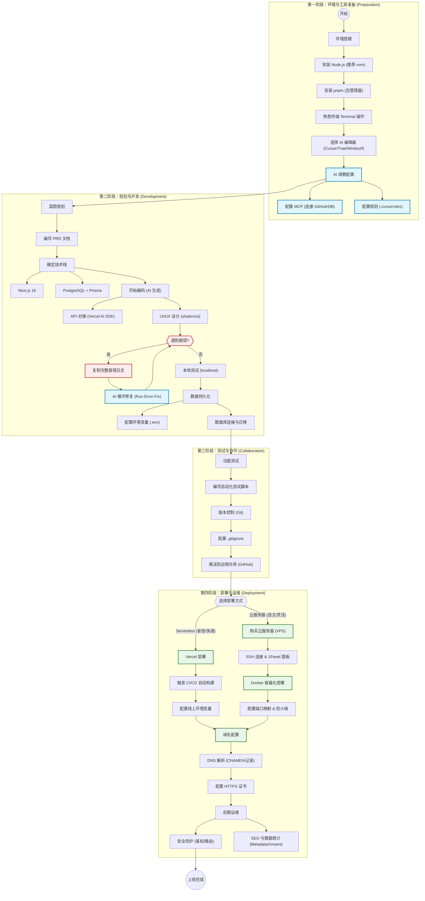
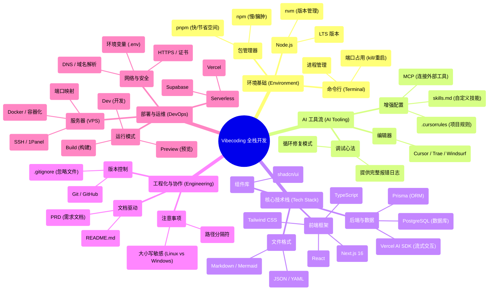

# Vibecoding 全栈开发实战：从零基础到上线的避坑指南




 


## 第一章：环境搭建、代码形态与包管理器的选择

你有一台新电脑，里面干干净净，除了浏览器什么都没有。你不会写代码，但是你觉得最近 AI 很火，心里有一个绝妙的 App 想法，打算在网页上指挥 AI 帮你做一个 Demo。

你遇到的第一个困惑是 **AI 输出代码的格式**。有时候，AI 会直接给你一段长长的代码，告诉你保存为 `index.html`。你照做了，新建文件、粘贴、保存，双击打开，浏览器里真的出现了一个会动的网页。你很高兴，以为编程不过如此。这种文件通常把结构（HTML）、样式（CSS）和逻辑（JavaScript）都塞在了一起，适合做简单的演示。

但当你要求更复杂的功能时，AI 开始给你后缀是 `.ts` 或 `.tsx` 的代码，还提到了 `import`、`React` 等词汇。你像之前一样保存文件，双击打开，却发现根本打不开，或者显示一堆看不懂的代码。你懵了，为什么代码不能跑了？

老师傅告诉你，这是因为现代开发使用了 **TypeScript**（简称 TS），它比普通的 JavaScript 更严谨，适合做大项目。但是，浏览器看不懂 TS，它需要一个“翻译官”把 TS 翻译成浏览器能懂的语言。这个翻译官运行在你的电脑上，它的名字叫 **Node.js**。如果不安装它，你的电脑就无法运行这些现代化的代码构建工具。

你兴致勃勃地去下载 Node.js，但老师傅和Nodejs 官网一样，拦住了你。他推荐你安装 **nvm**（Node Version Manager）。因为 Node.js 经常更新，不同项目可能需要不同版本，nvm 让你能轻松切换版本，而不需要反复卸载重装。你通过 nvm 安装了最新的 LTS（长期支持）版本，并在老师傅的推荐下更换了**国内镜像源**（为了解决下载慢的问题），终于拥有了所谓的运行环境。

接着，你接触到了 **Terminal（终端）**（如 Windows 的 CMD、PowerShell 或 Mac 的 Terminal）。它不是什么神秘的黑客工具，而是一种直接通过文字指令与操作系统对话的方式。相比于用鼠标点击图标，终端能更精确、更快速地执行复杂的任务。

环境有了，老师傅告诉你，现代软件开发很少从零开始写起。就像盖房子不需要自己烧砖一样，你可以直接使用全世界程序员贡献的代码——也就是**开源代码包**。React 帮你搞定界面，Axios 帮你搞定网络请求，Day.js 帮你处理时间，Zod 帮你处理数据验证。这些现成的代码包能让你专注于业务逻辑，而不是重复造轮子。

那么，怎么安装别人写好的代码包呢？你需要一个**包管理器**。Node.js 自带了一个叫 **npm**，但它下载速度慢，而且会把你的硬盘塞满重复的文件。有人开发了 **yarn**，但现在更推荐 **pnpm**。老师傅告诉你，一开始就使用 `pnpm`，它下载速度极快，而且通过巧妙的链接技术节省大量的硬盘空间。你学会了配置 pnpm 的国内镜像源，彻底解决了下载卡顿的问题。

现在，你拥有了完整的现代化开发环境，可以处理任何 AI 生成的代码了。老师傅特意叮嘱：**新建项目时，务必新建一个不含有中文、空格的文件夹**。这是因为许多底层的开发工具对非英文字符支持不佳，中文路径往往是各种离奇报错的根源。

代码都在本地了，但你完全不知道怎么把它跑起来。你试探性地把文件发给 AI，问它：“我该怎么启动这个项目？”AI 告诉你，要先运行 `pnpm install` 安装依赖（把别人写好的积木搬回家），然后运行 `pnpm dev` 启动开发服务器。你照着敲了进去，屏幕上滚动了一堆看不懂的字符，最后停在了 `Ready in 2345ms`，下面还有一行绿色的字：`http://localhost:3000`。

你盯着这个地址，老师傅给你补了一课网络基础：**Localhost** 也就是 **127.0.0.1**，在网络世界里，这代表“你自己的电脑”。如果在互联网上，每个网站都有一个 IP 地址（如 `192.168.x.x`），那么 `127.0.0.1` 就是你电脑永远的“身份证号”，而 `localhost` 则是它的“名字”（域名）。

而在冒号后面的 **:3000** 则是**端口号（Port）**。如果把你的电脑比作一栋大楼，IP 是大楼的地址，那么端口就是具体的**房间号**。你的网页应用此刻正坐在 3000 号房间里，等待你的浏览器去敲门。

你激动地点开这个链接，网页真的出来了！不过，老师傅顺便提了一句，虽然现在的开发工具都很智能——如果你再开一个项目，它们通常会自动检测到 3000 房间有人了，然后自动顺延去 3001 房间——但在**生产环境**（也就是未来你要部署的服务器）里，规则是严苛的：**一个房间（端口）同时只能容纳一个程序**。如果你看到 `EADDRINUSE` 这样的红色报错，别慌，那只是意味着你想去的房间已经被占用了，通常让 AI 为你换一个启动的端口就行了。


## 第二章：开发工具与 AI 调教指南

环境装好了，你手里握着一份庞大的工具清单，面对 **Deepseek、豆包、千问、GLM、GPT、Claude、Gemini** 这些模型，还有 **Cursor、Trae、Windsurf** 甚至 **Qoder、Code Buddy** 这些编辑器，以及 **Claude Code, CodeX, Qoder CLI, Droid CLI, Warp** 等各种 CLI 命令行工具，你彻底晕了。

你不知道它们之间有什么区别。经过老师傅的介绍，你终于明白了：**模型决定推理能力的上限，工具决定代码实现的效率。** 最终，你确定了适合自己的组合。


你想了一个 Demo 随便试了一下，发现 AI 给的方案五花八门，有时候想按照自己的心意修改，结果改了这里坏了那里，引发连锁问题。

你开始意识到需要统一标准。在老师傅的引导下，知道了要写 **PRD（产品需求文档，见下一节）**，并明白了“单一事实来源”的重要性：**不要让 AI 猜你想做什么，而是用文档告诉它必须做什么。**


除了选对工具，老师傅还传授了你三招让 AI 更加好用的技巧，解决了 AI 记性差、瞎胡写的问题：

### 第一招：配置插件 (MCP) —— 赋予 AI 外部操作能力

老师傅提到了 **MCP (Model Context Protocol)**，你可以把它理解为插件。 以前你只能问 AI 问题，现在通过配置 MCP，你可以让 AI **连接 GitHub 仓库**看代码，**连接 PostgreSQL 数据库**查数据，读取 **Figma** 设计稿，甚至接入 **Stripe** 支付。你不需要懂底层原理，只需要简单配置，你的 AI 就拥有了操作外部工具能力。

### 第二招：自定义技能 (Skills) —— 定义常用指令

针对 **Claude Code** 这样的 CLI 工具，老师傅教你创建或者安装 **Skills**。 在这里，你可以用自然语言定义专属的指令，比如“每当我说‘分析数据’时，就自动运行 `node scripts/analyze.js` 并总结结果”。这相当于为 AI 定义了一套标准作业流程，让它学会了你专属的工作流。

### 第三招：项目规则 (Project Rules) —— 设定项目规范

你之前总抱怨 AI 忘记你用的是 shadcn 还是 Tailwind，或者总是写错 TypeScript 类型。老师傅让你在项目根目录新建一个 **`.cursorrules`** (或 `.windsurfrules` 等) 文件。 你在里面写上：“禁止使用 `any` 类型”、“强制使用 `pnpm`”。从此以后，AI 每次写代码前都会先参考这份**项目规范**，生成的代码质量瞬间提升，再也不胡乱引入你没安装的库了。


你庆幸自己选择了 AI IDE 或 CLI 工具，而不是在网页版对话框里手动复制粘贴。 你发现，工具能直接读取你的项目上下文，生成的修改建议可以直接通过点击按钮无缝合并到代码中。这意味着你**不会**遇到那些手动复制粘贴时常犯的错误——比如不小心把 AI 偷懒生成的 `// ... rest of code` 注释也复制进文件导致程序崩溃。此外，你还发现可以给工具更高的权限，他们在执行大部分命令时都不需要你的批准，实现了高度的自动化，你可以趁机干自己的事情。

你深刻意识到：**Vibecoding 的核心不仅是 Prompt（提示词），更是 Workflow（工具流）。**


即便有了这些神器，开发过程中也难免会遇到满屏红字的报错。这时，老师傅向你传授了两个解决 Bug 的终极心法，让你从此告别慌乱：

- **提供完整报错日志**：面对终端或者控制台里满屏的红色报错日志，新手往往因为害怕只描述“报错了”或者只复制最后一行。老师傅告诉你，AI 需要的是完整的线索。你应该把那些**看起来最长、最复杂的红色报错日志——原封不动地全选、复制并发送给 AI**。只有提供了完整的信息，AI 才能精准定位是哪一行代码出了问题，而不是在那盲目推测。
- **循环修复模式 (Loop Fix)**：更高级的玩法是利用 AI IDE 的终端集成功能。现在的工具通常都能直接读取你的终端报错。你甚至不需要手动复制粘贴，只需要在对话框里下令：“**帮我构建项目，检查所有报错并自动修复。**” AI 会自动运行命令，读取错误，修改代码，再运行。你只需要让 AI **循环这个“运行-报错-修复”的过程**，通常几个回合下来，绝大部分棘手的 Bug 都会被自动消灭。

*如果这也解决不了？* 这意味着你可能需要更换模型、新开一个对话（清空缓存）、提供更多的项目文档（补充上下文），或者学习更多知识以引导 AI 往正确的方向思考。


看着你跃跃欲试准备让 AI 大改代码，老师傅突然按住了你的手，问了一个问题：“**如果 AI 这一次改错了，把你本来能跑的代码改崩了，甚至把你昨天的功能覆盖了，你怎么办？**” 你意识到，如果没有版本控制，错误的修改可能导致之前的成果无法恢复。

老师傅告诉你，AI 编程非常激进，它可能为了修一个 Bug 而破坏三个旧功能。所以，在开始大规模开发之前，你必须配置好 **Git**。在这一阶段，你不需要懂什么复杂的“远程仓库”或“分支策略”，你只需要利用它建立高频的**本地版本记录**。

既然代码是 AI 写的，那么维护版本这种重复性工作也应该全权交给 AI，完全不需要你操心。老师傅传授了一句**写在 AI 规则里的指令**，让版本管理成为自动化的常规流程：

> **“每当你完成一个独立功能的开发，或修复完一个 Bug 并验证通过后，请自动运行 git commit 提交代码，并生成一句简洁的中文 commit message。”**

从此，你的开发流程变成了：AI 写完登录功能 -> 自动存档；AI 写完首页 -> 自动存档。一旦 AI 在写“个人中心”时把整个项目搞崩了，你不需要慌张，让 AI 帮你回退到上一个版本即可。这能确保在代码出现问题时迅速恢复，保障开发进度。


## 第三章：PRD与文档驱动开发

在让 AI 写代码之前，老师傅按住了你想要狂飙的手。他告诉你，**写代码之前，先写文档**。如果没有蓝图，AI 很容易就会像脱缰的野马，生成的代码往往缺乏结构，写出一堆谁也看不懂、改不动的功能。

你开始学习编写 **PRD（产品需求文档）**。老师傅直接甩给你一份成熟的模板，并拍板决定了 **Next.js 16 全栈**（搭配 **Prisma** 和 **PostgreSQL**）的技术栈。看着你对 **Prisma** 和 **PostgreSQL** 这两个数据库名词一头雾水的样子，老师傅摆摆手打断了你的提问：“**关于数据怎么存，后面会有专门的章节详细讲，现在别深究。**” 他只是顺带提了一嘴，Prisma 的 `schema` 文件本身就是一份绝佳的数据库结构文档，非常适合在现阶段用来理清数据之间的关系。

在编写文档的过程中，你还顺便了解了 **Markdown (.md)** 和 **Mermaid**。Markdown 用于编写排版整齐的文本，Mermaid 用于通过文字代码绘制流程图、时序图。老师傅说，将这些文档提供给 AI，它生成的代码准确率显著提升。在这个过程中，你还顺便搞懂了 **JSON** 和 **YAML** 这种奇怪的配置文件格式。原来，对于 AI 来说，相比于散漫的自然语言，这些结构清晰的格式才是它们最爱读的“说明书”。**经过老师傅的教导，你进一步理解了前后端交互、API 是什么，HTTP 是什么——本质上就是两个程序通过 HTTP 协议互相发送 JSON 数据包的过程。**

在规划功能时，你遇到了两个必须提前考虑的问题：

**鉴权与模块拆分** 你想要做用户系统，这涉及到鉴权。你想要做地图功能，这涉及到“外部 API”。老师傅提醒你，不要把所有代码都塞在一个文件里，要学会把功能拆分成不同的模块，比如 `auth`（认证）、`api`（接口）、`components`（组件）。这种**模块化思维**是项目能长期维护的关键。

**API 文档与集成** 你想接入 AI 能力，或者地图服务等。老师傅告诉你，这些外部 API 通常是收费的，但对开发者很友好，一般都有免费额度供你测试。你需要做的是：

1. **获取凭证**：找到官方开放平台的开发者文档，找到你需要的功能，注册账号生成 **API Key**（这是你的敏感凭证，切勿泄露）。老师傅特意叮嘱，**一定要把 Key 保存到环境变量 `.env` 文件中**，而不是直接写死在代码里。环境变量就像是代码和密钥之间的“防火墙”，只要让 AI 配置一下，程序运行时会自动去读取它们，这样既能保证功能正常，又能防止你把密钥上传到 GitHub 被人盗用。
2. **确立技术路线（SDK vs HTTP）**：老师傅阻止了你让 AI 手写原始 HTTP 请求的想法。他介绍了 **SDK（软件开发工具包）** 的概念——官方通常已经把复杂的网络交互、错误处理和验证逻辑封装好了，只需要安装一下就可以直接使用。 **更关键的是，官方 SDK 通常自带完善的 TypeScript 类型定义**。这相当于给 AI 提供了代码指南，它能准确地知道有哪些功能可用，参数该怎么填，这比让它对着空白的 HTTP 请求瞎编要靠谱得多。 特别是 **Vercel AI SDK**，它极大地简化了 AI 应用的开发。它帮你处理了技术难度较高的“流式传输”协议，让 AI 的回复能够实时逐字显示。如果你非要手写 Fetch 请求，不仅代码量翻倍，还很难实现这种流畅的交互体验。
3. **归档参考文档**：将这些 API 的关键文档（如请求格式、示例代码、返回码）整理好，归档在项目中（比如 `docs/api-reference.md`）。这样下次你需要 AI 写相关功能时，直接把这份文档喂给它，它就能精准地写出调用代码，而不是编造一个不存在的接口。

**项目说明书 (README.md)** 你终于意识到，代码不仅是给机器运行的，也是给人和 AI 阅读的。你还学会了写 **README.md**。这不是冗余信息，而是项目的“说明书”。你在里面清晰地记录了如何启动项目 (`pnpm dev`)、如何配置环境变量、核心功能的逻辑。从此，无论是谁，直接看文档就上手了。

对了，记得让 AI 保持文档的更新。


## 第四章：代码运行的三种状态与构建原理

文档备齐，你正式开始开发。AI 帮你生成了新的代码文件。你切换到浏览器，疯狂刷新，但页面纹丝不动。你开始怀疑 AI 在骗你，或者电脑坏了。直到十分钟后，老师傅路过，指着你编辑器标签页上那个不起眼的**白色圆点**说：“你没保存文件。”那一刻，你学会了肌肉记忆般的 `Ctrl+S`（当然，后来你在 IDE 里开启了自动保存，彻底告别了这个烦恼）。

随着开发的深入，老师傅特意给你科普了代码的**三种生命状态**，以避免你混淆。

首先是 **Dev（开发模式）**，就是你平时用的 `pnpm dev`。它就像是**打草稿**。在这个模式下，当你修改代码并保存后，浏览器**不需要**刷新整个页面，只会替换改动的那一小块组件。这意味着如果你正在填写一个长长的表单，改了样式后，表单里填好的内容**不会丢失**。但代价是运行速度较慢，且包含了大量用于报错的调试信息。

其次是 **Build（构建模式）**，当你准备上线时，需要运行 `pnpm build`。这个过程就像是**把草稿排版印刷成书**。它会把你写的所有 TypeScript、React 代码进行压缩、优化、翻译，最终在项目中生成一个 `.next`（或 `dist`）文件夹。这里面的代码体积极小、运行极快，是专门给用户看的正式版。

最后是 **Preview（预览模式）**，运行 `pnpm preview` 或 `pnpm start`。这是在本地**模拟正式上线的环境**，用来运行刚才 `build` 生成的“正式版”。通常在上线前，你会用这个模式最后检查一遍有没有 Bug。

这时候，你可能会疑惑：**为什么输入 `pnpm dev` 就能启动项目？** 老师傅让你打开根目录下的 **`package.json`** 文件。他告诉你，这是 Node.js 项目的**核心配置文件**，管理着项目的元数据、脚本和依赖。

- **脚本管理 (Scripts)**： 在 `scripts` 字段中，定义了项目常用的运行命令。当你在终端输入 `pnpm dev` 时，包管理器会查表，发现它对应的是 `next dev` 命令并执行它。这就是为什么复杂的底层命令可以被简化成短短的 `dev` 或 `build`。 **老师傅顺便提了一嘴，这里也是自定义“房间号”的地方。** 还记得第一章那个烦人的端口占用吗？你完全可以在这里把命令修改为 `next dev -p 4000`。这样，下次你运行 `pnpm dev` 时，应用就会直接在 4000 端口启动，彻底避开拥挤的 3000 端口。
- **依赖管理 (Dependencies)**： `dependencies` 列表明确记录了项目运行所必须安装的第三方库（如 React, Next.js, Prisma）及其具体版本号。这确保了其他人（或服务器）获取代码后，可以通过 `pnpm install` 安装一模一样的库，完美还原你的开发环境。

构建完成后，你试图在文件夹里找一个 `index.html` 双击打开，就像第一章做的那样。老师傅告诉你构建产物在 `.next` （或者`dist` ）文件夹，但你翻遍了 `.next` 文件夹，只看到了一堆乱码般的 `.js` 和 `.json` 文件。老师傅告诉你，**本教程使用的 Next.js 全栈框架，本质上是一个运行在 Node.js 上的“程序”，而不是简单的“文件”**。它需要连接数据库、处理 API 请求、在服务端渲染页面，这些都离不开**服务器环境**的支持。

当然，有些场景下你也可以开发**纯静态项目**（比如使用 Vite + Vue/React），这种项目打包后确实会在 `dist` 文件夹生成一个 `index.html`。但为了带你走完数据库、鉴权等完整的全栈流程，我们选择了 Next.js。不过要记住，即使是 Vite 打包出的纯静态文件，通常也不能直接双击打开。因为现代应用使用**绝对路径**（如 `/assets/app.js`）引用资源，而双击打开使用的是 **文件协议** (`file:///`)，这会导致浏览器找不到资源。

所以，请记住铁律：**永远不要直接双击打开构建后的代码文件，永远通过 Web 服务器（如 `pnpm start` 或 `pnpm preview`）来访问你的应用。**

除了忘记保存文件，还有一个常见原因会让你的页面纹丝不动，那就是**浏览器缓存**。假设有一次，你让 AI 把按钮从蓝色改成红色。代码改了，文件保存了，编译也成功了，但你刷新浏览器，按钮依然是蓝色的。你崩溃了，以为进入了平行宇宙。后来才知道，浏览器为了加载更快，自作聪明地把旧的 CSS 文件存了起来。你学会了两个大招：一是**强制刷新**（按住 `Shift` + `Ctrl` + `R`）；二是打开 F12 开发者工具，在 Network 选项卡里勾选 **"Disable cache"**，只要开发者工具开着，浏览器就不敢偷懒。


## 第五章：界面(UI)与交互(UX)

看着屏幕上 AI 生成的网页，你觉得太丑了，尤其是那个紫色渐变，千篇一律。你试图让 AI 把按钮变漂亮点，结果它给你的代码里多了一堆 `<style>` 标签，改了这里坏了那里，搞了半天也不符合你的想法。

老师傅告诉你，要解决这个问题，你得先懂两个概念：**CSS** 和 **组件**。

- **CSS (层叠样式表)**：如果说 HTML 是网页的**骨架**（素颜），那 CSS 就是**化妆品**。它决定了按钮是圆角还是直角，背景是渐变还是纯色。
- **组件 (Component)**：现代网页不是画出来的，而是**搭**出来的。导航栏、按钮、输入框，这些都是预先做好的**乐高积木**。你不需要每次都手写一个“带圆角、有阴影、鼠标悬停变色的红色按钮”，而是直接拿来一个叫做 `<Button />` 的积木就能用。


懂了概念，老师傅推荐了 **shadcn/ui**。但在介绍它之前，他先让你理解了它的地基——**Tailwind CSS**。

传统的 CSS 写法像**写作文**，你需要给每个元素起个名字（比如 `login-box`），然后在一个单独的文件里描述它的长宽颜色。这很容易导致命名冲突。 而 Tailwind 允许你直接在 HTML 标签里写 `class="p-4 bg-red-500 rounded-lg"`。这就好比**AI 最擅长做填空题**，你让它“堆砌描述性的单词”比让它“管理复杂的文件引用”要准确得多。

随后是 **shadcn/ui**，它是一套基于 Tailwind 的**高质量组件库**。 老师傅特意强调，它和传统的组件库（如 Ant Design）完全不同。它不是一个安装在 `node_modules` 里的黑盒子，而是通过命令行**直接把组件的源代码复制粘贴到你的项目里**。 这意味着你拥有这些代码的**完全控制权**。AI 不仅能使用这些积木，还能直接修改积木的内部构造来满足你的特殊需求——这简直是为 AI 编程量身定做的模式。

你学会了去查阅 shadcn 的官方文档，提取核心部分（比如 Form 表单的用法）喂给 AI，强制它按照当前技术栈的规范来写代码。你还顺便指定了 **Lucide React** 作为图标库，因为 AI 经常瞎编图标的名字，指定标准库能避免它由着性子乱写。


但单纯的好看还不够。老师傅告诉你，**UI (界面) 只是皮囊，UX (体验) 才是灵魂**。你开始尝试让 AI **交互设计师**的角色，而不只是代码生成器。你不再直接下令给我画一个页面，而是描述场景，让 AI 帮你完善交互逻辑。老师傅举了几个经典的 **UX 避坑指南**：

- **按钮的反馈状态**：
  - *错误示范*：点击“支付”按钮后，页面毫无反应，用户以为没点上，于是疯狂点击，导致扣款两次。
  - *AI 指令*：“请给这个提交按钮加上 **Loading 状态**。当用户点击后，按钮应变灰并显示转圈动画，且不可再次点击，直到请求结束。”
- **破坏性操作的防护**：
  - *错误示范*：点击“删除”图标，数据瞬间消失，用户手滑误删欲哭无泪。
  - *AI 指令*：“这个删除操作太危险。请设计一个 **AlertDialog（警告弹窗）**，要求用户点击‘确认删除’红色按钮，甚至要求输入‘DELETE’这几个字才能执行删除。”
- **数据的空状态 ：
  - *错误示范*：新用户注册进来，没有任何数据，页面一片空白，像出了 Bug。
  - *AI 指令*：“当列表没有数据时，不要留白。请展示一个可爱的插画组件，并放一个‘创建第一个项目’的引导按钮。”

在 AI 的引导下，你设计出了不仅美观（UI），而且好用（UX）的交互流程。你甚至让 AI 把这些决策更新回了你的 **PRD 文档** 中，确保文档永远是最新的“单一事实来源”。

你似乎悟出了一个道理：**VibeCoding ，本质上就是你负责根据文档制定标准（选组件库、定流程），然后让 AI 帮你做填空题。**


## 第六章：环境变量与敏感信息管理

在开始处理数据之前，老师傅严肃地拦住了你。他发现你正准备把 AI 平台的 API Key 和数据库密码直接写在代码里。他告诉你，这是编程界的大忌。现在的互联网上到处是 24 小时巡逻的爬虫，专门扫描 GitHub 上的公开仓库。如果你的代码里包含明文密钥，往往在你提交代码的几秒钟后，你的 API 额度就会被盗刷一空，甚至背上巨额账单，这令你吓出一身冷汗。

你之前了解了使用 `.env` 文件来专门存放这些敏感信息。你明白了什么是环境变量——只有运行中的程序知道，而不会被写在明面上的代码里。

但单纯创建 `.env` 文件还不够，因为如果你一不小心执行了 `git add .`，这个文件还是会被打包上传到 GitHub。老师傅指着项目根目录下那个以点开头的文件 **`.gitignore`** 说，这才是防止你破产的最后一道防线。你可以把它理解为 Git 的**屏蔽清单。凡是写在这个文件里的名字，Git 在扫描项目变动时都会**假装没看见。

老师傅让你务必检查里面是否包含以下几类常见文件：

- **敏感配置**：如 `.env`，这是绝对不能上传的“真钥匙”。
- **依赖包**：如 `node_modules/`，这个巨大的文件夹里装着几万个第三方依赖包，队友只需要运行安装命令就能重新下载，不需要上传。
- **构建产物**：如 `.next/` 或 `dist/`，这些是代码编译后生成的临时文件，没必要存档。
- **系统垃圾**：如 `.DS_Store`（Mac 系统的缓存文件）或 `Thumbs.db`（Windows 的缩略图缓存），上传了只会显得你不专业。
- **错误日志**：如 `npm-debug.log`，这是报错时的现场记录，通常也不需要共享。

如果你真的手滑，在配置 `.gitignore` 之前就把敏感文件提交上去了，单纯的删除文件再提交是没用的，因为 Git 的历史记录里依然能查到。这时候，你可以求助 AI：**“我不小心把密码提交到 Git 历史里了，请帮我写一段命令彻底清洗掉它。”** AI 会指导你使用复杂的命令来修正错误。当然，为了绝对安全，清洗完记录后，最好还是去官网**重置你的 Key**。

既然 `.env` 被屏蔽了，以后队友拉下代码后怎么知道需要配置哪些变量呢？这就需要用到 **`.env.example`**。如果说 `.env` 是装着真钥匙的保险箱，那 `.env.example` 就是一个空的钥匙模具。你只在里面列出变量名（如 `DATABASE_URL=`），但不填具体的值。这个文件需要提交到 GitHub，队友拉取代码后，只需复制一份改名为 `.env`，然后填入自己的 Key，项目就能跑起来了。

配置好后，你马上就踩了一个大坑：你在 `.env` 里配置好了 Key，代码里也写好了调用逻辑，但程序依然报错说 `undefined` 或者出现一些奇怪的问题。你检查了拼写，检查了文件路径，甚至开始怀疑人生。最后老师傅淡淡地说了一句：“**改了配置文件，要重启终端服务。**” 你含泪杀掉终端进程（Ctrl+C）再运行 `pnpm dev`，一切正常。你深刻理解了环境变量配置的“生效滞后性”——因为环境变量是在程序启动的那一瞬间加载到内存里的，运行中修改文件，内存里的旧值是不会自动更新的。

随着 Next.js 开发的深入，你又遇到了一个诡异现象：你在 `.env` 里定义了 `API_KEY`，在服务器端（API Route）里能读到，但在前端组件（React Component）里打印出来却是 `undefined`。老师傅告诉你，这是 Next.js 为了防止你犯蠢而设计的**安全机制**，并顺便给你补习了 **Server（服务端）** 和 **Client（客户端）** 的概念。

- **Server（服务端）**：通常指的是**部署在云端的服务器**（或者你本地启动的 Node.js 后台进程）。这里运行着你的后端代码，直接连接数据库。因为用户无法直接接触到这台机器的内部，所以在这里读取私钥（API Key）是非常安全的。默认情况下，`.env` 里的变量**只在服务端可用**。
- **Client（客户端）**：指的是**用户的设备**，比如用户电脑上的浏览器、手机上的 App。前端代码最终是运行在用户的手机或电脑里的。任何发送到客户端的数据，用户都可以通过技术手段（比如浏览器的 F12 开发者工具）查看到。如果在客户端把 API Key 暴露出来，就等于把保险箱密码贴在了大门上。

所以，如果你真的需要在前端使用某些非敏感信息（比如网站标题、公开的 API 地址），你必须给变量名加上 **`NEXT_PUBLIC_`** 前缀（例如 `NEXT_PUBLIC_ANALYTICS_ID`）。只有带这个前缀的变量，构建工具才会允许它从安全的服务器端被发送到用户的设备上。

最后，你可能会问：上线后没有 `.env` 文件怎么办？老师傅告诉你，在后续的部署平台上，都有专门的环境变量设置页面。你只需要把本地 `.env` 里的内容一条条填进去即可。这就像是把钱从家里的保险箱（本地 .env）转移到了银行的保险箱（云端配置），虽然位置变了，但本质没变。


## 第七章：数据持久化与数据库

界面搭建得有模有样了，但你发现一个尴尬的问题：每次刷新网页，刚才填写的表单、生成的对话全都不见了。

老师傅告诉你，这是因为浏览器里的数据默认只存储在临时的**内存**中。想要数据在关闭或刷新页面后依然存在，你需要**数据持久化**。

他严肃地提醒你：**数据是所有业务的基石**。 前端代码丢了可以重写，UI 丑了可以换皮，但如果数据库里的用户数据丢了、乱了，你的产品就彻底完了。这就是为什么后端开发往往比前端更注重严谨性——因为你守护的是产品的灵魂。

持久化不一定上来就要装复杂的软件。最简单的方式，其实就是把你之前在配置文件里学到的 **JSON** 格式利用起来，把数据存成 `.json` 文件。每一条聊天记录或用户信息，本质上就是一段文本。把它保存进硬盘的文件里，下次读取文件就能恢复。这种方式让你瞬间理解了“数据库”的本质——**无非就是高效地读写硬盘上的文件。**

## 

虽然 JSON 文件简单，但当你数据多了，想找“所有住在北京且年龄大于 20 岁的用户”时，就需要遍历整个文件，效率极低。 于是你接触到了 **Relational Databases（关系型数据库）**。老师傅让你把它想象成一个**超级 Excel**，理解它只需要掌握几个关键点：

- **Table (表)**：就是一个 Excel Sheet（工作表），比如 `Users` 表。
- **Row (行)**：表里的一行，代表一条具体的数据（比如用户张三）。
- **Column (列)**：表里的表头，定义了数据有哪些属性（姓名、年龄、邮箱）。
- **Primary Key (主键)**：每一行数据的唯一身份证号（通常是 `id`），绝对不能重复。
- **Foreign Key (外键)**：用来关联其他表的线索。比如在 `Orders`（订单）表中记录一个 `user_id`，就能顺藤摸瓜找到这个订单属于哪个用户。

**实战秘籍：如何判断 AI 设计的表结构好坏？** 新手往往很难一眼看出 Schema 设计得合不合理。老师傅传授了你一招**“AI 交叉论证法”**（俗称“炼蛊”）： 你让 ChatGPT 帮你设计好表结构，然后把生成的代码发给 Claude 或 Deepseek，问它：“**作为一个资深数据库架构师，请批判一下这个设计有什么潜在的性能隐患或逻辑漏洞？**” 通常经过两轮这样的“左右互搏”，你就能得到一个非常健壮的数据库模型。

## 

就像你用 JavaScript 指挥浏览器一样，指挥数据库也有专门的语言，叫 **SQL**。但在 Vibecoding 中，你不需要专门去学 SQL，因为我们有 **Prisma**。你只需要看懂它的“蓝图文件”——`schema.prisma`。

你可能会问，这个复杂的文件是谁写的？是你需要背诵语法然后一个字一个字敲出来的吗？ 当然不是。它是 **AI 从你的 PRD 文档里“悟”出来的**。 当你在 PRD 里写下“一个用户可以发布多篇文章”时，AI 读懂了这层业务逻辑，于是它自动在 `User` 表里加上了 `posts` 字段，在 `Post` 表里加上了 `authorId` 字段。**你的工作不是写代码，而是检查 AI 是否正确理解了你的意图。**

为了能看懂 AI 交的作业，老师傅指着一段代码，逐行教你认字：

```
model User {
  id        Int      @id @default(autoincrement())  // 整数类型，作为主键，自动+1
  email     String   @unique                        // 字符串类型，必须唯一
  name      String?                                 // 字符串类型，但在类型后面加了问号，表示“可选项”（可以不填）
  createdAt DateTime @default(now())                // 时间类型，默认填入当前时间
  posts     Post[]                                  // 关联关系：一个用户可以有多篇文章
}
```

- **`model`**：这就代表一张**表**。
- **类型**：`Int` (整数), `String` (文本), `Boolean` (真假), `DateTime` (时间)。
- **`?` (问号)**：这是新手的救星。它代表**Optional (可选)**。如果你不确定一个字段是不是必填的（比如用户的“个人简介”），加上问号，数据库就允许它为空，否则一旦没填程序就会报错。
- **`@unique`**：代表这个内容（如邮箱）全表唯一，不能重复注册。

虽然不用写 SQL，但你必须把 **CRUD** (Create 增, Read 查, Update 改, Delete 删) 刻在脑子里。**这是所有数据库操作的基石，也是你指挥 AI 操作数据的核心通用术语。**

## 

为了实战，你接触到了 **SQLite**，它是一个轻量级的文件数据库，不需要安装，非常适合开发测试。但为了未来的扩展性，老师傅建议你使用 **PostgreSQL**。

为什么是 PostgreSQL？除了它是世界上最强大的开源关系型数据库之一，它还有两个让 AI 开发者无法拒绝的特性：

1. **JSONB 支持**：它虽然是关系型数据库，但能像 NoSQL 一样直接存 JSON 数据。这意味着你可以把 AI 生成的那些结构不确定的复杂数据直接丢进去，既有规则（SQL）又有灵活性（NoSQL）。
2. **pgvector (向量检索)**：这是 AI 时代的杀手锏。它可以存储和查询“向量数据”，这是实现 **AI 长期记忆**（RAG）的核心技术。选了 PostgreSQL，就等于为你的 AI 应用铺平了未来的路。


在实操中，有两个新手必踩的坑：

**坑一：Connection URL (连接字符串)** 你经常看到 `Error: Invalid URL` 的报错。老师傅告诉你，连接数据库就像寄信，格式必须严格遵守： `postgresql://用户名:密码@主机地址:端口/数据库名` 任何一个标点符号错了，或者密码里包含了特殊字符（需要转义），都会导致连接失败。

**坑二：Schema 与代码不同步 (最重要的命令)** 你让 AI 在数据库里增加了一个 `phone` 字段，AI 修改了 `schema.prisma` 文件。但当你运行代码时，程序却炸了，提示“User 上不存在 phone 属性”。 你开始怀疑人生，老师傅却淡定地让你运行一句命令：`npx prisma generate`。

原来，Prisma 为了保证 TypeScript 的类型安全，需要根据 Schema 生成一份“类型定义文件”。**每当你修改了数据库结构（Schema），都必须重新运行 generate 命令**，告诉代码：“嘿，数据库结构变了，请更新你的认知。”

老师傅特意叮嘱：**这个命令非常重要，以至于在未来你部署上线时（比如在 Vercel 的 Build Command 里），也必须把它加进去**，否则线上的代码会因为不认识新的数据库结构而报错。


## 第八章：功能测试流程与自动化脚本

功能越来越多了，为了保证每次修改代码后功能不挂，你开始接触**测试**。

上线之前，你不再只是单纯依靠人肉在网页上点点点（虽然这也需要），而是让 AI 帮你写出**自动化测试脚本**。你学会了用脚本去模拟用户的点击、输入和提交操作。每当你修改完代码，跑一遍测试脚本，看到全绿的 `PASS`，那种安全感是前所未有的。你确保了在面对真实用户前，把那些低级 Bug 全部消灭。


## 第九章：Localhost 与公网访问

你看着电脑上完美的网页，想让朋友惊叹一下。你自信地把浏览器地址栏里的 `http://localhost:3000` 复制发给了微信上的朋友。一分钟后，朋友回了你一个问号：“打不开啊，你逗我？”

那一刻，你脸红到了耳根。你终于明白了“本地环境”和“互联网”的区别——`localhost` 是你的家，别人进不来。你意识到，想要朋友看到你的杰作，或者更进一步，跟你一起修改这个杰作，你不能只靠截图或复制粘贴代码，你需要一座桥梁。


## 第十章：Git 版本控制与跨平台协作

功能越来越丰富，你的本地 Git 仓库里已经积累了厚厚一摞存档记录。一天，你的好朋友也打算跟你一起做。

现在，为了让朋友能拿到你的代码，老师傅告诉你，你需要把这些本地的存档同步到云端。他向你介绍了代码托管平台（如 **GitHub** 或国内的 **Gitee**）。他告诉你，协作其实很简单：你已经在自己的电脑上通过 AI 养成了良好的提交习惯，现在只需要通过 `git push` 把这些记录推送到云端的仓库里；你的朋友在另一头，通过 `git pull` 就能把你的最新进度拉取到他的电脑上。这比互相发压缩包要靠谱得多。

然而，在第一次尝试这个流程时，你犯了一个经典的错误。你不小心把那个巨大的 `node_modules` 文件夹（包含了成千上万个依赖包）和你的环境变量文件（`.env`，里面存着你的私钥）一起传到了线上仓库。虽然你用的是私有仓库没造成泄露，但这依然是一个危险的操作。你学会了 Git 的基础，知道了 **`.gitignore`** 是什么，明确了哪些文件（如依赖包和密钥）绝对**不应该**出现在那个“云端中转站”里。

随后，你发现你的好朋友用的 Mac 电脑，但是你的项目在他那里却跑不起来，报错说找不到文件。你明明写的是 `import Button from './button'`，文件名叫 `Button.tsx`，在你的 Windows 电脑上跑得欢快无比。老师傅告诉你，**Linux/Mac 系统对文件名大小写敏感**，而 Windows 不敏感。你第一次切身体会到不同系统之间的差异，并学会了严格规范命名。

这还没完，作为 Windows 用户，你还踩了一个隐形的坑：**路径分隔符**。老师傅指出，你直接从文件夹地址栏复制的路径包含反斜杠 `\`，这在代码中会被识别为转义字符导致报错，必须手动将其统一修改为正斜杠 `/`。此外，你也终于弄懂了为什么有时候明明改了代码、点了 Push，仓库里却没变化。老师傅打了一个形象的比方：Git 的 `add` 是打包，`commit` 是封箱，`push` 才是发货。你之前总是跳过打包和封箱直接发货，快递员自然什么都拿不到。

## 第十一章：无服务器部署与 CI/CD 自动化

你准备上线了，听说要买服务器，但你囊中羞涩。老师傅告诉你可以使用 Vercel 免费部署。但 Vercel 不提供数据库，老师傅建议你可以用免费的 **Supabase**，但也悄悄提醒你：**“最好不要被它深度捆绑，保持代码的独立性。”**

老师傅还顺便提到了一个叫做 **CI/CD**（持续集成/持续部署）的概念。虽然这个词听起来很复杂，但在现在的开发流程里，它就意味着自动化。当你把代码通过 `git push` 上传到 GitHub 后，GitHub 会自动通知 Vercel：“嘿，有新代码了！”。Vercel 收到信号后，会自动拉取最新代码，重新构建并发布上线。你不需要懂复杂的运维命令，只需要负责上传代码，网站就会自动更新。

你学会了将 GitHub 项目绑定到 Vercel，并填写构建命令和输出目录。第一次构建失败了，因为 Node 版本不一样，修正后成功了。但你发现项目跑不起来，因为你**忘记在 Vercel 的后台再填一遍环境变量**了——你以为代码传上去，变量就自动跟上去了。

你获得了 Vercel 为你提供的公网链接， 你终于可以把他分享给他人了。


## 第十二章：域名解析原理与网络接入

很遗憾，你发现发给国内朋友的 Vercel 链接，他们打开非常慢，甚至直接打不开。老师傅推荐了腾讯云 EdgeOne Pages 作为国内的替代方案。你惊喜地发现，它上面的填空题——绑定项目/上传文件、构建命令、环境变量、输出目录——竟然跟 Vercel 几乎一模一样，项目瞬间就部署成功了。

但当你把 EdgeOne 分配的默认域名发给朋友时，他们却截图告诉你 **404**。老师傅借机给你快速科普了 **HTTP 状态码** 的常识——只看第一位数字，就能判断是谁的锅：**2xx (如 200)**：**成功**。一切正常；**3xx (如 301)**：**重定向**。搬家了，去新地址找；**4xx (如 404/403)**：**客户端错误**（你的错）。比如地址输错了找不到 (404)，或者没权限访问 (403)；**5xx (如 500)**：**服务器错误**（它的错）。比如代码炸了或服务器宕机。

原来，这次的 404（或 403）是因为 EdgeOne 默认分配的域名自带鉴权保护，只有作为开发者的你才能访问。

你明白了，就像无论是vercel和 EdgeOne Pages 都在提醒的那样，想给别人看，最好绑定一个属于你自己的自定义域名。

你听说网上有可以免费领取的二级域名，心想能省则省。老师傅拦住了你说：这些免费域名通常极不稳定，随时可能被回收，伴随着各种安全风险。做产品，域名就是门面。于是你决定去买一个正经的域名。

在绑定域名到 EdgeOne 时，老师傅特意提醒你注意服务区域的选择：如果你选择了**“中国大陆”**节点，那么根据法规，你的域名必须先完成 ICP 备案和公安备案才能接入，这通常需要数周时间。为了让朋友立刻能看到，你选择了**不含中国大陆**的区域。虽然速度稍逊于大陆直连，但胜在**无需备案**，即刻上线。

在配置过程中，你终于弄懂了 **DNS 解析**。你明白了 DNS 就像是互联网的**电话本**，它的作用是把你那个好记的域名翻译成机器能懂的 IP 地址。

- **A 记录**：直接指向一个具体的 IP 地址（比如你未来买云服务器时的公网 IP）。
- **CNAME 记录**：指向另一个域名（也就是 EdgeOne 给你的那个长长的接入地址）。

你的网站终于在互联网上有了身份，且通常这些部署平台会为你提供免费的HTTPS证书，它会让你的网站更安全。

最后，老师傅告诉你，你的项目可以向**本教程的实践篇**投稿。如果入选，你可以联系本教程网站负责人，他们会为你分配一个专属的二级域名并提供云资源支持，让你专注于代码，不再为域名和运维的琐事烦恼。


## 第十三章：云服务器运维与项目部署

假如你囊中不羞涩，真的去买了一台服务器；或者你发现某云厂商的福利活动，可以领取试用机。

此外，在选择地区时，老师傅建议最好用香港的服务器，不然还要忍耐网站备案的过程。

总之，你获得了一个 IP 、用户名（通常是root）  和密码，发现只能通过终端操作。你学会了使用 SSH 远程连接服务器。老师傅推荐你安装 **1Panel** 面板，你学会了安装，并且让它帮你一键装好了 Docker 并配置了镜像加速。

但当你兴奋地输入1Panel给出的 `IP:端口` 访问时，浏览器却转圈圈直到超时。你以为是面板配置错了，但老师傅告诉你，云服务器通常有**第一道安全门**——云厂商的安全组。要去控制台后台开放安全组规则；否则，外面的请求连你的服务器边都摸不到。

老师傅告诉你，**1Panel** 的核心其实就是 **Docker**。虽然这听起来又是一个新名词，但你可以把它理解为集装箱。每一个应用（你的网站）都被打包在一个独立的集装箱里运行，互不干扰，也不污染你的服务器系统。你在面板里点的每一次安装应用，本质上就是在拉取和运行这些 Docker 集装箱。这种隔离机制让你明白了一个铁律：**永远不要直接在服务器上写代码或修改文件**。服务器是用来跑代码的**生产环境（Production）**，而写代码、调试 Bug 应该永远在你的本地电脑这个**开发环境（Development）**里完成，然后通过 Git 同步上去。

老师傅告诉你，可以直接通过面板的“运行环境”功能快速部署项目。你发现这上面的填空题——构建命令、环境变量、输出目录——竟然跟之前在 Vercel 上做的一模一样，只是多了让服务器去拉取代码和端口映射的过程。

老师傅还顺便给你补了一课关于 **Docker 网络** 的知识。你之前很疑惑，为什么你的服务器只有一个公网 IP，却可以同时运行好几个都在内部监听 3000 端口的项目？原来，Docker 为每个容器提供了隔离的网络环境。你的应用 A 和应用 B 在各自的容器里都可以自由地使用 3000 端口，互不冲突。当你把它们部署到服务器上时，通过 **端口映射 技术，你可以把服务器的 3001 端口映射到应用 A 的 3000 端口，把 3002 端口映射到应用 B 的 3000 端口。这样，外部用户访问 `IP:3001` 和 `IP:3002` 时，流量会被准确地转发给对应的容器。这就解决了端口冲突的问题，让一台服务器能同时跑多个应用。

你通过 IP 加端口成功访问到了服务器上的应用，但在面板绑定域名后却打不开，原来是没有做 DNS 解析。你添加了解析，访问发现有一个巨大的不安全标志。老师傅告诉你需要申请证书，于是你在面板里一键申请了证书，开启了 **HTTPS**。


## 第十四章：安全防护与 SEO 数据统计

你终于做好项目了，发给你的朋友，他们惊叹于你的创造力。但你发现，你的朋友居然可以打开管理员后台并且编辑数据！你吓出了一身冷汗，赶紧学会了鉴权和路由保护，真正理解了全栈闭环的意义。

现在网站安全了，你每天都会上去刷新几次。但是你在搜索引擎里翻了十页都找不到你的应用。你把网址发到群里，只显示一串蓝色的链接，没有任何标题或图片，根本没人想点。你不知道每天到底有多少人来访问。

于是你学会了配置 **Metadata**，做好了 SEO 的第一步。你学会了配置 **Open Graph**，当你再次把链接分享到群里时，出现了一张精美的大图。为了统计数据又不侵犯隐私，你在服务器上部署了轻量级的统计工具（如 Umami）。看着后台跳动的在线人数，你第一次感受到了产品的生命力。

**尾声**：

现在的你，不再是一个只会对着 AI 喊“帮我写个网页”的小白。你依然可能不会手写复杂的算法，但你懂得如何指挥 AI，懂得如何配置环境，懂得从 `Localhost` 走到全世界。你踩过的那些坑——未保存的文件、被占用的端口、失效的缓存、大小写的差异、AI 的幻觉——都化作了你全栈之路上的勋章。

你，终于把一个想法做成了一个产品。

准备好开始下一个项目了吗？

