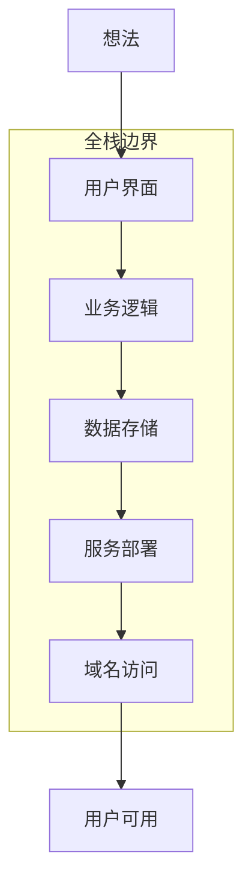
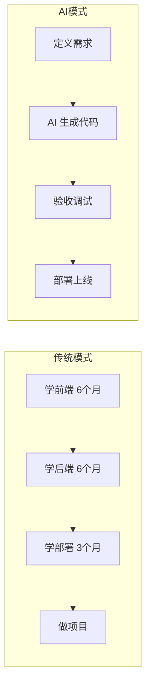
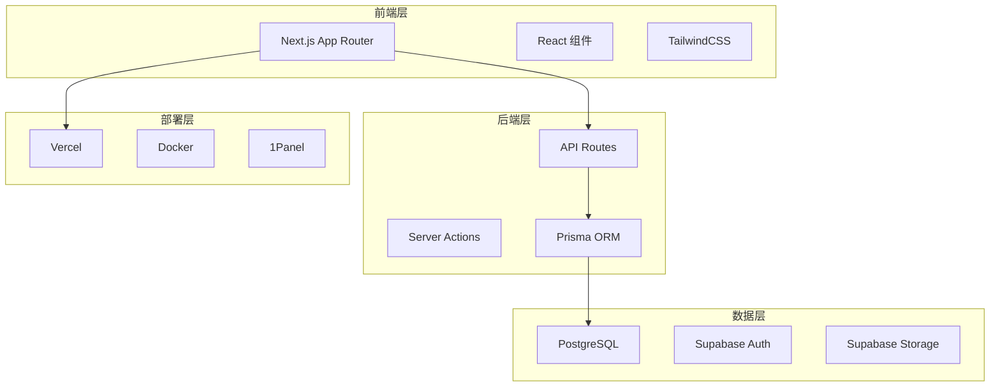

# 0.0.1 到底什么才算全栈

> **一句话破题**：全栈 = 一个人能把想法变成可访问的在线产品，从界面到数据库到部署，端到端闭环。

## 全栈的本质

全栈不是"精通所有技术"，而是**能独立交付完整产品**。

传统定义把全栈理解为"前端 + 后端"，这是**技术视角**。

Vibe Coding 时代的全栈是**产品视角**：能不能让用户通过一个 URL 使用你的产品？

## 全栈的三个层次

| 层次 | 能力要求 | 典型产出 |
|-----|---------|---------|
| **L1：原型级** | 能跑通演示流程 | 本地 demo、截图展示 |
| **L2：产品级** | 能部署上线、处理真实用户 | 可分享的 URL、基础用户系统 |
| **L3：商业级** | 能承载付费、处理规模化 | 支付集成、性能优化、监控告警 |

本课程目标：带你从 L1 到 L2，并为 L3 打下基础。

## AI 时代的全栈可能性

| 对比维度 | 传统路径 | AI 辅助路径 |
|---------|---------|------------|
| 学习周期 | 1-2 年系统学习 | 数周实战驱动 |
| 核心技能 | 语法、算法、框架 | 需求表达、结果验收 |
| 产出速度 | 按月计 | 按天/周计 |
| 瓶颈所在 | 编码能力 | 需求清晰度 |

## 本课程的全栈技术栈

这套技术栈的选择逻辑：

1. **Next.js**：前后端一体，减少技术切换成本
2. **Supabase**：开箱即用的后端服务，省去基础设施搭建
3. **Vercel**：零配置部署，专注于产品而非运维
4. **TypeScript**：类型安全让 AI 生成的代码更可靠

## 觉知

> **全栈不等于全能**
> - 你不需要手写 Webpack 配置——Next.js 已经封装好了
> - 你不需要从零搭建用户系统——Supabase Auth 开箱即用
> - 你不需要管理服务器——Vercel 处理部署和扩容
> 
> 全栈的本质是**知道每一层在做什么**，而不是**亲手实现每一层**。

## 本节小结

- 全栈 = 端到端交付能力，从想法到可访问的在线产品
- AI 时代的全栈门槛大幅降低，核心技能从"写代码"转向"定义需求"
- 本课程技术栈：Next.js + Supabase + Vercel，一套打通全链路
