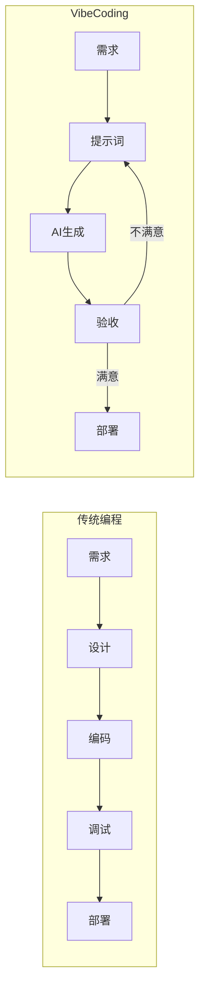
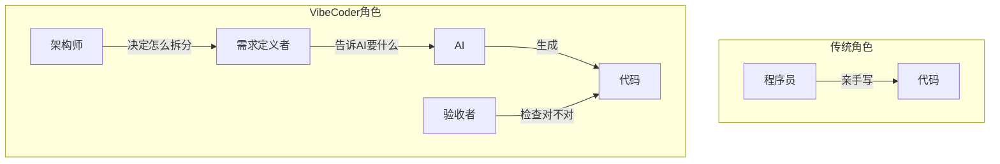
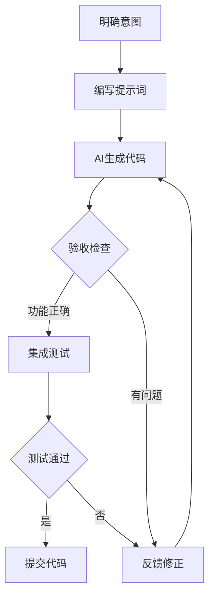

# 0.0.2 为什么 Vibe 一下就能编程

> **一句话破题**：Vibe Coding 的本质是用自然语言表达意图，让 AI 处理实现细节——你负责"做什么"，AI 负责"怎么做"。

## 什么是 Vibe Coding

Vibe Coding 是 Andrej Karpathy 在 2025 年 2 月提出的概念：

> "你完全沉浸在氛围中，拥抱指数级增长，忘记代码的存在。"

这不是"让 AI 帮你写代码"那么简单。它是一种**全新的人机协作范式**：

## 核心差异对比

| 维度 | 传统编程 | Vibe Coding |
|-----|---------|-------------|
| **输入** | 精确的代码语法 | 自然语言描述 |
| **输出** | 开发者写的代码 | AI 生成的代码 |
| **核心技能** | 语法、算法、调试 | 需求表达、结果验收 |
| **迭代方式** | 修改代码 → 运行 → 调试 | 修改提示词 → 生成 → 验收 |
| **学习曲线** | 陡峭，需要系统学习 | 平缓，边做边学 |
| **最大瓶颈** | 编码速度和技术深度 | 需求清晰度和验收能力 |

## 角色转变

| 传统身份 | Vibe Coding 身份 |
|---------|-----------------|
| 代码编写者 | 需求定义者 |
| 语法调试者 | 结果验收者 |
| 实现者 | 架构决策者 |

你不再是"写代码的人"，而是"指挥 AI 写代码的人"。

## Vibe Coding 的工作流

**关键步骤解析**：

1. **明确意图**：用一句话说清楚要实现什么
2. **编写提示词**：把意图转化为 AI 能理解的描述
3. **AI 生成代码**：让 AI 处理具体实现
4. **验收检查**：确认代码是否符合预期
5. **反馈修正**：如果不对，告诉 AI 哪里需要调整

## 什么时候用 Vibe Coding

| 场景 | 适合度 | 原因 |
|-----|-------|-----|
| 快速原型 | ⭐⭐⭐⭐⭐ | 最小成本验证想法 |
| CRUD 业务 | ⭐⭐⭐⭐⭐ | 模式固定，AI 生成质量高 |
| UI 组件 | ⭐⭐⭐⭐ | 样式代码重复度高 |
| 配置文件 | ⭐⭐⭐⭐ | 格式标准，易于生成 |
| 复杂算法 | ⭐⭐ | 需要深度理解才能验收 |
| 性能优化 | ⭐⭐ | 需要精细调优和基准测试 |
| 安全关键 | ⭐ | 必须人工审查每一行 |

## 觉知

> **Vibe Coding 不是"不看代码"**
> 
> 常见误解：Vibe Coding = 完全不懂代码也能编程
> 
> 事实：你需要能**读懂** AI 生成的代码，才能：
> - 判断逻辑是否正确
> - 发现潜在的安全问题
> - 识别 AI 的"一本正经胡说八道"
> 
> Vibe Coding 降低的是**写代码**的门槛，不是**理解代码**的门槛。

## 本节小结

- Vibe Coding 是用自然语言驱动 AI 生成代码的开发范式
- 核心技能从"编码"转向"需求表达"和"结果验收"
- 适合快速原型、CRUD 业务、UI 组件等场景
- 你仍需具备代码阅读能力来验收 AI 的输出
