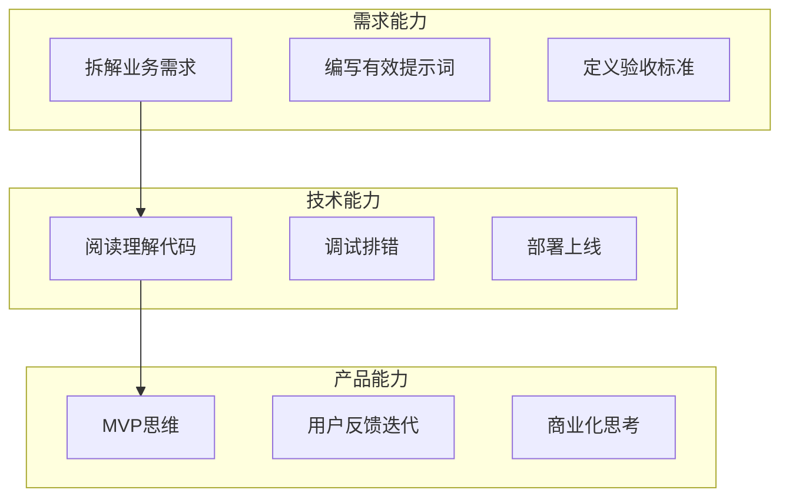
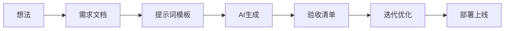

# 0.0.3 学完这门课我能做什么

> **一句话破题**：这门课的目标是让你能独立完成一个可上线、可分享、有商业化潜力的 Web 应用。


## 能力目标

学完这门课，你将具备以下能力：



| 能力维度 | 具体技能 | 验证方式 |
|---------|---------|---------|
| **需求定义** | 把模糊想法转化为清晰的功能描述 | 能写出 AI 可执行的提示词 |
| **代码验收** | 判断 AI 生成的代码是否正确 | 能发现逻辑错误和安全隐患 |
| **系统调试** | 定位问题并引导 AI 修复 | 能让应用跑通全流程 |
| **产品部署** | 把本地项目部署到公网 | 获得可分享的 URL |


## 具体产出

课程结束时，你将拥有：

### 1. 一个完整的全栈项目

```
你的项目/
├── 用户认证系统（注册/登录/权限）
├── 核心业务功能（根据你的选题）
├── 数据持久化（PostgreSQL）
├── 响应式 UI（适配移动端）
└── 生产环境部署（可访问的 URL）
```

### 2. 可复用的开发流程



### 3. 一套思维框架

| 思维模式 | 应用场景 |
|---------|---------|
| **MVP 思维** | 先做最小可用版本，再逐步扩展 |
| **验收思维** | 先定义"什么算做完"，再开始动手 |
| **迭代思维** | 小步快跑，持续交付 |
| **产品思维** | 从用户需求出发，而非技术炫技 |


## 课程路径

```mermaid
graph TB
    subgraph 第一阶段：基础认知
        A1[环境搭建] --> A2[Git基础]
        A2 --> A3[Next.js入门]
    end
    
    subgraph 第二阶段：核心技能
        B1[React组件] --> B2[数据库操作]
        B2 --> B3[用户认证]
        B3 --> B4[API设计]
    end
    
    subgraph 第三阶段：实战项目
        C1[需求分析] --> C2[功能开发]
        C2 --> C3[测试调试]
        C3 --> C4[部署上线]
    end
    
    A3 --> B1
    B4 --> C1
```

| 阶段 | 核心内容 | 预期时长 |
|-----|---------|---------|
| 基础认知 | 环境、工具、框架概念 | 1 周 |
| 核心技能 | 前端、后端、数据库、认证 | 3-4 周 |
| 实战项目 | 完整项目从 0 到上线 | 2-3 周 |


## 商业化潜力

完成课程后，你的项目可以：

| 方向 | 具体形式 | 变现方式 |
|-----|---------|---------|
| **SaaS 产品** | 面向特定用户群的工具 | 订阅付费 |
| **独立项目** | 个人作品集、博客、工具站 | 广告、赞助 |
| **外包接单** | 帮客户快速搭建 MVP | 项目收费 |
| **技术服务** | 帮企业做 AI 编程培训 | 咨询收费 |


## 觉知

> **这门课不会让你成为"资深程序员"**
> 
> 清醒认识：
> - 你不会精通算法和数据结构
> - 你不会成为框架源码专家
> - 你不会获得大厂面试通关能力
> 
> 但你会获得：
> - 独立交付产品的能力
> - 与 AI 高效协作的方法
> - 把想法变成现实的执行力
> 
> 这是两条不同的路径，各有价值。


## 本节小结

- 课程目标：独立完成可上线的全栈 Web 应用
- 核心能力：需求定义、代码验收、系统调试、产品部署
- 具体产出：一个完整项目 + 可复用流程 + 思维框架
- 商业化方向：SaaS、独立项目、外包接单、技术服务
