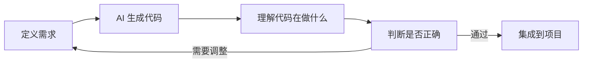

# 0.0 进阶版要学什么

在基础版中，你已经学会了 Vibe Coding 的核心心法：用自然语言表达需求，让 AI 帮你生成代码。

**进阶版的目标是：让你能独立完成一个完整的全栈项目。**

> **一句话定位**：从"能做出东西"到"能做出专业的产品"——一个人搞定从界面到数据库到部署的全流程。

## 基础版 vs 进阶版

| 维度 | 基础版（已完成） | 进阶版（即将开始） |
|-----|----------------|------------------|
| **核心能力** | 用 AI 做出简单项目 | 用 AI 构建完整产品 |
| **技术深度** | 点到为止，AI 处理细节 | 理解原理，能审查 AI 输出 |
| **项目复杂度** | 单页应用、静态网站 | 全栈应用、数据库、认证 |
| **部署方式** | 一键部署 | 容器化、CI/CD |

## 你的角色升级

在基础版中，你是"需求定义者"。

在进阶版中，你还需要成为"架构决策者"和"质量把关人"：

## 本章导读

| 小节 | 核心问题 | 你将获得 |
|-----|---------|---------|
| [0.0.1 全栈开发定义](./0.0.1-fullstack-definition.md) | 什么是全栈？一个人能做到吗？ | 全栈边界的清晰认知 |
| [0.0.2 Vibe Coding vs 传统编程](./0.0.2-vibe-coding-vs-traditional.md) | 为什么自然语言就能编程？ | 两种范式的本质差异 |
| [0.0.3 课程目标](./0.0.3-goals.md) | 学完能做什么？ | 具体的能力清单和交付物 |

## 技术栈预览

本课程锁定以下技术栈，所有实战项目都将基于此：

| 层级 | 技术选型 | 选择理由 |
|-----|---------|---------|
| 前端框架 | Next.js (App Router) | React 生态 + 全栈能力 + Vercel 原生支持 |
| 类型系统 | TypeScript | AI 生成代码的类型安全保障 |
| 后端服务 | Supabase | 开箱即用的 PostgreSQL + Auth + Storage |
| ORM | Prisma | 类型安全的数据库操作 |
| AI 集成 | Vercel AI SDK | 流式响应 + 多模型支持 |
| 部署 | Vercel | 零配置部署 + 边缘网络 |
| 容器化 | Docker + 1Panel | 自托管场景的标准方案 |

## 觉知

> **这门课不适合谁？**
> - 想要系统学习计算机科学基础的人（这不是 CS101）
> - 追求"完全不看代码"的人（你需要能读懂 AI 生成的代码）
> - 不愿意动手实践的人（Vibe Coding 的核心是迭代验证）

## 本节小结

- 这是一门**实战优先**的课程，用 AI 加速从想法到产品的全过程
- 你的角色是**需求定义者和结果验收者**，而非代码编写者
- 技术栈已锁定，专注于 Next.js + Supabase + Vercel 生态
