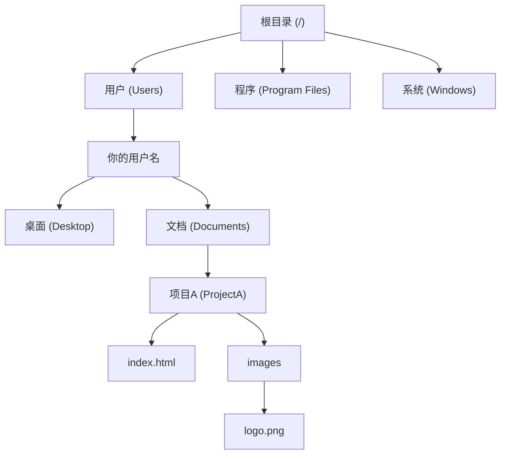

# 0.1.1 文件系统：电脑的数字图书馆

### 一句话破题

文件系统，就是操作系统用来管理和组织电脑上所有数据（文件）的一套规则和结构。你可以把它想象成一个巨大的数字图书馆，负责给每一份资料（文件）分类、贴标签、并放在正确的书架（目录）上，让你能随时找到它。

### 核心价值

作为开发者，理解文件系统至关重要，因为：

1.  **组织代码**：你的所有项目代码、图片、配置文件，都需要在一个合理的目录结构中安家。
2.  **资源定位**：程序运行时，需要准确地从文件系统中读取或写入数据。路径一旦出错，程序就会“迷路”。
3.  **环境隔离**：不同的项目依赖不同的工具和库，文件系统帮助我们将它们隔离开，避免冲突。

### 核心概念解析

文件系统的核心由几个简单概念组成：

*   **文件 (File)**：存储信息的基本单位，就像图书馆里的一本书或一份文档。每个文件都有一个文件名和扩展名（如 `index.html`, `style.css`），扩展名告诉我们文件的类型。
*   **目录 (Directory/Folder)**：存放文件和其他目录的“容器”，好比图书馆里的书架或分类区域。
*   **路径 (Path)**：一个文件或目录在文件系统中的“地址”。
    *   **绝对路径 (Absolute Path)**：从“图书馆大门”（根目录）开始的完整地址，独一无二。例如 `C:\\Users\\YourName\\Documents\\project\\index.html`。
    *   **相对路径 (Relative Path)**：从你“当前所在位置”开始的地址。例如，如果你在 `project` 目录下，要找 `index.html`，相对路径就是 `./index.html`。`.` 代表当前目录，`..` 代表上一级目录。

#### 可视化解构

文件系统的结构就像一棵倒过来的树。

### AI 协作指南

当你需要 AI 帮你处理文件时，清晰地表达路径是关键。

*   **核心意图**：告诉 AI 你想对**哪个位置**的**哪个文件**做什么操作。
*   **需求定义公式**：`“请帮我 [操作] 位于 [绝对或相对路径] 的 [文件名] 文件，内容是......”`
*   **关键术语**：`读取文件 (read file)`, `写入文件 (write file)`, `创建目录 (create directory)`, `文件路径 (file path)`, `绝对路径 (absolute path)`。

**示例**：

> **Bad ❌**: “帮我把项目里的 logo 换一下。”
> *AI 会感到困惑：哪个项目？logo 在哪里？*
>
> **Good ✅**: “请帮我更新项目 `ProjectA` 的 logo。新的 logo 图片路径是 `D:\\Downloads\\new_logo.png`，请把它复制到 `C:\\Users\\YourName\\Documents\\ProjectA\\images\\` 目录下，并覆盖原有的 `logo.png` 文件。”

### 避坑指南

*   **路径分隔符**：Windows 使用反斜杠 `\`，而 macOS/Linux 和网页 URL 使用正斜杠 `/`。在编程时，为了跨平台兼容，通常推荐使用 `/`，大多数现代工具都能理解。
*   **相对路径的“迷路”**：使用相对路径时，一定要清楚你的程序当前在哪个目录下运行，否则很容易找不到文件。

理解了文件系统，你就掌握了与计算机沟通的基础语言之一。
