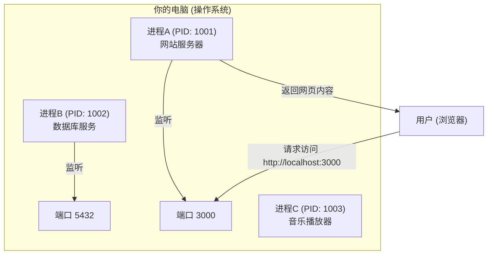

# 0.1.2 进程与端口：餐厅里的服务员和电话分机

### 一句话破题

**进程 (Process)** 是电脑上一个正在运行的程序实例，就像餐厅里一位正在忙碌的服务员。而 **端口 (Port)** 则是这个服务员用来与外界（其他程序或网络）沟通的特定“电话分机号码”。

### 核心价值

理解进程和端口，对于 Web 开发者来说是家常便饭：

1.  **运行服务**：当你启动一个网站项目时，它就在电脑上以一个“进程”的方式运行起来。
2.  **访问服务**：你需要在浏览器里通过 `http://localhost:3000` 这样的地址访问你的网站，这里的 `3000` 就是端口号。
3.  **问题排查**：最常见的错误之一就是“端口被占用”（Port already in use），这意味着你想用的电话分机号已经被别的服务员占了。

### 核心概念解析

*   **进程 (Process)**：
    *   你每打开一个应用（如浏览器、VS Code、音乐播放器），操作系统都会为它创建一个或多个进程。
    *   每个进程都有一个唯一的身份标识，叫做 **PID (Process ID)**。
    *   你可以通过操作系统的任务管理器（Windows）或活动监视器（macOS）看到所有正在运行的进程。

*   **端口 (Port)**：
    *   端口是一个 16 位的数字，范围从 0 到 65535。
    *   当一个进程需要提供网络服务时（比如一个 Web 服务器），它会“监听”一个特定的端口，等待外部的连接请求。
    *   一台电脑上，**一个端口在同一时间只能被一个进程监听**。这就是为什么你不能同时在 `3000` 端口上运行两个不同的网站项目。

#### 可视化解构

想象一下你的电脑是一家大餐厅，里面有很多服务员（进程）在同时工作。

在这个模型中：
*   网站服务器和数据库服务都是独立的进程，它们需要通过端口与外界沟通。
*   音乐播放器也是一个进程，但它可能不需要监听端口来提供网络服务。
*   浏览器通过访问 `localhost:3000`，准确地找到了正在监听 3000 端口的那个网站服务器进程。

### AI 协作指南

当你需要 AI 帮你管理服务时，清晰地指明进程和端口至关重要。

*   **核心意图**：告诉 AI 你想对**哪个端口**上的**哪个服务**做什么。
*   **需求定义公式**：`“请帮我 [启动/停止/检查] 在端口 [端口号] 上运行的服务。”`
*   **关键术语**：`运行 (run)`, `启动 (start)`, `停止 (stop)`, `进程 (process)`, `端口 (port)`, `端口被占用 (port in use)`。

**示例**：

> **Bad ❌**: “我的网站起不来了。”
> *AI 不知道是哪个网站，遇到了什么问题。*
>
> **Good ✅**: “我在运行我的 Next.js 项目时，终端提示 `Error: listen EADDRINUSE: address already in use :::3000`。请帮我检查一下是哪个进程占用了 3000 端口，并告诉我如何停止它。”

### 避坑指南

*   **常用端口**：Web 开发中，`3000`, `8000`, `8080` 是非常常见的开发端口。`80` 是 HTTP 服务的默认端口，`443` 是 HTTPS 的默认端口。
*   **如何找到并停止占用端口的进程**：这是一个非常高频的操作。你可以直接让 AI 给你具体的命令行指令。
    *   **Windows**: `netstat -ano | findstr :<端口号>` 找到 PID，然后 `taskkill /PID <PID> /F`。
    *   **macOS/Linux**: `lsof -i :<端口号>` 找到 PID，然后 `kill -9 <PID>`。

掌握了进程和端口，你就拿到了进入网络应用世界的钥匙。
