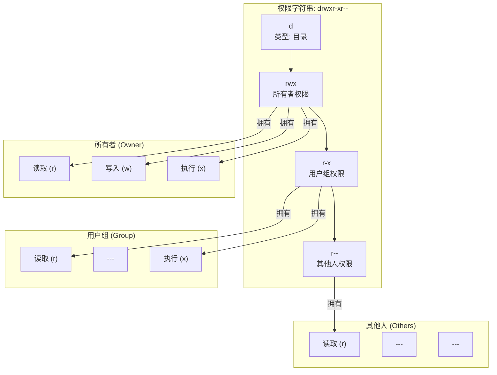

# 0.1.3 权限：谁能动我的数字资产

### 一句话破题

文件和目录的**权限 (Permissions)**，定义了**谁**可以对它们进行**何种**操作。这就像一栋公寓大楼的门禁系统，规定了谁（用户）拥有哪把钥匙（权限），可以进入哪个房间（文件/目录），以及进去后能干什么（读/写/执行）。

### 核心价值

虽然在个人电脑上感知不强，但在服务器和团队协作中，权限是安全和稳定的基石：

1.  **保护系统**：防止普通用户或恶意程序修改核心系统文件，导致系统崩溃。
2.  **保护数据**：确保只有授权用户才能读取或修改敏感数据（如数据库文件、配置文件）。
3.  **团队协作**：在多人项目中，明确谁有权修改代码，谁只能查看，避免混乱。

### 核心概念解析 (以 Linux/macOS 为例)

权限系统主要围绕三个维度展开：

*   **三种操作**：
    *   **读取 (Read, r)**：查看文件内容或列出目录中的文件。
    *   **写入 (Write, w)**：修改文件内容，或在目录中创建/删除文件。
    *   **执行 (Execute, x)**：运行一个文件（如果是程序或脚本），或进入一个目录。

*   **三类用户**：
    *   **所有者 (Owner)**：创建文件或目录的用户。
    *   **用户组 (Group)**：一个用户集合，文件可以属于某个组。
    *   **其他人 (Others)**：除了所有者和用户组成员之外的所有人。

当你通过命令行 `ls -l` 查看文件时，会看到类似 `drwxr-xr--` 这样的字符串，这就是权限的表示。

*   第一个字符 `d` 表示这是一个目录，`-` 表示是文件。
*   后面 9 个字符，每 3 个一组，分别代表**所有者**、**用户组**、**其他人**的权限。
    *   `rwx` 表示可读、可写、可执行。
    *   `r-x` 表示可读、不可写、可执行。
    *   `r--` 表示只可读。

#### 可视化解构

以 `drwxr-xr--` 为例，我们可以这样解读：

**解读**：这是一个目录，其所有者拥有全部权限；用户组的成员可以读取和进入该目录，但不能在里面创建或删除文件；而其他人只能读取目录内容。

### AI 协作指南

在服务器上部署应用时，经常需要 AI 帮忙设置权限。

*   **核心意图**：告诉 AI 你想把**哪个文件/目录**的权限，修改成**什么样**。
*   **需求定义公式**：`“请帮我修改 [文件/目录路径] 的权限，让 [用户类型] 拥有 [读/写/执行] 的权限。”`
*   **关键术语**：`权限 (permission)`, `修改权限 (change permission)`, `chmod`, `所有者 (owner)`, `用户组 (group)`。

**示例**：

> **Bad ❌**: “我的脚本运行不了。”
> *原因可能有很多，不一定是权限问题。*
>
> **Good ✅**: “我上传了一个部署脚本 `deploy.sh` 到服务器的 `/opt/scripts/` 目录下，但是当我尝试运行它时，系统提示 `Permission denied`。请给我 `chmod` 命令，让这个脚本的当前所有者可以执行它。”

### 避坑指南

*   **`sudo` 的滥用**：`sudo` (Super User Do) 是一个用管理员权限执行命令的指令。当你遇到 `Permission denied` 时，**不要**下意识地就在原命令前加上 `sudo`。这就像用万能钥匙去开所有的门，虽然方便，但极不安全。你应该先搞清楚为什么需要更高权限，然后只在必要时使用。
*   **危险的 `777`**：`chmod 777 <file>` 是一个“终极武器”，它把一个文件的读、写、执行权限完全开放给了系统上的所有人。这在服务器上是**极其危险**的行为，相当于把你的公寓大门敞开，任何人都可以为所欲为。除非你非常清楚自己在做什么，否则永远不要使用 `777`。

理解权限，是让你从一个“代码玩家”成长为“系统工程师”的重要一步。
