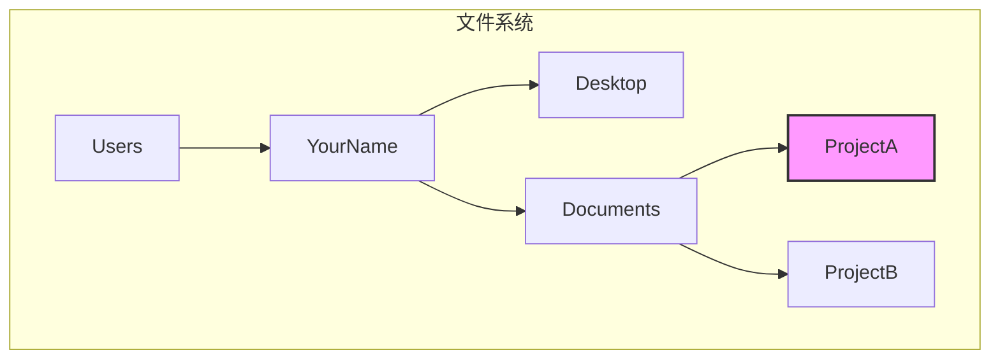

# 0.2.1 导航：在数字世界里自由穿梭

### 一句话破题

命令行导航，就是通过几个核心指令，让你在文件系统的“目录树”中快速定位和移动，就像在游戏地图里使用传送点一样高效。

### 核心价值

1.  **效率**：当你熟悉了路径和指令，直接输入命令跳转，远比在图形界面中一层层点击文件夹要快得多。
2.  **精确**：你可以直接到达任何深度的目录，而不需要记住中间路径的每一个细节。
3.  **自动化**：导航是所有自动化脚本的基础。你需要先“去到”正确的地方，才能执行后续操作。

### 核心概念解析

命令行导航主要依赖两个核心命令：`pwd` 和 `cd`，以及对路径的理解。

*   **`pwd` (Print Working Directory)**：打印当前工作目录。这个命令告诉你“你现在在哪里”。
    *   Windows PowerShell 中对应的命令是 `Get-Location`，但 `pwd` 作为别名通常也能使用。

*   **`cd` (Change Directory)**：切换目录。这是导航的核心，后面需要跟一个路径作为参数。

*   **路径 (Path)**：
    *   **绝对路径**：从根目录开始的完整路径，例如 `C:\Users\YourName\Desktop` (Windows) 或 `/Users/YourName/Desktop` (macOS/Linux)。它提供了唯一的、明确的位置。
    *   **相对路径**：相对于你当前位置的路径。
        *   `.` (一个点)：代表**当前目录**。
        *   `..` (两个点)：代表**上一级目录**。

#### 可视化解构

假设我们的文件结构如下，并且当前我们在 `ProjectA` 目录下。

| 你的目标 | 使用的命令 (相对路径) | 解释 |
| --- | --- | --- |
| 查看当前位置 | `pwd` | 输出 `/Users/YourName/Documents/ProjectA` |
| 进入 `Documents` 目录 | `cd ..` | `..` 代表上一级，即从 `ProjectA` 回到 `Documents` |
| 从 `Documents` 进入 `ProjectB` | `cd ProjectB` | 直接进入当前目录下的子目录 `ProjectB` |
| 从 `ProjectB` 直接回到 `Desktop` | `cd ../../Desktop` | 连续使用 `..`，两次返回上一级，再进入 `Desktop` |
| 任何位置去 `ProjectA` | `cd /Users/YourName/Documents/ProjectA` | 使用绝对路径，一步到位 |

### AI 协作指南

当你需要 AI 帮你写脚本时，清晰地描述路径和导航意图非常重要。

*   **核心意图**：告诉 AI 你的**当前位置**和**目标位置**。
*   **需求定义公式**：`“我当前在 [起始路径] 目录下，请写一个命令，让我可以进入 [目标路径] 目录。”`
*   **关键术语**：`当前目录 (current directory)`, `上一级目录 (parent directory)`, `根目录 (root directory)`, `cd`, `pwd`。

**示例**：

> **Bad ❌**: “怎么去我的项目文件夹？”
> *AI 不知道你的项目文件夹在哪里。*
>
> **Good ✅**: “我的项目路径是 `D:\workspace\my-awesome-project`。我现在命令行的路径是 `D:\workspace`。请给我一个 `cd` 命令进入我的项目目录。”

### 避坑指南

*   **路径中的空格**：如果你的目录名包含空格（例如 `My Documents`），你需要用引号把整个路径包起来，像这样：`cd "My Documents"`。
*   **Windows vs macOS/Linux 的斜杠**：Windows 使用反斜杠 `\` 作为路径分隔符，而 macOS/Linux 使用正斜杠 `/`。不过，在现代的命令行工具（如 PowerShell）中，通常两者都能被正确识别，但保持原生习惯是最佳实践。
*   **Tab 自动补全**：这是命令行导航的“超级技能”！输入路径的前几个字母，然后按 `Tab` 键，系统会自动帮你补全剩下的部分。如果存在多个匹配项，多按几次 `Tab` 会列出所有选项。**一定要养成使用 `Tab` 的习惯，这能极大提升效率并减少拼写错误。**
