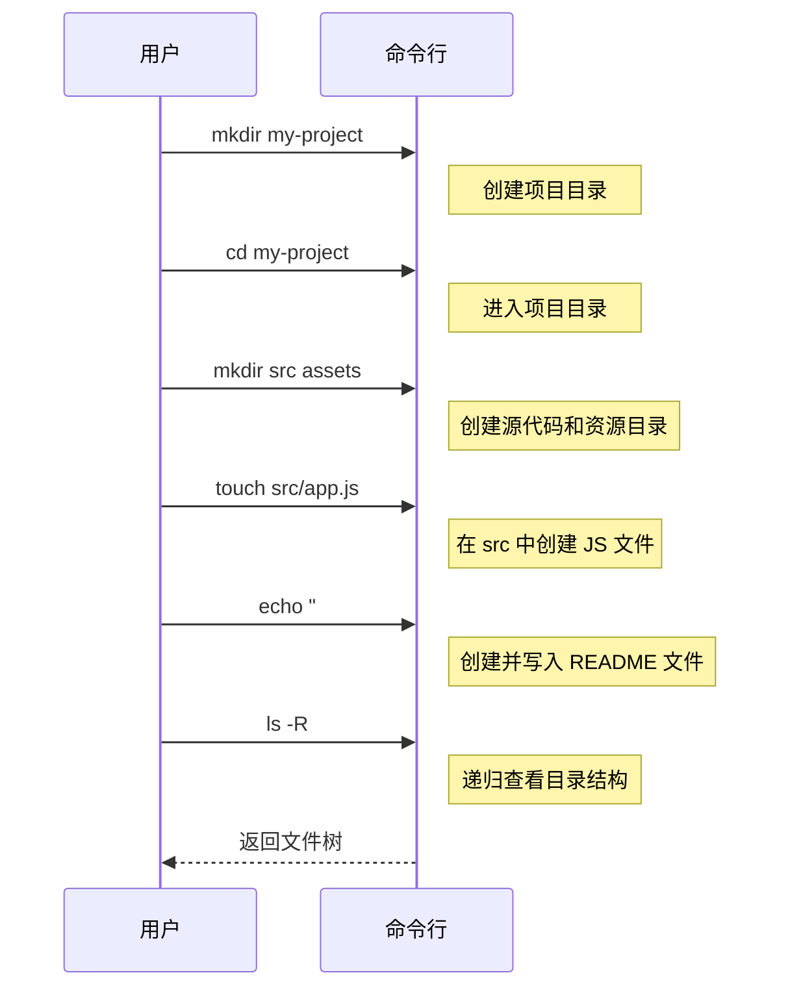

# 0.2.2 文件操作：数字世界的建筑师

### 一句话破题

命令行文件操作，就是用指令来扮演“建筑师”的角色，在你的数字空间里创建（盖楼）、查看（看图纸）、移动（搬迁）、复制（克隆）和删除（拆除）文件和目录。

### 核心价值

1.  **批量处理**：可以一次性创建、移动或删除大量文件，这是图形界面难以企及的。
2.  **精确控制**：通过参数和选项，可以实现非常精细的操作，例如，只复制特定类型的文件。
3.  **脚本核心**：几乎所有的自动化脚本都包含文件操作。例如，一个典型的构建脚本会先清空旧的输出目录，然后创建新的文件。

### 核心概念解析

掌握以下几个核心命令，你就能完成绝大部分日常文件管理任务。注意 Windows (PowerShell) 和 macOS/Linux (Bash/Zsh) 在命令名称上的区别。

| 任务 | PowerShell (Windows) | Bash/Zsh (macOS/Linux) | 解释 |
| :--- | :--- | :--- | :--- |
| **列出文件** | `Get-ChildItem` (别名: `ls`, `gci`) | `ls` | 显示当前目录下的文件和文件夹。 |
| **创建目录** | `New-Item -ItemType Directory <目录名>` (别名: `mkdir`) | `mkdir <目录名>` | 创建一个新的文件夹。 |
| **创建文件** | `New-Item <文件名>` (别名: `ni`) 或 `echo "内容" > <文件名>` | `touch <文件名>` 或 `echo "内容" > <文件名>` | 创建一个空文件或带有内容的文件。 |
| **查看内容** | `Get-Content <文件名>` (别名: `cat`, `gc`) | `cat <文件名>` | 在命令行直接显示文件的全部内容。 |
| **复制** | `Copy-Item <源> <目标>` (别名: `cp`, `copy`) | `cp <源> <目标>` | 复制文件或目录。 |
| **移动/重命名** | `Move-Item <源> <目标>` (别名: `mv`, `move`) | `mv <源> <目标>` | 移动文件或目录，或在同一目录下移动实现重命名。 |
| **删除** | `Remove-Item <路径>` (别名: `rm`, `del`) | `rm <文件>` / `rm -r <目录>` | 删除文件或目录。`-r` (recursive) 选项用于递归删除整个目录。 |

#### 可视化工作流

让我们模拟一个创建项目并整理文件的过程：

这个流程清晰地展示了如何从无到有地构建一个项目的基本骨架。

### AI 协作指南

文件操作是 AI 最擅长生成的代码之一，但你需要提供清晰的上下文。

*   **核心意图**：告诉 AI 你想对**什么文件/目录**，执行**什么操作**，以及操作的**源和目标**。
*   **需求定义公式**：`“请给我一个命令，将 [源路径] 的 [文件/目录] [复制/移动/删除] 到 [目标路径]。”`
*   **关键术语**：`创建 (create/make)`, `复制 (copy)`, `移动 (move)`, `重命名 (rename)`, `删除 (delete/remove)`, `目录 (directory/folder)`, `文件 (file)`。

**示例**：

> **Bad ❌**: “帮我把文件弄过去。”
> *哪个文件？弄到哪里去？*
>
> **Good ✅**: “我有一个 `logo.png` 文件在 `~/Downloads` 目录下，请帮我写一个命令，把它复制到我当前项目下的 `public/images` 目录里。”

### 避坑指南

*   **`rm` 的危险性**：`rm` (或 `Remove-Item`) 命令是**不可逆的**！它删除的文件不会进入回收站。在使用，特别是配合 `-r` (递归) 和 `-f` (强制) 选项时，一定要再三确认你所在的目录和要删除的目标。**误删系统文件是新手最容易犯的灾难性错误之一。**
*   **覆盖文件**：在执行 `cp` 或 `mv` 时，如果目标位置已存在同名文件，系统通常会提示你是否覆盖。但在脚本中，可能会直接覆盖。养成先检查目标位置的习惯。
*   **通配符 `*`**：`*` 是一个强大的通配符，代表“任何字符”。例如，`rm *.log` 会删除所有以 `.log` 结尾的文件。它非常高效，但也同样危险，使用前请用 `ls *.log` 这样的命令先预览一下将要被操作的文件列表。
