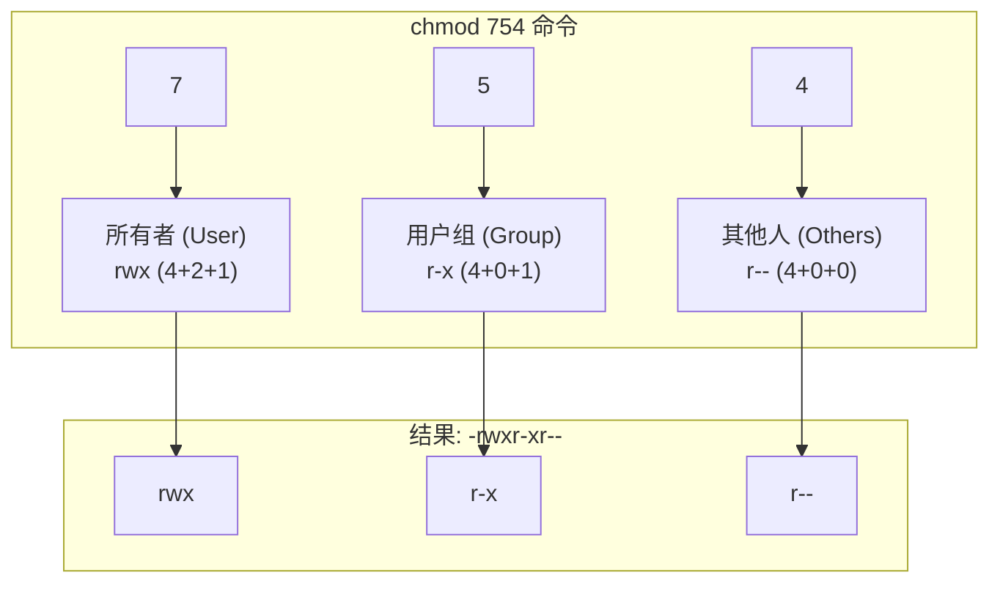

# 0.2.3 权限管理：数字资产的守护神

### 一句话破题

命令行的权限管理，主要是通过 `chmod` 命令，像“配钥匙”一样，精确地授予或撤销不同用户对文件和目录的访问能力。

### 核心价值

1.  **安全部署**：在服务器上部署应用时，正确设置文件权限是第一道安全防线。例如，上传的私钥文件必须设置为只有所有者才能读取。
2.  **脚本执行**：你自己编写的脚本文件（如 `.sh` 文件），默认可能没有执行权限。你需要手动为它“激活”执行能力。
3.  **协作规范**：在 Git 等版本控制系统中，文件的执行权限是会被记录的。正确设置权限可以避免团队成员在不同操作系统上遇到不一致的行为。

### 核心概念解析 (以 Linux/macOS 为例)

我们在 `0.1.3` 章节已经理解了权限的 `rwx` 概念。在命令行中，我们使用 `chmod` (Change Mode) 命令来修改这些权限位。`chmod` 有两种主要的用法：符号模式和数字模式。

*   **符号模式 (Symbolic Mode)**：更直观，易于理解。
    *   **用户**: `u` (user/owner), `g` (group), `o` (others), `a` (all)
    *   **操作**: `+` (添加权限), `-` (移除权限), `=` (精确设置权限)
    *   **权限**: `r` (read), `w` (write), `x` (execute)

    **示例**：
    *   `chmod u+x script.sh`：为所有者（user）添加（+）执行权限（x）。
    *   `chmod go-w config.yml`：为用户组（group）和其它人（others）移除（-）写权限（w）。
    *   `chmod a=r private.key`：为所有人（all）精确设置（=）为只读权限（r）。

*   **数字模式 (Octal Mode)**：更简洁，是专业人士和脚本中的常用方法。
    它将 `rwx` 权限用一个三位的八进制数表示：
    *   `r` = 4
    *   `w` = 2
    *   `x` = 1

    一个权限组合是这三个数字的和。例如：
    *   `rwx` = 4 + 2 + 1 = `7`
    *   `r-x` = 4 + 0 + 1 = `5`
    *   `rw-` = 4 + 2 + 0 = `6`
    *   `r--` = 4 + 0 + 0 = `4`

    `chmod` 后面跟的 3 个数字，分别对应**所有者**、**用户组**、**其他人**的权限。

#### 可视化解构

`chmod 754 <文件名>` 这条命令到底做了什么？

**解读**：这条命令将文件权限设置为：所有者可读可写可执行，用户组成员可读可执行，其他人只可读。

### AI 协作指南

当你不确定应该使用何种权限时，可以向 AI 寻求最佳实践。

*   **核心意图**：描述你的**文件类型**和**使用场景**，让 AI 给出最安全的权限建议。
*   **需求定义公式**：`“我有一个 [文件类型]，它将被用于 [使用场景]。请问我应该把它设置为多少权限？请给我具体的 chmod 命令。”`
*   **关键术语**：`chmod`, `权限 (permission)`, `数字模式 (octal)`, `符号模式 (symbolic)`, `脚本 (script)`, `配置文件 (config file)`, `私钥 (private key)`。

**示例**：

> **Bad ❌**: “我的文件权限有问题。”
> *太模糊，无法提供有效帮助。*
>
> **Good ✅**: “我正在部署一个 Node.js 应用到 Ubuntu 服务器。我有一个 `.env` 文件，里面包含了数据库密码。为了安全，我应该给这个文件设置什么权限？请用数字模式告诉我 `chmod` 命令。”
> *AI 会告诉你，这种敏感文件通常应该设置为 `600` 或 `400`，即只有所有者可读写或只读。*

### 避坑指南

*   **目录的执行权限**：对目录来说，`x` (执行) 权限的意义是“**可以进入该目录**”。如果你移除了一个目录的 `x` 权限，那么即便你拥有里面所有文件的读写权限，你也无法 `cd` 进去，也无法访问其中的任何文件。
*   **`chmod -R` 的威力**：`-R` (Recursive) 参数会让 `chmod` 命令递归地应用到目录下的所有文件和子目录。这是一个非常强大的工具，但也同样危险。例如，`chmod -R 777 /my-app` 会将你整个应用目录都设置为完全开放，可能导致严重的安全漏洞。
*   **Windows 的权限模型**：Windows 的 `icacls` 和 `Set-Acl` 命令提供了更复杂的 ACL (Access Control List) 权限模型，与 Linux/macOS 的 `rwx` 模型不同。虽然 PowerShell 提供了一些兼容性的别名，但在进行精细的权限管理时，你需要使用 Windows 原生的工具和概念。
