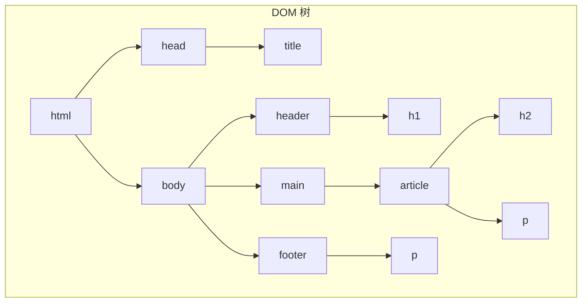

# 0.3.1 搭建网页的骨架——HTML：结构与语义化标签

### 一句话破题

HTML (HyperText Markup Language) 是一种**标记语言**，它通过各种**标签 (Tag)** 来定义网页的**结构**和**内容**，就像搭建房子的钢筋骨架，决定了哪里是客厅、哪里是卧室。

### 认知重构：HTML 不是编程语言

传统观念认为前端就是写代码，但 HTML 的本质是**描述**，而非**逻辑**。它不包含变量、循环或条件判断。它的任务是告诉浏览器：“这是一个标题”、“这是一个段落”、“这是一个图片”。

在 Vibe Coding 的世界里，AI 极度擅长生成 HTML 结构。你的核心任务从“手动敲每一个标签”转变为“**定义清晰的页面结构和内容区块，并选择最合适的语义化标签来描述它们**”。你负责设计蓝图，AI 负责砌墙。

### 本质还原：HTML 是一个树状结构 (DOM)

浏览器在读取 HTML 文档后，会在内存中构建一个树状的“文档对象模型”(Document Object Model, DOM)。这个模型是后续 CSS 样式和 JavaScript 交互的基础。

一个典型的 HTML 结构如下：

```html
<!DOCTYPE html>
<html>
<head>
    <title>我的网页</title>
</head>
<body>
    <header>
        <h1>网站标题</h1>
    </header>
    <main>
        <article>
            <h2>文章标题</h2>
            <p>这是一个段落。</p>
        </article>
    </main>
    <footer>
        <p>版权信息</p>
    </footer>
</body>
</html>
```

#### 可视化解构 (DOM 树)

上面的 HTML 代码可以被解析成以下的 DOM 树：



**觉知**：当你理解了 DOM 树，你就能明白为什么 CSS 的选择器可以“层层深入”，为什么 JavaScript 可以“按图索骥”地找到任何一个元素。**你审查 AI 生成的 HTML 时，核心是检查这个树的逻辑结构是否清晰、合理。**

### 核心价值：语义化标签 (Semantic Tags)

同样是展示一个标题，你可以用 `<h1>`，也可以用 `<div>` 然后通过 CSS 把它放大加粗。但前者是“语义化”的，后者不是。

**语义化标签**，就是用最能描述其内容功能的标签。这不仅仅是为了好看。

*   **对机器友好 (SEO)**：搜索引擎（如 Google）的爬虫能更好地理解你的页面结构，知道哪里是主标题，哪里是导航，从而给予更高的搜索排名。
*   **对残障人士友好 (Accessibility)**：屏幕阅读器等辅助工具可以根据标签的语义，为视障用户提供清晰的导航和内容朗读。
*   **对 AI 友好**：你给 AI 的指令中包含语义化标签，AI 能更准确地理解你的意图。例如，告诉 AI “在 `<main>` 标签里添加一个新的 `<section>`”比“在那个 `div` 里再加一个 `div`”要清晰得多。
*   **对未来的你友好**：几个月后回头看代码，清晰的语义化结构能让你瞬间回忆起每个部分的功能。

**常用语义化标签**：

*   `<header>`: 页面或区块的头部。
*   `<nav>`: 导航链接区域。
*   `<main>`: 页面的核心内容，每个页面只应有一个。
*   `<article>`: 独立的、完整的内容块，如一篇博客、一则新闻。
*   `<section>`: 主题性的内容区块。
*   `<aside>`: 侧边栏，与主要内容相关性较低的内容。
*   `<footer>`: 页面或区块的底部。

### AI 协作指南

*   **核心意图**：向 AI 清晰地描述你想要的**页面布局**和**内容区块**，并指定使用**语义化标签**。
*   **需求定义公式**：`“请帮我生成一个标准的网页布局，包含 <header>、<main> 和 <footer>。在 <main> 区域，我需要两个 <article>，每个 <article> 包含一个 <h2> 标题和三个 <p> 段落。”`
*   **关键术语**：`布局 (layout)`, `语义化 (semantic)`, `<header>`, `<main>`, `<footer>`, `<article>`, `<section>`。

**交互策略**：

1.  **先要结构，再要内容**：先让 AI 生成页面的整体 HTML 骨架。
2.  **确认骨架**：检查 AI 给出的骨架是否符合你的预期，语义化标签是否使用得当。
3.  **填充细节**：然后指令 AI：“现在，请帮我在第一个 `<article>` 里填充关于‘Vibe Coding’的介绍文字。”

通过这种方式，你始终掌控着页面的宏观结构，而把繁琐的内容填充和细节标签生成工作交给了 AI。
