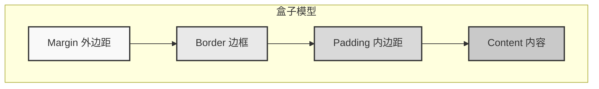
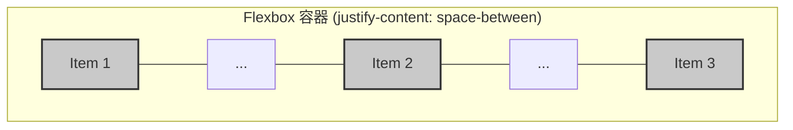

# 0.3.2 给网页穿上衣服——CSS：样式与布局基础

## 认知重构：从“画笔”到“规则集”

传统观念里，CSS 像是一支画笔，哪里不好看就涂一下。这种思维在面对复杂页面时会迅速崩溃，导致样式混乱、难以维护，最终变成“样式屎山”。

**现代前端开发的认知：CSS 不是画笔，而是一套“规则集” (Rule Set)。** 你不再是那个满头大汗的装修工人，而是一位优雅的建筑设计师，你负责定义规则，浏览器会根据你的规则自动、精准地完成渲染。

你只需要告诉浏览器：“所有 class 为 `card` 的 `div` 元素，都应该有一个灰色的边框和 16px 的内边距。” 无论页面上有 1 个还是 100 个这样的卡片，浏览器都会忠实地执行这条规则。

这种思维的转变，是从“命令式”到“声明式”的跃迁，也是高效、可维护样式系统的基石。

## 本质还原：CSS 的两大支柱——“盒子模型”与“布局”

所有复杂的 CSS 效果，都可以拆解为两个最基本的概念：

1.  **盒子模型 (Box Model)**：万物皆盒。网页上的每一个元素，无论是一段文字、一张图片还是一个按钮，都被浏览器视为一个矩形的“盒子”。你对元素应用的所有样式，本质上都是在调整这个盒子的属性。
2.  **布局 (Layout)**：盒子与盒子之间的关系。是垂直排列，是水平分布，还是复杂的网格结构？布局就是定义这些盒子如何在一维或二维空间中自洽共存的规则。

### 可视化解构 1：盒子模型

每个 HTML 元素都是一个由内到外的矩形盒子，它由四部分组成：

*   **Content (内容)**: 盒子的核心，显示文本、图片等。
*   **Padding (内边距)**: 包裹在内容区域外部的透明区域。
*   **Border (边框)**: 包裹内边距的线条。
*   **Margin (外边距)**: 包裹边框的透明区域，用于控制盒子与其他盒子的距离。



**觉知**：当 AI 生成的样式出现尺寸或间距问题时，你的第一反应应该是打开浏览器的开发者工具，检查对应元素的盒子模型。是 `padding` 太大，还是 `margin` 计算错误？通过审查盒子模型，90% 的样式问题都能被快速定位。

### 可视化解构 2：现代布局的基石——Flexbox

忘记那些陈旧的 `float` 和 `position` 吧。对于现代 Web 开发而言，**Flexbox** 是解决一维布局问题的最佳实践。它像一条传送带，你可以轻松控制传送带上的物品（盒子）是靠左、靠右、居中，还是平均分配空间。

假设我们有一个容器（父元素），里面有三个项目（子元素）。

```html
<div class="container">
  <div class="item">1</div>
  <div class="item">2</div>
  <div class="item">3</div>
</div>
```

```css
.container {
  display: flex; /* 开启 Flexbox 布局 */
  justify-content: space-between; /* 子元素之间平均分配空间 */
}
```

**效果**：



**觉知**：当你需要让一组元素水平或垂直对齐时，直接告诉 AI：“使用 Flexbox 布局，让子元素垂直居中并水平两端对齐”。AI 应该立刻生成 `display: flex; align-items: center; justify-content: space-between;` 这样的代码。如果它还在用 `position: absolute` 配合 `top: 50%` 和 `transform: translateY(-50%)` 这种“古法”居中，你要立刻意识到这可能不是当前场景的最优解。

## AI 协作指南：从“给我一个按钮”到“定义一个按钮规范”

与 AI 协作写 CSS，最忌讳的是碎片化、命令式的沟通。

*   **低效沟通**：“把这个按钮变大一点，颜色改成蓝色。”
*   **高效沟通**：“为我们的应用定义一套按钮规范。主按钮（primary）背景色是品牌蓝，次要按钮（secondary）是灰色边框。所有按钮都应该有 4px 的圆角和 8px 16px 的内边距。”

### 需求定义公式

**组件描述 + 视觉状态 + 布局行为**

*   **示例**：“创建一个卡片组件 (`.card`)。默认状态下有柔和的阴影和圆角。当鼠标悬停 (`:hover`) 时，阴影加深。在移动端视图下，卡片宽度占满屏幕；在桌面端，一行最多显示三个卡片。”

### 关键术语

*   **选择器 (Selector)**: `h1`, `.class`, `#id`, `[attribute]`
*   **属性 (Property)**: `color`, `font-size`, `margin`
*   **值 (Value)**: `red`, `16px`, `auto`
*   **伪类 (Pseudo-class)**: `:hover`, `:focus`, `:nth-child`
*   **响应式设计 (Responsive Design)**: `@media (max-width: 768px)`

### 交互策略

1.  **先结构，后样式**：先让 AI 生成 HTML 结构，确认无误后，再让它为其编写 CSS。
2.  **组件化定义**：围绕“组件”进行沟通，而不是“页面”。告诉 AI 你要写一个“导航栏”，而不是“页面顶部的蓝色条”。
3.  **提供设计系统/规范**：如果你有颜色、字体、间距等设计规范，直接喂给 AI。它能更快地生成符合你品牌风格的代码。
4.  **多用 `class`，少用 `id`**：`class` 是可复用的规则，`id` 是唯一的特例。优先使用 `class` 能让你的 CSS 更加模块化和可维护。

通过这种方式，你将引导 AI 生成结构清晰、易于扩展的 CSS 代码，而不是一堆难以维护的“补丁”。

