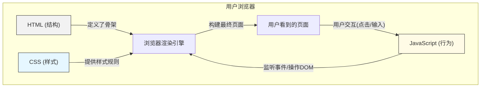

# 0.3.4 为什么骨架、衣服和动作要分开——三者协作：分离关注点的设计思想

## 认知重构：从“大杂烩”到“各司其职”

初学者最容易犯的错误，就是把 HTML, CSS, 和 JavaScript 搅和在一起，写出“大杂烩”式的代码。比如，在 HTML 标签里直接写 `style` 属性，或者用 `onclick` 属性执行 JavaScript 代码。

这种做法在小规模的练习中看似方便，但在真实项目中，它是一场灾难的开始。代码会变得极难阅读、维护和扩展。想象一下，要修改一个按钮的颜色，你可能需要在几十个 HTML 文件中手动搜索和替换，而不是只改动一个 CSS 文件的一行代码。

**正确的认知：HTML, CSS, 和 JavaScript 是一个团队，但团队成员应该各司其职，而不是互相干涉。** 这种思想，就是软件工程中至关重要的**关注点分离 (Separation of Concerns, SoC)**。

*   **HTML (结构层)**: 只负责定义页面的内容和结构。它像建筑的钢筋骨架，决定了哪里是客厅，哪里是卧室。
*   **CSS (表现层)**: 只负责定义页面的样式和布局。它像建筑的室内设计，决定了墙壁刷什么颜色的漆，家具如何摆放。
*   **JavaScript (行为层)**: 只负责定义页面的交互和逻辑。它像建筑的水电系统，让灯能亮，水能流。

## 本质还原：一种可持续维护的契约

关注点分离的本质，是在这三层之间建立一种清晰的、可持续维护的“契约”。

*   **CSS 通过“选择器”与 HTML 签订契约**。CSS 说：“我不管你 HTML 结构怎么变，只要你有一个 class 是 `primary-button` 的元素，我就会把它渲染成蓝色。”
*   **JavaScript 通过“选择器”和“事件”与 HTML 签订契约**。JavaScript 说：“我不管你长什么样，只要页面里有一个 ID 是 `login-form` 的表单，并且它被提交 (submit) 了，我就会负责处理登录逻辑。”

这种基于“契约”的协作模式，使得三层可以独立地进行修改和扩展，而不会轻易地破坏彼此的功能。

## 可视化解构：三层协作模型

这张图清晰地展示了：
1.  HTML, CSS, JS 作为独立的模块被浏览器加载。
2.  浏览器渲染引擎将它们“组合”起来，生成用户最终看到的页面。
3.  用户的交互行为（如点击）会触发 JavaScript，JavaScript 再去操作 DOM（即改变 HTML 结构或通过修改 class 来间接改变 CSS），从而更新视图，形成一个完整的交互闭环。

## 觉知：如何识破“坏代码”

当你 Review AI 生成的代码时，要像一个经验丰富的架构师一样，对违反“关注点分离”原则的“坏味道”保持警惕：

*   **HTML 中的 `style` 属性**: ` 
...
 `
    *   **为什么是坏味道？** 这将样式死死地焊在了结构上。如果未来需要统一修改所有段落的字体大小，这将是一场噩梦。
    *   **正确做法**: 在 CSS 文件中定义一个类 ` .error-text { color: red; font-size: 14px; } `，然后在 HTML 中使用 ` 
...
 `。

*   **HTML 中的 `on*` 事件属性**: ` <button onclick="myFunction()">Click me</button> `
    *   **为什么是坏味道？** 这将行为与结构混合。使得 JavaScript 代码散落在各个 HTML 文件中，难以管理和调试。
    *   **正确做法**: 在独立的 JS 文件中，通过 `document.getElementById('my-button').addEventListener('click', myFunction);` 来绑定事件。

*   **JavaScript 中直接操作 `style`**: ` element.style.color = 'blue'; element.style.backgroundColor = 'white'; `
    *   **为什么是坏味道？** 当需要修改的样式很多时，这会让 JS 代码变得臃肿且混乱，把表现层的逻辑带入了行为层。
    *   **正确做法**: 在 CSS 中预先定义一个类 ` .is-active { color: blue; background-color: white; } `，然后在 JS 中只做一件事：` element.classList.add('is-active'); `。让 JS 专注于“切换状态”，而不是关心“状态的具体样式”。

## AI 协作指南

### 核心意图

向 AI 强调你希望它生成**“结构、样式、行为分离”**的代码。

### 需求定义公式

**“给我创建一个[组件]，请将 HTML, CSS, 和 JavaScript 分别放在独立的代码块中。使用 class 作为 CSS 和 JavaScript 的连接点。”**

*   **示例**：“我需要一个可折叠的手风琴组件。请为我提供三部分代码：HTML 结构（使用 `div` 和 `button`），CSS 样式（定义展开和折叠两种状态的 class），以及 JavaScript 逻辑（通过切换 class 来控制展开和折叠，而不是直接操作 style）。”

### 交互策略

1.  **强制分离**：明确要求 AI “不要使用内联样式 (inline style)” 和 “不要使用 on-event 属性”。
2.  **基于状态切换进行沟通**：多使用“切换 class”、“添加/移除 class”这样的指令，引导 AI 通过改变状态（class）来驱动视图变化。
3.  **分步索取**：你可以先让 AI 生成 HTML 结构，然后基于这个结构，再让它分别生成 CSS 和 JavaScript。这能让你更好地控制每一部分代码的质量。

掌握了“关注点分离”，你就掌握了编写可维护、可扩展前端代码的钥匙。这是从入门到专业的必经之路，也是与 AI 高效协作，产出高质量代码的基础。

