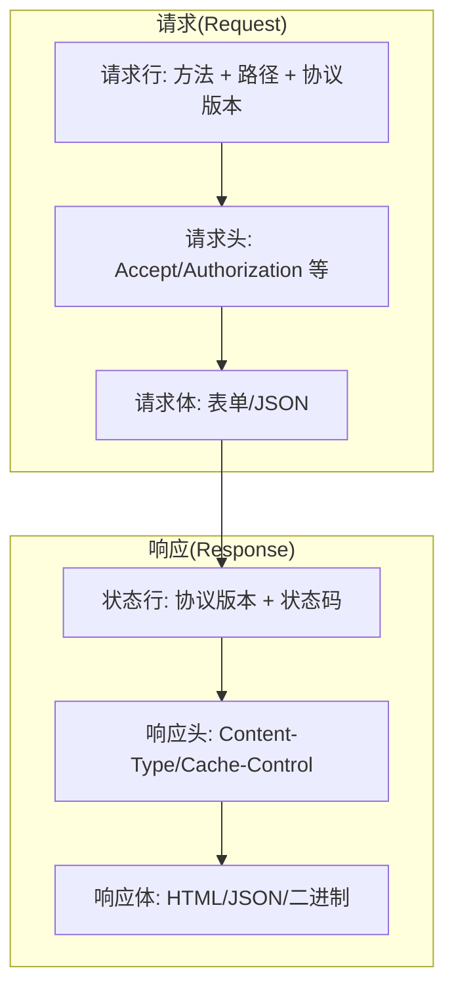
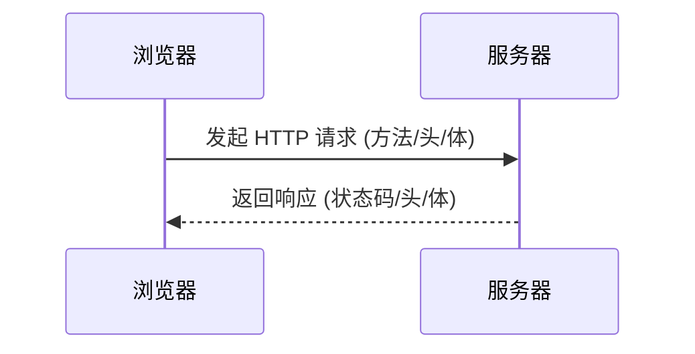

# 0.3.5.1 浏览器在说什么——HTTP 协议基础：请求/响应/状态码

## 一句话破题

HTTP 是浏览器与服务器“对话”的统一格式：**客户端发请求 (Request)，服务器回响应 (Response)**，双方依据固定的语法交流。

## 核心价值

- 统一语义：方法 (GET/POST/PUT/DELETE/PATCH) 与状态码 (2xx/3xx/4xx/5xx) 让沟通有章可循。
- 松耦合：客户端与服务器只需约定接口与交换格式（如 JSON），便可独立演进。
- 可观测：请求与响应易于记录与分析，支持可靠的调试与监控。

## 本质还原：请求与响应的结构

### 方法的语义与幂等性

- `GET`：读取资源。应无副作用、幂等。
- `POST`：创建或触发动作。通常非幂等。
- `PUT`：整体更新资源。幂等。
- `PATCH`：部分更新资源。通常非幂等。
- `DELETE`：删除资源。幂等（重复删除不应失败）。

### 常见状态码

- `200` 成功；`201` 已创建；`204` 无内容
- `301/302` 重定向；`304` 命中缓存
- `400` 请求错误；`401` 未认证；`403` 未授权；`404` 未找到
- `500` 服务器错误；`502` 网关错误；`503` 服务不可用

## 可视化交互：一次完整的请求-响应

## 觉知：Review 代码时该看哪里

- 方法与语义是否匹配？写入操作却用 `GET` 是错误设计。
- 状态码是否正确？不要把业务错误也返回 `200`。
- 头信息是否合理？`Content-Type`/`Accept` 是否与实际内容一致。
- 幂等性是否被破坏？重复调用的影响是否明确。

## AI 协作指南

- 核心意图：让 AI 帮你“设计规范的接口”或“诊断某个请求为何失败”。
- 需求定义公式：
  - “为 `/api/users` 设计 REST 接口：支持分页查询 (GET)、创建 (POST)、整体更新 (PUT)、删除 (DELETE)，返回 JSON。”
  - “我访问 `https://api.example.com/users` 返回 `403`，请给我在 PowerShell 下排查的命令。”
- 关键术语：`方法`, `状态码`, `请求头`, `响应头`, `幂等性`, `缓存`。
- Windows PowerShell 常用命令：
  - `Invoke-WebRequest -Method GET -Uri https://api.example.com/users -UseBasicParsing`
  - `Invoke-RestMethod -Method POST -Uri https://api.example.com/users -Body '{"name":"Alice"}' -ContentType 'application/json'`
  - `Test-NetConnection -ComputerName api.example.com -Port 443`

## 避坑指南

- 不要用 `GET` 传敏感信息；避免把令牌放在查询字符串。
- 返回体与 `Content-Type` 必须匹配；JSON 一律用 `application/json`。
- 失败场景请返回明确的错误码与错误信息，便于客户端处理。
