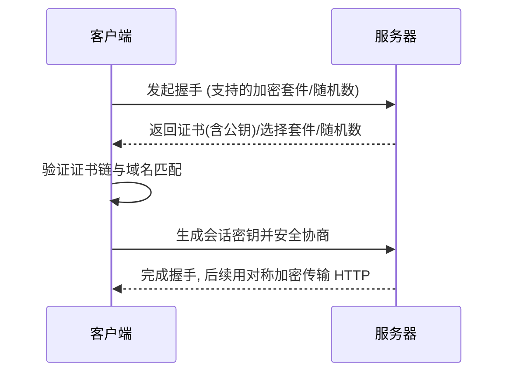

# 0.3.5.2 为什么网址会有把锁——HTTPS 与安全：SSL/TLS 证书配置

## 一句话破题

HTTPS = HTTP + TLS。它通过加密、校验与证书，让你的数据在互联网上**保密**、**不被篡改**、**对方身份可信**。

## 核心价值

- 机密性：防止窃听（中间人无法读懂内容）。
- 完整性：防止篡改（内容被改会被发现）。
- 身份认证：客户端能确认服务器确实是“它自己”（证书链与域名匹配）。

## 本质还原：TLS 握手的简化视图

### 证书与信任

- 证书由受信任的 CA 颁发，包含公钥与域名信息。
- 浏览器验证证书链（中间证书 → 根证书），并检查域名是否匹配。
- 生产环境应启用 HSTS (`Strict-Transport-Security`) 强制全站 HTTPS。

## 觉知：Review 配置时该看哪里

- 证书域名是否与站点完全匹配（含子域与通配符）。
- 证书是否过期，链是否完整，是否启用现代加密套件。
- 是否存在“混合内容”（HTTPS 页面引用了 HTTP 资源）。
- 反向代理处的 TLS 终止配置是否正确（Nginx/Cloudflare 等）。

## AI 协作指南

- 核心意图：让 AI 帮你“配置证书”或“诊断 HTTPS 访问异常”。
- 需求定义公式：
  - “我在 Nginx 前面启用了 TLS 终止，请生成完整的证书链配置，并开启 HSTS 与重定向到 HTTPS。”
  - “访问 `https://api.example.com` 报证书错误，请逐步检查证书域名、有效期与链。”
- Windows PowerShell 常用命令：
  - `Test-NetConnection -ComputerName api.example.com -Port 443`
  - `Invoke-WebRequest -Uri https://api.example.com -UseBasicParsing`

## 避坑指南

- 证书只覆盖申请的域名；`www.example.com` 与 `api.example.com` 需要分别覆盖或使用通配符。
- 别在生产环境提供 `http://` 入口；强制跳转到 HTTPS 并启用 HSTS。
- 避免在前端代码里硬编码敏感信息；所有数据传输都走 HTTPS。
