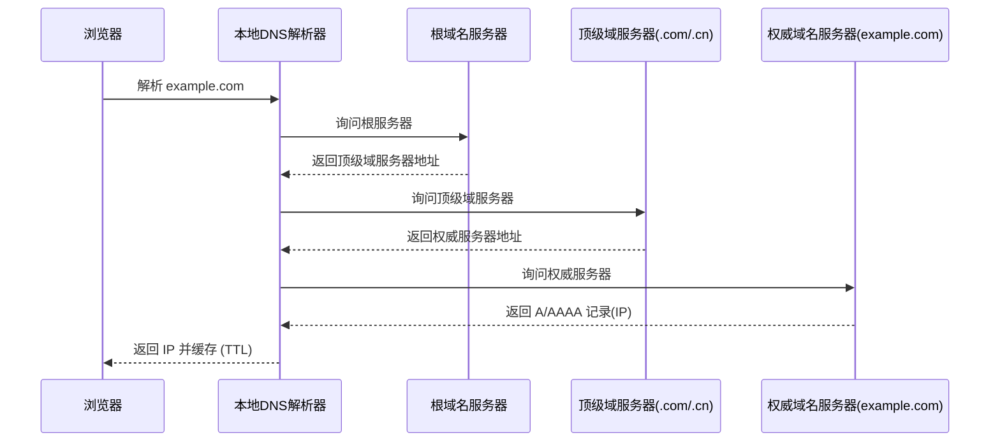

# 0.3.5.3 https://www.baidu.com/search?q=www.baidu.com 是什么——域名与 DNS：域名解析与配置

## 一句话破题

DNS 就是互联网的“电话簿”：把好记的**域名**翻译成难记的**IP 地址**，让你的浏览器知道该去找哪台机器。

## 核心概念

- 记录类型：`A`(IPv4)、`AAAA`(IPv6)、`CNAME`(别名)、`MX`(邮件)、`TXT`(文本/验证)、`NS`(域名服务器)。
- TTL（生存时间）：缓存多久。TTL 越低越实时，越高越省资源但更新慢。
- 递归解析：本地解析器逐级询问根 → 顶级域 → 权威服务器，最终得到 IP。

## 解析流程可视化

## 觉知：配置与排错的关注点

- CNAME 与 A 不要相互循环；CNAME 不能与其他记录同名并存。
- 记录值是否正确（IPv4/IPv6）；是否遗漏 `www` 与根域名的分别配置。
- DNS 变更的传播需要时间；不同运营商的解析生效速度不一。

## AI 协作指南

- 核心意图：让 AI 帮你“设计记录集”或“定位解析失败原因”。
- 需求定义公式：
  - “为 `example.com` 配置 `A` 与 `AAAA` 记录，`www` 使用 CNAME 指向根域名。”
  - “`api.example.com` 无法访问，请逐步检查记录是否存在、TTL 是否过低、权威 DNS 是否可达。”
- Windows PowerShell 常用命令：
  - `Resolve-DnsName example.com`
  - `nslookup example.com`
  - `ipconfig /flushdns`

## 避坑指南

- 不要用过短的 TTL 在高流量系统中频繁更新，容易导致解析压力过高。
- CDN/代理场景下注意源站与边缘节点的 IP 区分；避免直接暴露源站。
