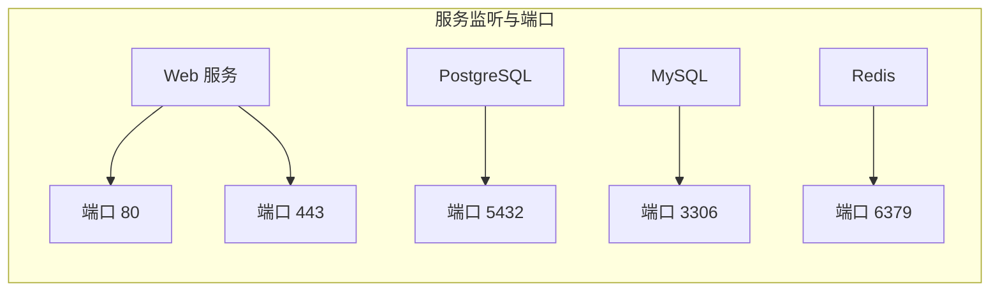

# 0.3.5.4 电脑上的门牌号——端口与服务：常用端口与服务映射

## 一句话破题

端口就是一台电脑上的“门牌号”。不同服务监听不同端口，比如网页服务常见 `80/443`，数据库常见 `5432/3306`。

## 核心概念

- 端口范围：`0-65535`，其中 `0-1023` 为知名端口（需管理员权限），`1024-49151` 为注册端口，`49152-65535` 为临时端口（客户端连接时随机分配）。
- 一端口一进程：同一时刻一个端口只能被一个进程占用（同协议）。
- 常见映射：
  - `80` HTTP，`443` HTTPS
  - `22` SSH
  - `53` DNS
  - `5432` PostgreSQL，`3306` MySQL，`6379` Redis

## 可视化：服务与端口的关系

## 觉知：排查端口占用与冲突

- 在 Windows PowerShell 中：
  - 查看端口占用：`Get-NetTCPConnection | Where-Object { $_.LocalPort -eq 3000 }`
  - 通过 PID 查进程：`Get-Process -Id <PID>`
  - 经典方式：`netstat -ano | findstr ":3000"`
- 启动失败，多半是端口被占用或权限不够；改端口或释放占用。

## AI 协作指南

- 核心意图：让 AI 帮你“定位端口冲突”或“规划服务端口映射”。
- 需求定义公式：
  - “本地 `3000` 端口被占用，请给我在 PowerShell 下的排查命令，并建议修改端口的方案。”
  - “为 Web/API/DB 规划端口，遵循知名端口与安全策略。”
- 关键术语：`端口范围`, `临时端口`, `监听`, `PID`, `端口冲突`。

## 避坑指南

- 不要在生产环境使用随机端口暴露服务；规范端口并在防火墙中明确开放。
- 避免多个服务抢同一端口；引入反向代理统一入口更容易管理。
