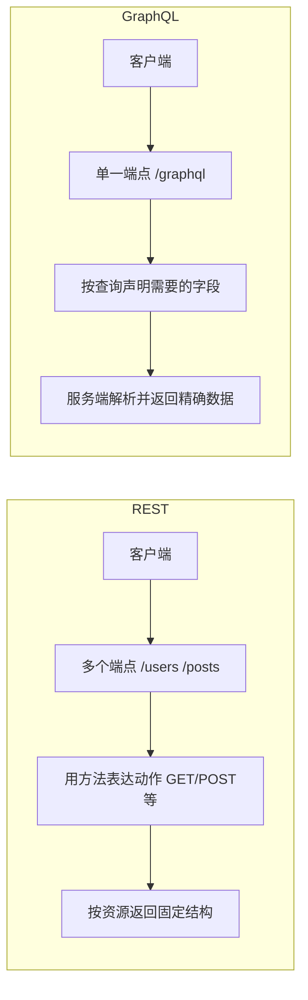

# 0.3.5.5 程序间的通用语言——API 设计基础：RESTful 与 GraphQL 概念

## 认知重构：从“接口”到“契约”

API 不只是“一个地址加点数据”，而是**客户端与服务端的协作契约**：双方约定资源结构、交互方式与错误语义。主流风格有两种：REST 与 GraphQL。

## 本质还原：REST 与 GraphQL 的核心差异



### REST 要点

- 以“资源”为中心：`/users`, `/posts/{id}`。
- 方法表达语义：读用 `GET`，写用 `POST/PUT/PATCH/DELETE`。
- 状态码表达结果：`200/201/204/4xx/5xx`。
- 支持缓存：`ETag`/`Cache-Control`。
- 分页、筛选与排序：`?page=1&pageSize=20&sort=createdAt`。

### GraphQL 要点

- 单一端点，按查询语句返回所需字段，避免“过多或过少的数据”。
- 强类型 Schema 定义数据结构与关系。
- 由 Resolver 实现字段级的数据获取。
- 支持聚合多个后端源，前端一次拿到所需数据。

## 落地与实战：最小闭环示例

### 需求 (Mini-PRD)

- 获取用户列表与其文章数。
- 前端希望一次请求拿到用户 `id/name` 与 `postCount`。

### REST 方案

- 端点：`GET /users` 返回用户数组；`GET /posts?userId=<id>` 获取该用户的文章，再在客户端汇总。
- 优点：简单直观；缓存与监控成熟。
- 缺点：可能需要多次请求；前端需要汇总逻辑。

### GraphQL 方案

- 查询：

```graphql
query {
  users {
    id
    name
    postCount
  }
}
```

- 优点：一次拿齐，需要什么拿什么。
- 缺点：服务端需要维护 Schema/Resolver；监控与缓存策略需专门设计。

## 验收清单

- REST：
  - 方法与语义一致；状态码与错误体规范；分页参数与默认值明确。
  - 返回的 `Content-Type` 与内容一致；支持合理的缓存策略。
- GraphQL：
  - Schema 边界清晰（必填/可选）；错误结构一致；复杂查询有速率限制。
  - Resolver 无 N+1 问题（必要时加入数据加载器）。

## AI 协作指南

- 核心意图：让 AI 按“契约”生成接口与验证脚本。
- 需求定义公式：
  - “为用户资源设计 REST 接口，返回分页数据，并且提供错误示例与状态码说明。”
  - “请提供一个 GraphQL Schema 与对应 Resolver 的雏形，用于查询 `users{id,name,postCount}`。”
- 关键术语：`资源(REST)`, `状态码`, `ETag`, `Schema`, `Resolver`, `N+1`。
- Windows PowerShell 调试：
  - REST：`Invoke-RestMethod -Method GET -Uri https://api.example.com/users?page=1&pageSize=10`
  - GraphQL：
    ```powershell
    $body = @{ query = "query { users { id name } }" } | ConvertTo-Json
    Invoke-RestMethod -Method POST -Uri https://api.example.com/graphql -Body $body -ContentType 'application/json'
    ```

## 决策建议

- 后端资源清晰、缓存友好、监控成熟的场景选 REST；
- 前端组合数据、减少往返、字段可裁剪的场景选 GraphQL；
- 大多数产品可采用“REST 为主，关键聚合场景引入 GraphQL”的混合策略。
