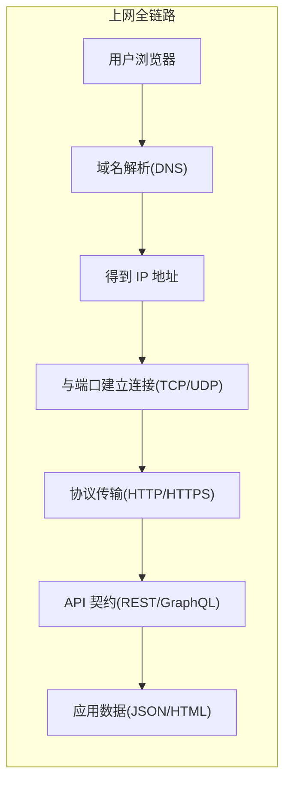

# 0.3.5 你的电脑如何上网——网络基础：HTTP/HTTPS/域名/端口/API 概念

## 一句话破题

上网的全链路可以概括为：**域名解析到 IP → 通过端口建立连接 → 用 HTTP/HTTPS 交换数据 → 以 API 作为程序间的协作契约**。

## 章节导览

- **HTTP 协议**：浏览器与服务器的“对话格式”，包含方法、头、体与状态码。
- **HTTPS 与证书**：在 HTTP 外面套一层“加密与身份验证”的保护壳，保障隐私与完整性。
- **DNS 域名解析**：把人类可读的域名翻译成机器可读的 IP 地址。
- **端口与服务**：一台机器上的“门牌号”，不同服务监听不同端口。
- **API 风格**：REST 与 GraphQL，定义程序间如何协作与传输数据。

## 可视化总览

## AI 协作指南

- 核心意图：让 AI 帮你“定位网络故障点”或“设计合理的接口契约”。
- 需求定义公式：
  - “请帮我诊断访问 `example.com` 失败的原因，依次检查 DNS 解析、端口连通性与 HTTPS 证书。”
  - “请为用户列表提供一个 REST API，返回分页数据，包含总数与当前页。”
- 关键术语：`DNS`, `端口连通性`, `HTTP 方法/状态码`, `HTTPS 证书`, `REST`, `GraphQL`。
- 在 Windows PowerShell 中的常用检查命令：
  - `Resolve-DnsName example.com`
  - `Test-NetConnection -ComputerName example.com -Port 443`
  - `Invoke-WebRequest -Uri https://example.com -UseBasicParsing`
  - `Get-NetTCPConnection | Where-Object { $_.LocalPort -eq 3000 }`

## 避坑指南

- 把业务错误一律返回 `200` 是反模式，应使用恰当的状态码（如 `400/401/403/404/500`）。
- 生产环境必须启用 HTTPS，避免明文传输与中间人攻击；同时注意“混合内容”问题。
- DNS 变更有传播延迟，TTL 过低会导致频繁查询，过高会导致更新滞后。
- 端口冲突会导致服务启动失败，先查占用再启动：`Get-NetTCPConnection -LocalPort <端口>`。
