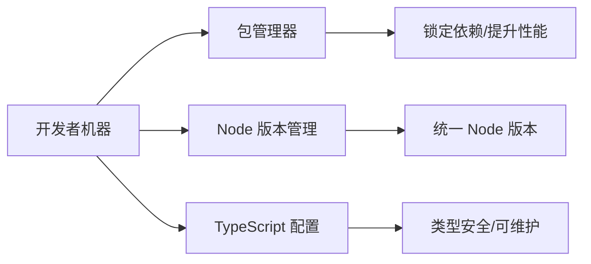

# 0.4 搭建你的编程工作室——开发环境配置：Node.js、包管理器与工具链

## 一句话破题

稳定的开发环境 = 合适的 Node 版本 + 高效的包管理器 + 严谨的 TypeScript 配置。先跑通最小闭环，再优化性能与团队协作。

## 章节导览

- 包管理器选择：性能/磁盘占用/一致性对比，`npm` vs `pnpm` vs `yarn`。
- Node 版本管理：跨平台 `nvm`/`nvm-windows`，`.nvmrc` 项目级锁定与环境变量配置。
- TypeScript 配置：`tsconfig.json` 严格模式与路径别名最佳实践。

## 总览可视化

## AI 协作指南

- 核心意图：让 AI 帮你“搭环境”和“制定规范”，而不是零碎地安装依赖。
- 需求定义公式：
  - “在 Windows PowerShell 下，使用 `nvm-windows` 安装并切换到 Node LTS 版本，生成 `.nvmrc` 与 `tsconfig.json` 严格模式配置。”
  - “对现有项目的包管理器进行迁移到 `pnpm`，并提供缓存与 registry 优化命令。”
- 关键术语：`nvm-windows`, `.nvmrc`, `NODE_ENV`, `registry`, `tsconfig`, `strict`。

## 避坑指南

- 全局 Node 与项目 Node 不一致导致构建失败；使用 `.nvmrc` 锁定版本并在 CI 中强制检查。
- 包管理器混用会破坏锁文件；团队统一选择一个，并清理缓存与锁文件后再迁移。
- TypeScript 未开启严格模式造成隐形错误；务必开启 `strict` 与 `noImplicitAny`。
