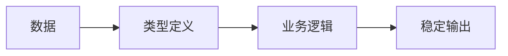

# 0.5.1 动态与静态到底在说什么——JavaScript/TypeScript 思维转换：从动态到静态类型

## 认知重构：从“数据随用随变”到“先定类型再用”

JavaScript 的动态类型让开发很自由，但自由伴随不确定；TypeScript 用静态类型为数据“立约”，把风险前置到编译期。



## 基础类型

```ts
const s: string = 'hello'
const n: number = 42
const b: boolean = true
const arr: number[] = [1, 2, 3]
const obj: { id: string; name: string } = { id: 'u1', name: 'Alice' }
```

## 接口与类型别名：interface vs type

- interface：更适合描述**对象形状**与**可扩展接口**。
- type：更通用，支持联合与交叉、条件类型等更复杂的建模。

```ts
interface User {
  id: string
  name: string
}

type Id = string | number
type UserLite = Pick<User, 'id' | 'name'>
```

## 联合类型与交叉类型：| vs &

```ts
type Admin = { role: 'admin'; permissions: string[] }
type Member = { role: 'member'; teamId: string }

type UserRole = Admin | Member
type WithTimestamp = { createdAt: Date }
type AdminWithTimestamp = Admin & WithTimestamp
```

## 类型缩小：类型守卫与断言

```ts
function formatId(id: string | number): string {
  if (typeof id === 'string') {
    return id.toUpperCase()
  }
  return id.toString()
}

function getBadge(u: Admin | Member): string {
  if ('permissions' in u) {
    return 'ADMIN'
  }
  return 'MEMBER'
}

function ensureArray(input: unknown): string {
  if (Array.isArray(input)) {
    return input.join(',')
  }
  return String(input)
}
```

断言只在你能保证类型正确时使用；优先通过守卫收窄类型，再进行断言。

## unknown vs any：类型安全的权衡

- `any` 放弃类型检查，风险不可控；**禁用**。
- `unknown` 需要先收窄再使用，安全且灵活。

```ts
function parse(data: unknown): string {
  if (typeof data === 'string') {
    return data
  }
  if (typeof data === 'number') {
    return data.toString()
  }
  return JSON.stringify(data)
}
```

## 严格模式配置与最佳实践

```json
{
  "compilerOptions": {
    "strict": true,
    "noImplicitAny": true,
    "noImplicitReturns": true
  }
}
```

## AI 协作指南

- 核心意图：让 AI 先产出**类型与函数签名**，再补实现；以契约驱动代码生成。
- 需求定义公式：
  - “定义用户与角色的类型，写一个函数输入 `Admin | Member` 返回 `string` 的徽章文本，禁止使用 `any`。”
- 关键术语：`interface`, `type`, `union`, `intersection`, `narrowing`, `unknown`。

## 避坑指南

- 任何不确定类型都不要用 `any`；用 `unknown` 并收窄。
- 断言不是规避错误的手段；优先守卫。
- 保持签名稳定；变更签名需同步更新调用方。
