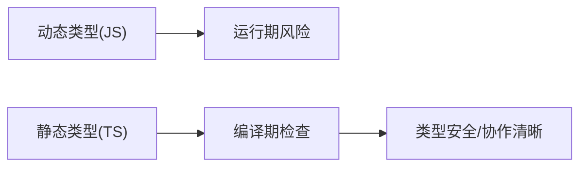

# 0.5 从随心所欲到规行矩步——JS → TS 思维转换

## 一句话破题

TypeScript 的价值不在“语法更复杂”，而在于把“运行时报错”提前到“编译期”。它让协作像签合同一样明确，减少猜测与隐性 bug。

## 章节导览

- 动态与静态的核心差异：数据先有类型，再写逻辑。
- 基础类型与复合类型：从 `string/number/boolean` 到 `array/object`。
- 接口与类型别名：`interface` vs `type` 的适用场景。
- 联合与交叉：`|` 与 `&` 的建模方式。
- 类型缩小：类型守卫与断言的工程用法。
- unknown vs any：安全边界与折中方案。
- 严格模式与团队规范：`strict/noImplicitAny/noImplicitReturns` 等。

## 可视化总览

## AI 协作指南

- 核心意图：让 AI 按“契约”生成类型与函数签名，再填充实现。
- 需求定义公式：
  - “给我为用户列表写一个类型定义与分页函数的签名，要求返回值包含分页信息与总数。”
- 关键术语：`interface`, `type`, `union`, `intersection`, `narrowing`, `unknown`。

## 避坑指南

- 禁止使用 `any`；不确定类型时用 `unknown` 并收窄。
- 断言不是“消灭错误”的工具；先做类型守卫再断言。
- 别在实现中偷换返回类型；函数签名就是契约。
