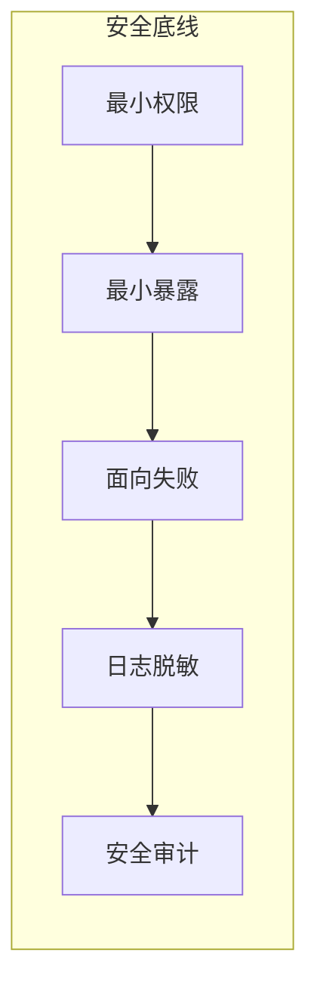

# 0.6 别让你的网站裸奔——开发安全底线

## 一句话破题

安全不是堆功能，而是建立底线：**最小权限、最小暴露、面向失败、日志脱敏与定期审计**。先守底线，再谈高级能力。

## 章节导览

- 安全设计原则：像保安一样思考，建立最小化与防御性策略。
- 环境变量与密钥管理：把秘密放在正确的地方，并制定轮换机制。

## 总览可视化

## AI 协作指南

- 核心意图：让 AI 帮你“按原则设计方案”，而非零碎修补。
- 需求定义公式：
  - “为后台管理系统设计最小权限模型、接口暴露策略与日志脱敏方案，输出验收清单。”
- 关键术语：`最小权限`, `最小暴露`, `异常处理`, `日志脱敏`, `安全审计`。

## Windows PowerShell 常用操作

- 查看环境变量：`Get-ChildItem Env:`
- 设置会话变量：`$env:API_KEY = '***'`
- 持久化变量：`setx API_KEY '***'`

## 避坑指南

- 把密钥硬编码进代码或日志是高危行为；使用环境变量与密钥管理服务。
- 接口不要过度返回数据；遵循“所需即所返”。
- 异常时默认拒绝而非默认放行；记录但不暴露内部细节。
