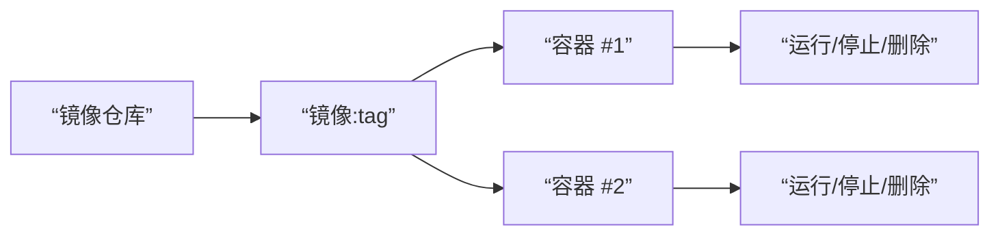

# 0.7.1 模具与标准零件——镜像与容器：构建/运行/生命周期管理

## 一句话破题

镜像是只读“模具”，容器是运行中的“标准零件”。先有镜像，后有容器；容器的生命周期可控：创建、启动、停止、删除。

## 本质还原：镜像与容器的关系



## Windows PowerShell 常用命令

```powershell
Get-Command docker
docker pull node:18-alpine
docker run -d --name app -p 3000:3000 node:18-alpine
docker ps -a
docker logs -f app
docker stop app
docker rm app
docker rmi node:18-alpine
```

## 构建你的镜像

`Dockerfile`

```Dockerfile
FROM node:18-alpine
WORKDIR /app
COPY package.json package-lock.json /app/
RUN npm ci
COPY . /app
EXPOSE 3000
CMD ["npm","start"]
```

构建与运行：

```powershell
docker build -t myapp:latest .
docker run -d --name myapp -p 3000:3000 myapp:latest
```

## 觉知：面向失败的生命周期管理

- 容器异常退出时，先看日志再重启：`docker logs -f <容器名>`。
- 端口冲突导致启动失败，先查占用：`Get-NetTCPConnection | Where-Object { $_.LocalPort -eq 3000 }`。
- 保持“镜像不可变”，变更通过重建镜像与重新部署完成。

## AI 协作指南

- 核心意图：让 AI 输出从 Dockerfile 到运行命令的完整闭环。
- 需求定义公式：
  - “为一个监听 `3000` 端口的 Node 应用生成 `Dockerfile` 与运行命令，使用 `node:18-alpine`，并提供查看日志与排障命令。”
