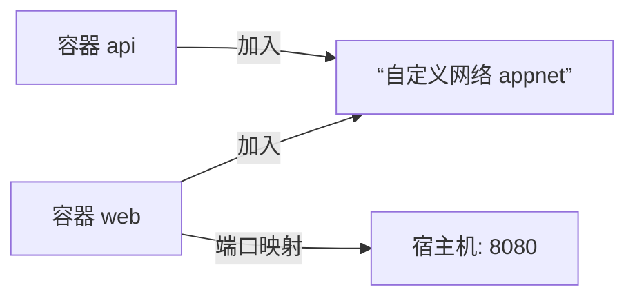

# 0.7.3 集装箱之间如何对话——网络与端口

## 一句话破题

Docker 通过“网络”让容器互联，通过“端口映射”把服务暴露到宿主机。默认 `bridge` 网络已够用，复杂场景用自定义网络。

## 网络类型速览

- `bridge`：默认容器网络，容器间可互相通信。
- `host`：与宿主机共享网络栈（Linux 专用）。
- `none`：不配置网络。

## 端口映射与服务暴露

```powershell
docker run -d --name web -p 8080:80 nginx:alpine
```

访问：`http://localhost:8080`

## 自定义网络与服务发现

```powershell
docker network create appnet
docker run -d --name api --network appnet myapi:latest
docker run -d --name web --network appnet -p 8080:80 myweb:latest
```

在同一网络内，容器可通过“容器名”互相访问，如 `http://api:3000`。

## 网络可视化



## Windows PowerShell 常用命令

- 列出网络：`docker network ls`
- 检查网络：`docker network inspect appnet`
- 断开/连接：`docker network disconnect appnet web`、`docker network connect appnet web`

## AI 协作指南

- 核心意图：让 AI 设计“网络拓扑与端口策略”。
- 需求定义公式：
  - “为 web/api 两个服务创建自定义网络与端口映射，web 通过容器名访问 api，并给出 PowerShell 验证命令。”
