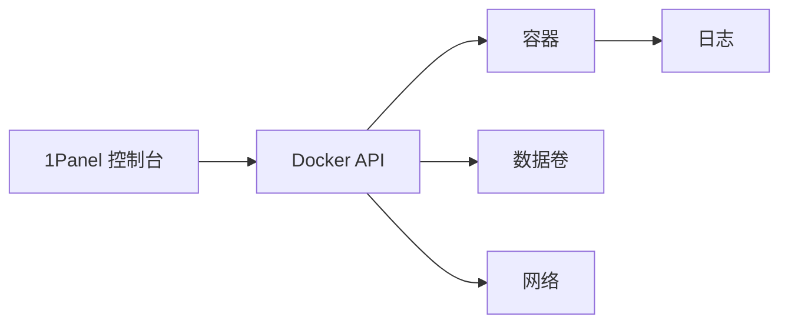

# 0.7.5 可视化的集装箱港口——1Panel 核心理念：运行环境 = 预配置 Docker

## 核心理念

1Panel 将“Docker 应用”做成可视化的管理与编排：镜像、容器、网络、卷、环境变量与日志，在一个控制台里完成创建、更新与运维。

## 能力速览

- 应用市场：一键创建常见应用（数据库、缓存、Web 环境）。
- 镜像与容器管理：拉取、更新、启动、停止、重启、删除。
- 环境变量与端口：以表单方式配置，避免命令复杂度。
- 数据卷与备份：挂载路径、快照与定期备份。
- 网络：自定义网络与服务暴露策略。
- 日志与监控：查看容器日志与资源占用。

## 工作流可视化

## 落地与实战：创建一个应用

- 选择应用 → 配置镜像版本与端口映射 → 设置环境变量 → 挂载数据卷 → 创建。
- 验证：查看容器状态、日志与端口可访问性。

## 验收清单

- 端口：服务对外暴露的端口明确且无冲突。
- 环境变量：敏感信息来源安全，遵循最小暴露。
- 数据卷：持久化路径清晰，定期备份策略到位。
- 日志：日志转储与保留周期清晰，脱敏合规。

## AI 协作指南

- 核心意图：让 AI 输出“1Panel 下的容器化配置方案”。
- 需求定义公式：
  - “在 1Panel 中创建一个 `myapp`，指定镜像版本、端口映射、环境变量与数据卷挂载，输出验收清单。”

## 避坑指南

- 不要在生产暴露多余端口；只开放必要端口并加防火墙策略。
- 数据卷路径规范化；避免挂载到临时目录导致数据丢失。
- 镜像更新后需验证兼容性；先在测试环境演练再发布。
