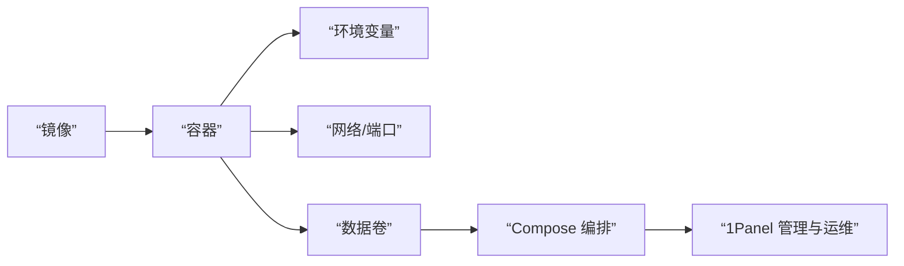

# 0.7 把程序装进集装箱——Docker 核心概念

## 一句话破题

Docker 用“镜像”定义运行环境，用“容器”执行你的程序；再用“环境变量、网络、数据卷与 Compose”把它变成可编排、可复用的工程能力。

## 章节导览

- 镜像与容器：构建、运行与生命周期管理。
- 环境变量配置：安全注入配置与密钥。
- 网络与端口：容器间通信与服务暴露。
- 数据卷与 Compose：持久化与多服务编排。
- 1Panel：用图形化面板管理 Docker 应用。

## 总览图

## AI 协作指南

- 核心意图：让 AI 输出“完整的容器化方案”，而不是零碎命令。
- 需求定义公式：
  - “为一个 Node.js 应用生成 Dockerfile 与运行命令，包含端口映射、环境变量与数据卷，并提供 Compose 版本。”
- 关键术语：`image`, `container`, `ENV`, `-p`, `volume`, `docker-compose`, `1Panel`。

## Windows PowerShell 常用命令

- 检查 Docker：`Get-Command docker`
- 查看：`docker ps -a`
- 日志：`docker logs -f <容器名>`
- 进入容器：`docker exec -it <容器名> sh`
