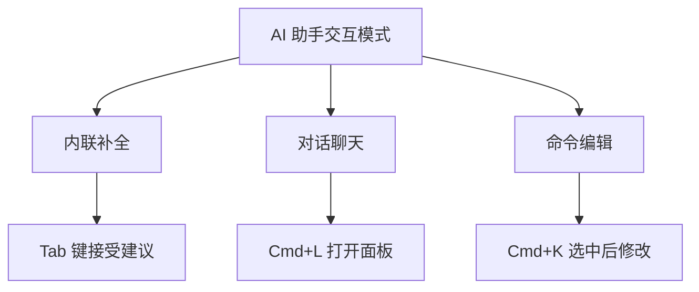

# 1.1.2 给你的 IDE 装上大脑——AI 助手集成：Trae/Cursor 配置

### 一句话破题

AI 助手是你的编程搭档——它能理解你的意图、生成代码、解释错误，甚至帮你重构整个模块。配置好它，就像给你的 IDE 装上了一颗会思考的大脑。

### 核心价值

在 Vibe Coding 中，AI 助手不是"辅助工具"，而是"核心生产力"。你需要学会的不是"如何写代码"，而是"如何让 AI 帮你写出正确的代码"。

### Cursor 内置 AI 配置

如果你选择了 Cursor，AI 已经内置好了，只需要简单配置：

**步骤 1：选择模型**

打开 Cursor 设置（Cmd/Ctrl + ,），找到 `Models` 选项：

| 模型 | 特点 | 适用场景 |
|------|------|----------|
| **Claude 3.5 Sonnet** | 代码能力强，理解力佳 | 复杂逻辑、代码生成 |
| **GPT-4o** | 综合能力均衡 | 日常编程、问答 |
| **cursor-small** | 速度快，成本低 | 简单补全 |

**推荐配置**：日常使用 Claude 3.5 Sonnet，简单补全用 cursor-small。

**步骤 2：配置 API Key（可选）**

Cursor 免费版有调用限额。如果你有自己的 OpenAI 或 Anthropic API Key，可以在设置中添加，解锁无限制使用。

### VS Code + AI 插件方案

如果你选择 VS Code，需要安装 AI 插件：

**方案 A：GitHub Copilot**

```
1. 在扩展商店搜索 "GitHub Copilot"
2. 安装后登录 GitHub 账号
3. 需要付费订阅（学生免费）
```

**方案 B：Trae（国内可用）**

```
1. 访问 trae.ai 下载 Trae 编辑器
2. 或在 VS Code 中安装 Trae 插件
3. 国内网络环境友好
```

### AI 助手的三种交互模式

无论使用哪个工具，AI 助手都有三种核心交互方式：



1. **内联补全**：你打字时，AI 自动预测后续代码，按 Tab 接受
2. **对话聊天**：像聊天一样讨论代码问题，AI 会结合项目上下文回答
3. **命令编辑**：选中一段代码，用自然语言描述修改需求

### 验证配置成功

打开任意代码文件，尝试：

1. 输入 `// 创建一个函数，计算两个数的和`，看 AI 是否自动补全
2. 按 `Cmd/Ctrl + L`，输入"解释这段代码的作用"，看是否有回复

如果以上两步都正常工作，恭喜你，AI 助手配置成功！

### 避坑指南

- **网络问题**：大部分 AI 服务需要科学上网，或者选择国内可用的方案（如 Trae）
- **额度限制**：免费版通常有调用次数限制，重要项目建议升级付费版或使用自己的 API Key
- **隐私考量**：代码会上传到云端处理，敏感项目需注意合规性
