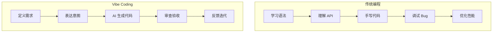

# 1.2.1 从编码员到指挥官——AI 辅助编程的核心思维转变

### 认知重构

在传统编程中，你是"施工工人"——亲手敲下每一行代码，亲自解决每一个 bug。在 Vibe Coding 中，你是"项目总设计师"——你的任务是提供清晰的蓝图，让 AI 这支高效的施工队帮你把想法变成现实。

**核心差异不在于"会不会写代码"，而在于"能不能清晰地定义需求"。**

### 两种模式的本质对比



| 维度 | 传统编程 | Vibe Coding |
|------|----------|-------------|
| **核心技能** | 语法、算法、API | 需求定义、沟通、审查 |
| **主要输入** | 精确的代码 | 自然语言提示 |
| **关注焦点** | 实现细节 | 预期结果 |
| **调试方式** | 断点、日志 | 对话反馈 |
| **学习曲线** | 陡峭 | 相对平缓 |

### 指挥官的三个核心职责

#### 1. 战略规划：定义"做什么"

在动手之前，先想清楚：

- 这个功能要解决什么问题？
- 用户会如何使用它？
- 成功的标准是什么？

**示例**：与其直接让 AI "写一个登录页面"，不如先定义：

```
登录功能需求：
- 支持邮箱+密码登录
- 需要表单验证（邮箱格式、密码长度）
- 登录失败显示错误提示
- 登录成功跳转到首页
```

#### 2. 战术指挥：表达"怎么做"

把需求拆解成 AI 能执行的任务：

- 任务要足够小，一次只做一件事
- 提供必要的上下文（用什么技术栈、有什么约束）
- 给出参考示例（如果有的话）

#### 3. 质量把控：验收"做得对不对"

AI 不是神，它会犯错。你需要：

- 检查代码逻辑是否正确
- 验证边界情况是否处理
- 确认代码风格是否符合项目规范

### 常见的思维误区

**误区 1："AI 能自动理解我的想法"**

AI 只能理解你表达出来的内容。如果你的需求模糊，AI 的产出也会模糊。

**误区 2："AI 写的代码可以直接用"**

AI 生成的代码需要审查。它可能有逻辑错误、安全漏洞，或者不符合你的项目规范。

**误区 3："Vibe Coding 不需要懂代码"**

你不需要会写代码，但需要能看懂代码。否则你无法判断 AI 的产出是否正确。

### 觉知：如何识别 AI 的"胡说八道"

当 AI 生成代码时，重点检查：

1. **依赖是否存在**：AI 有时会"发明"不存在的库或 API
2. **逻辑是否完整**：检查边界情况、错误处理
3. **是否符合最新版本**：AI 的知识可能过时
4. **安全性**：敏感信息是否暴露、是否有注入风险

### 从今天开始的行动

1. **写代码之前先写需求**：用自然语言描述你要做的事
2. **一次只做一件事**：把大任务拆成小任务
3. **每次都审查**：不要盲目接受 AI 的产出
4. **持续反馈**：告诉 AI 哪里对、哪里不对
