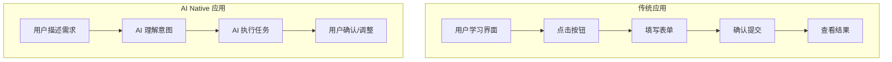

# 1.2.2 让 AI 听懂人话——AI Native 应用特点：自然语言交互与智能化工作流

### 本质还原

AI Native 应用与传统应用的核心区别：**交互方式从"点击操作"变成了"自然语言对话"**。

用户不再需要学习复杂的操作流程，只需用日常语言描述需求，AI 就能理解并执行。这不仅是界面的变化，更是人机交互范式的根本转变。

### 传统应用 vs AI Native 应用



| 维度 | 传统应用 | AI Native 应用 |
|------|----------|----------------|
| **主要输入** | 点击、表单 | 自然语言 |
| **学习成本** | 需要学习操作 | 会说话就会用 |
| **灵活性** | 固定功能 | 理解意图，灵活响应 |
| **个性化** | 预设选项 | 根据上下文适配 |

### AI Native 应用的三大特征

#### 1. 自然语言作为主要界面

传统应用需要设计大量按钮、菜单、表单来覆盖各种功能。AI Native 应用只需要一个对话框：

```
传统方式：点击"文件" → "导出" → 选择格式 → 设置参数 → 确认

AI Native：告诉 AI "把这个文档导出成 PDF，页边距设为 2cm"
```

#### 2. 上下文感知与记忆

AI 能记住对话历史，理解上下文：

```
用户：帮我写一个用户注册的 API
AI：[生成代码]

用户：加上邮箱验证
AI：[理解是在上一个 API 的基础上添加邮箱验证功能]
```

#### 3. 智能化工作流

AI 不仅执行单个任务，还能串联多个步骤：

```
用户：帮我做一个博客系统

AI 可能会：
1. 设计数据库结构
2. 创建 API 接口
3. 生成前端页面
4. 配置路由
5. 添加认证功能
```

### 这对开发者意味着什么？

#### 1. 产品设计思维的变化

不再是"设计功能菜单"，而是"定义 AI 能理解的意图"：

- **传统**：这个页面需要哪些按钮？
- **AI Native**：用户可能会提出什么需求？AI 如何理解并响应？

#### 2. 交互设计的简化

界面可以更简洁，因为复杂的操作都可以通过对话完成：

- **传统**：5 层菜单 + 20 个表单字段
- **AI Native**：一个聊天框 + 确认/取消按钮

#### 3. 功能的"涌现"

AI 可能会产生设计者没有预设的功能，这既是机会也是挑战：

- **机会**：用户可以获得更灵活的服务
- **挑战**：需要设置边界，防止 AI 做不该做的事

### 构建 AI Native 应用的关键要素

1. **清晰的意图识别**：AI 需要准确理解用户想要什么
2. **合理的能力边界**：明确 AI 能做什么、不能做什么
3. **优雅的降级方案**：当 AI 无法理解时，如何引导用户
4. **持续的上下文管理**：如何维护对话历史，何时清除

### 实践启示

在学习本课程的过程中，你使用的 AI 助手（Cursor/Claude/GPT）就是典型的 AI Native 工具。留意你与它们的交互方式：

- 你是如何表达需求的？
- AI 是如何理解你的意图的？
- 当 AI 理解错误时，你是如何纠正的？

这些经验将帮助你在未来设计和构建 AI Native 应用。
