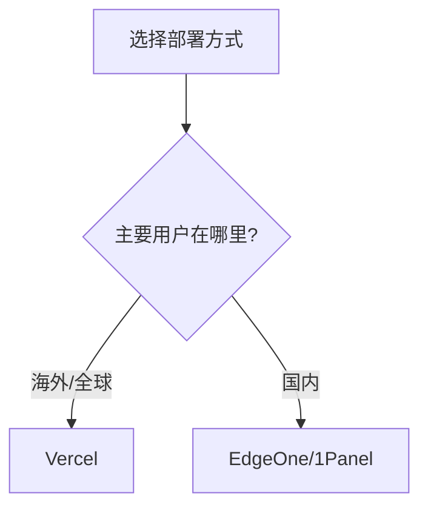

# 1.3 让全世界看到你的作品——最小上线实战与 Vercel/EdgeOne 部署

### 一句话破题

部署是把代码变成产品的最后一步——让你的作品拥有一个全世界都能访问的 URL。

### 为什么要尽早部署？

很多初学者的误区是"等功能做完了再部署"。但在 Vibe Coding 理念下，我们提倡**尽早部署、持续部署**：

1. **验证环境**：本地能跑不代表生产环境能跑，越早发现问题越好
2. **获得反馈**：让用户（哪怕只是你自己）尽早体验，获得真实反馈
3. **建立信心**：看到自己的作品在线运行，是极大的成就感
4. **形成闭环**：从需求到上线的完整闭环，才是真正的"全栈"

### 部署方式选择



| 方式 | 适用场景 | 优点 | 缺点 |
|------|----------|------|------|
| **Vercel** | 海外用户为主 | 零配置、免费、与 Next.js 深度集成 | 国内访问较慢 |
| **EdgeOne** | 国内用户为主 | 国内 CDN 加速、访问快 | 需要备案（使用国内域名时） |
| **1Panel** | 自建服务器 | 完全可控、灵活配置 | 需要服务器运维知识 |

### Vercel 部署（推荐新手）

Vercel 是 Next.js 的官方部署平台，对 Next.js 应用有最好的支持。

#### 部署步骤

**步骤 1：将代码推送到 GitHub**

```bash
# 初始化 Git 仓库（如果还没有）
git init
git add .
git commit -m "Initial commit"

# 创建 GitHub 仓库后，关联并推送
git remote add origin https://github.com/你的用户名/你的仓库.git
git push -u origin main
```

**步骤 2：连接 Vercel**

1. 访问 [vercel.com](https://vercel.com) 并登录（可用 GitHub 账号）
2. 点击 "Add New..." → "Project"
3. 选择你刚才推送的 GitHub 仓库
4. Vercel 会自动检测 Next.js 项目，直接点击 "Deploy"

**步骤 3：等待部署完成**

通常 1-2 分钟后，你就会获得一个 `.vercel.app` 域名，可以直接访问你的应用！

#### 环境变量配置

如果你的应用需要环境变量（如数据库连接字符串）：

1. 在 Vercel 项目设置中找到 "Environment Variables"
2. 添加你需要的环境变量
3. 重新部署

### EdgeOne 部署（国内用户）

腾讯云 EdgeOne 提供了边缘计算和 CDN 加速能力，特别适合面向国内用户的应用。

#### 核心优势

- **国内访问快**：利用腾讯云的 CDN 节点
- **边缘函数**：支持在边缘节点运行代码
- **安全防护**：内置 DDoS 防护和 WAF

#### 部署方式

EdgeOne 支持多种接入方式，对于 Next.js 应用，推荐：

1. **静态导出 + CDN**：适合纯静态站点
2. **边缘函数**：适合需要 SSR 的应用

具体配置请参考 1.5.6 章节的详细说明。

### 持续部署

无论使用哪个平台，都支持**持续部署**：


每次你 `git push` 到 main 分支，部署平台会自动拉取最新代码并重新部署。这意味着：

- 不需要手动部署
- 代码提交即上线
- 可以快速迭代

### 验证部署成功

部署完成后，检查：

1. **访问首页**：确认页面正常显示
2. **测试功能**：点击各个链接和按钮
3. **检查控制台**：打开浏览器开发者工具，确认没有错误

### 常见问题

**Q: 部署后页面白屏？**

1. 查看 Vercel/EdgeOne 的部署日志
2. 检查是否有构建错误
3. 确认环境变量配置正确

**Q: 国内访问 Vercel 很慢？**

考虑使用 EdgeOne 或配置自定义域名 + CDN。

**Q: 如何绑定自己的域名？**

在部署平台的域名设置中添加自定义域名，然后在域名服务商处添加 DNS 解析记录。

### 里程碑达成

完成本节后，你的应用已经：

- [x] 有了一个公开可访问的 URL
- [x] 实现了代码提交即部署
- [x] 可以分享给任何人

**下一步**：学习如何建立高效的 AI 协作工作流，让开发过程更加顺畅。
