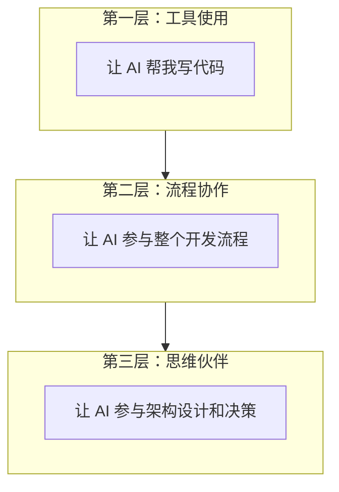
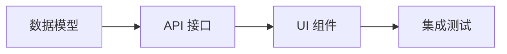

# 1.4 如何让 AI 成为真·队友——AI 协作工作流实战与最佳实践

### 认知重构

AI 不是"代替你写代码的工具"，而是"与你协作的队友"。高效的人机协作，需要建立一套可复用的工作流。

### AI 协作的三个层次



| 层次 | 特点 | 典型场景 |
|------|------|----------|
| **工具使用** | 单点调用，用完即弃 | "帮我写个函数" |
| **流程协作** | 持续对话，上下文连贯 | "我们一起实现这个功能" |
| **思维伙伴** | 参与决策，提供建议 | "这个架构方案你怎么看？" |

### 高效工作流模板

#### 阶段 1：需求定义

在开始编码之前，先与 AI 一起梳理需求：

```
我需要实现 [功能名称]。

背景：
[简要描述为什么需要这个功能]

用户故事：
作为 [用户角色]，我希望 [做某事]，以便 [获得某种价值]

验收标准：
1. [标准 1]
2. [标准 2]
3. [标准 3]

请帮我分析这个需求，看看有没有遗漏的点。
```

#### 阶段 2：方案设计

让 AI 参与技术方案的设计：

```
基于上面的需求，请帮我设计技术方案。

技术栈：Next.js 16 + TypeScript + Tailwind CSS + Prisma

请考虑：
1. 数据结构设计
2. API 接口设计
3. 组件拆分
4. 边界情况处理
```

#### 阶段 3：分步实现

按照方案，分步让 AI 生成代码：



**关键原则**：每一步都确认 OK 再进入下一步。

#### 阶段 4：审查优化

完成实现后，让 AI 帮你审查：

```
请审查以下代码，检查：
1. 逻辑是否正确
2. 是否有安全问题
3. 是否有性能问题
4. 代码是否符合最佳实践

[粘贴代码]
```

### 上下文管理策略

AI 的记忆有限，需要主动管理上下文：

#### 1. 项目规则文件

在项目根目录创建 `.cursorrules` 或 `CLAUDE.md`：

```markdown
# 项目规则

## 技术栈
- Next.js 16 (App Router)
- TypeScript (严格模式)
- Tailwind CSS
- Prisma + PostgreSQL

## 代码规范
- 使用函数组件，不使用 class 组件
- 优先使用 Server Components
- 文件名使用 kebab-case
- 组件名使用 PascalCase

## 目录结构
- src/app - 页面和路由
- src/components - 可复用组件
- src/lib - 工具函数
- src/types - 类型定义
```

#### 2. 任务开始时同步上下文

每次开始新任务，先提供必要的背景：

```
我正在开发一个 [项目类型] 项目。

当前任务：[任务描述]

相关文件：
- [文件 1 路径及作用]
- [文件 2 路径及作用]

现在我需要...
```

#### 3. 定期总结进度

长对话后，请 AI 总结：

```
请总结一下我们这次对话完成了什么：
1. 实现了哪些功能
2. 还有什么待办事项
3. 需要注意的问题
```

### 协作工作流检查清单

在每个开发任务中，按照以下流程进行：

```markdown
## 任务：[任务名称]

### 1. 需求定义
- [ ] 明确功能目标
- [ ] 定义验收标准
- [ ] 识别边界情况

### 2. 方案设计
- [ ] 确定数据结构
- [ ] 设计 API 接口
- [ ] 规划组件结构

### 3. 分步实现
- [ ] 实现数据层
- [ ] 实现接口层
- [ ] 实现 UI 层
- [ ] 处理错误情况

### 4. 审查验收
- [ ] 代码审查通过
- [ ] 功能测试通过
- [ ] 边界情况覆盖
```

### 常见协作模式

#### 模式 1：结对编程

像真人结对编程一样，实时讨论：

```
我现在要实现 [功能]，先写一个基础版本...

[粘贴你写的代码]

你看这样写对不对？有没有更好的写法？
```

#### 模式 2：代码评审

让 AI 扮演 Code Reviewer：

```
请以严格的 Code Reviewer 角色审查以下代码：

[粘贴代码]

请指出：
- 潜在的 bug
- 可以优化的地方
- 不符合最佳实践的写法
```

#### 模式 3：橡皮鸭调试

当你卡住时，向 AI 解释你的问题：

```
我遇到了一个问题，让我解释一下...

现象：[描述问题现象]
我的理解：[你认为应该是什么样]
已尝试：[你已经尝试的方法]

能帮我分析一下可能的原因吗？
```

### 避坑指南

1. **不要完全依赖 AI**：AI 是助手，不是替代品。最终决策权在你
2. **不要一口气要太多**：大任务拆成小任务，逐步完成
3. **及时纠正错误**：发现 AI 走偏了，立即指出
4. **保存有价值的对话**：好的解决方案和提示词值得保存复用

### 本章小结

高效的 AI 协作需要：

1. **建立流程**：需求 → 设计 → 实现 → 审查
2. **管理上下文**：项目规则 + 任务背景 + 定期总结
3. **灵活切换模式**：结对编程 / 代码评审 / 问题讨论
4. **保持主导权**：AI 是队友，但你是项目负责人
