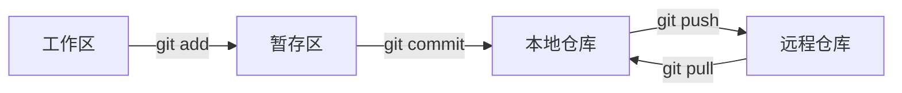
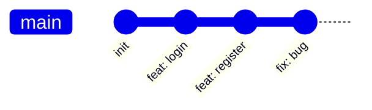
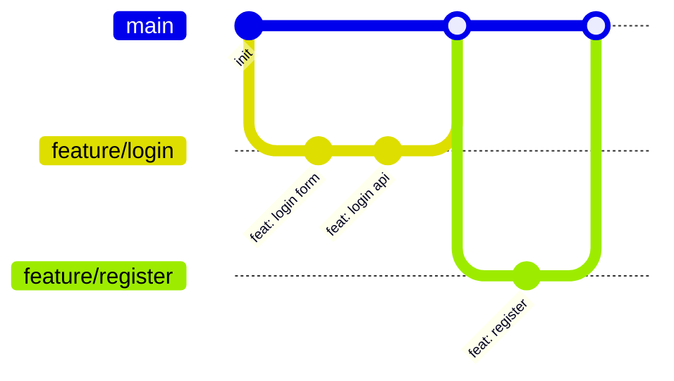

# 1.5.2 团队协作如何不打架——Git 工作流：分支策略与协作规范

### 一句话破题

Git 是代码的"时光机"——它记录每一次改动，让你能随时回到任何历史版本，更能让多人同时协作而不互相干扰。

### 核心概念



| 概念 | 说明 |
|------|------|
| **工作区** | 你正在编辑的文件 |
| **暂存区** | 准备提交的改动 |
| **本地仓库** | 已提交的历史记录 |
| **远程仓库** | GitHub 上的代码库 |

### 基础命令速查

```bash
# 查看状态
git status

# 添加文件到暂存区
git add .                    # 添加所有文件
git add src/components/      # 添加指定目录

# 提交
git commit -m "feat: 添加用户登录功能"

# 推送到远程
git push origin main

# 拉取远程更新
git pull origin main

# 查看历史
git log --oneline

# 回退版本
git reset --soft HEAD~1      # 回退一个版本，保留改动
git reset --hard HEAD~1      # 回退一个版本，丢弃改动
```

### 分支策略

#### 单人开发

对于个人项目，简单的策略就够了：



直接在 `main` 分支开发即可。

#### 团队开发

团队项目推荐 **GitHub Flow**：



**核心规则**：

1. `main` 分支始终保持可部署状态
2. 新功能从 `main` 创建 feature 分支
3. 完成后通过 Pull Request 合并回 `main`
4. 合并前需要 Code Review

### 提交规范

使用 **Conventional Commits** 规范：

```
<type>(<scope>): <description>

[可选的正文]

[可选的脚注]
```

**常用类型**：

| 类型 | 说明 | 示例 |
|------|------|------|
| `feat` | 新功能 | `feat: 添加用户登录` |
| `fix` | 修复 bug | `fix: 修复登录按钮无响应` |
| `docs` | 文档更新 | `docs: 更新 README` |
| `style` | 代码格式 | `style: 格式化代码` |
| `refactor` | 重构 | `refactor: 优化登录逻辑` |
| `test` | 测试相关 | `test: 添加登录测试` |
| `chore` | 构建/工具 | `chore: 更新依赖` |

### 常见操作场景

#### 场景 1：开发新功能

```bash
# 1. 确保 main 是最新的
git checkout main
git pull origin main

# 2. 创建功能分支
git checkout -b feature/user-profile

# 3. 开发并提交
git add .
git commit -m "feat: 添加用户资料页面"

# 4. 推送分支
git push -u origin feature/user-profile

# 5. 在 GitHub 上创建 Pull Request
```

#### 场景 2：修复紧急 bug

```bash
# 1. 从 main 创建修复分支
git checkout main
git pull origin main
git checkout -b fix/login-error

# 2. 修复并提交
git add .
git commit -m "fix: 修复登录时的空指针错误"

# 3. 推送并创建 PR
git push -u origin fix/login-error
```

#### 场景 3：处理合并冲突

```bash
# 1. 拉取最新的 main
git checkout main
git pull origin main

# 2. 切回功能分支并合并 main
git checkout feature/user-profile
git merge main

# 3. 手动解决冲突（编辑器会标记冲突位置）
# 4. 标记冲突已解决
git add .
git commit -m "merge: resolve conflicts with main"
```

### .gitignore 配置

确保敏感文件不被提交：

```gitignore
# 依赖
node_modules/

# 构建产物
.next/
out/
dist/

# 环境变量
.env
.env.local
.env.*.local

# IDE
.vscode/
.idea/

# 系统文件
.DS_Store
Thumbs.db

# 日志
*.log
```

### 避坑指南

- **提交前检查**：`git status` 和 `git diff` 确认改动
- **小步提交**：每个提交只做一件事，方便回滚
- **写好提交信息**：未来的你会感谢现在的你
- **不要提交敏感信息**：API Key、密码等必须在 .gitignore 中排除
- **冲突不要慌**：先理解冲突原因，再手动解决
