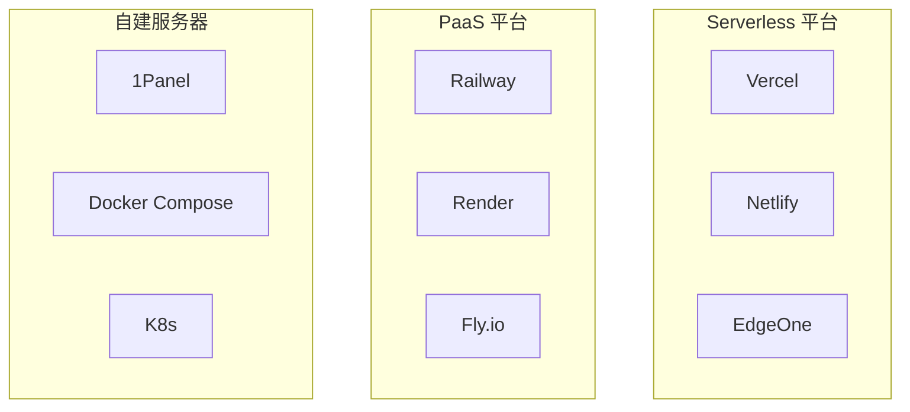
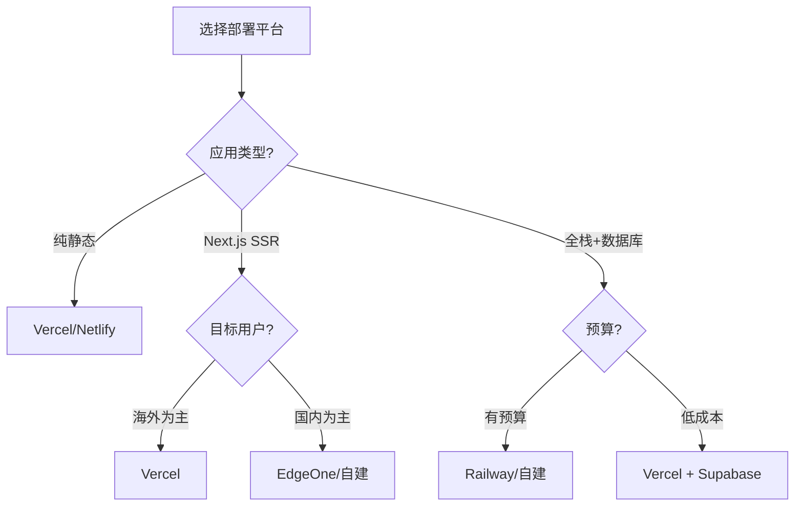

# 1.5.4 项目最终落户在哪——部署平台：容器化与云服务选择

### 一句话破题

部署平台决定了你的应用如何运行在互联网上——选择合适的平台，能让运维变得轻松，成本可控。

### 部署方式全景图



### 平台对比

| 平台 | 类型 | 适合场景 | 免费额度 | 国内访问 |
|------|------|----------|----------|----------|
| **Vercel** | Serverless | 前端/SSR | 慷慨 | 较慢 |
| **Netlify** | Serverless | 静态站点 | 慷慨 | 较慢 |
| **EdgeOne** | CDN + 边缘 | 国内用户 | 有 | 快 |
| **Railway** | PaaS | 全栈应用 | $5/月 | 慢 |
| **1Panel** | 自建 | 完全可控 | 服务器费 | 取决于服务器 |

### 选择决策树



### 容器化基础

无论选择哪个平台，理解 Docker 都很重要：

```dockerfile
# 典型的 Next.js Dockerfile
FROM node:20-alpine AS base

# 依赖阶段
FROM base AS deps
WORKDIR /app
COPY package.json pnpm-lock.yaml ./
RUN corepack enable pnpm && pnpm install --frozen-lockfile

# 构建阶段
FROM base AS builder
WORKDIR /app
COPY --from=deps /app/node_modules ./node_modules
COPY . .
RUN corepack enable pnpm && pnpm build

# 运行阶段
FROM base AS runner
WORKDIR /app
ENV NODE_ENV=production

COPY --from=builder /app/public ./public
COPY --from=builder /app/.next/standalone ./
COPY --from=builder /app/.next/static ./.next/static

EXPOSE 3000
CMD ["node", "server.js"]
```

### 本课程推荐策略

| 阶段 | 推荐方案 | 原因 |
|------|----------|------|
| **学习阶段** | Vercel | 零配置，快速上手 |
| **个人项目** | Vercel + Supabase | 免费额度足够 |
| **国内用户** | EdgeOne 或 1Panel | 访问速度快 |
| **生产项目** | 自建服务器 + 1Panel | 完全可控，成本可预测 |

### 成本考量

| 方案 | 初期成本 | 扩展成本 | 适合规模 |
|------|----------|----------|----------|
| **Vercel 免费版** | 0 | 按量计费 | 小型项目 |
| **Vercel Pro** | $20/月 | 按量计费 | 中型项目 |
| **自建服务器** | 服务器费用 | 固定 | 任意规模 |

### 避坑指南

- **Vercel 免费版限制**：Serverless 函数执行时间限制 10 秒
- **冷启动问题**：Serverless 函数首次调用可能较慢
- **数据本地化**：某些行业要求数据存储在国内
- **备案要求**：使用国内服务器和域名需要 ICP 备案
