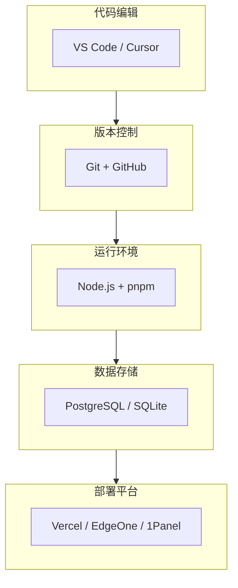

# 1.5 全副武装你的开发环境——工具链与环境：IDE/Git/Node.js/数据库/部署平台

### 一句话破题

开发环境是你的"工作台"——工具选对了、配置好了，开发效率能提升数倍。

### 工具链全景图



### 本节覆盖内容

| 章节 | 主题 | 核心内容 |
|------|------|----------|
| 1.5.1 | IDE 配置 | VS Code 插件推荐与配置 |
| 1.5.2 | Git 工作流 | 分支策略与协作规范 |
| 1.5.3 | 数据库选择 | PostgreSQL vs MySQL vs SQLite |
| 1.5.4 | 部署平台 | 容器化与云服务选择 |
| 1.5.5 | Vercel | Next.js 最佳部署平台 |
| 1.5.6 | 腾讯云 EO | 国内访问优化方案 |

### 推荐技术栈

本课程统一使用以下技术栈，确保学习过程中的一致性：

| 类别 | 推荐工具 | 备选方案 |
|------|----------|----------|
| **编辑器** | Cursor | VS Code |
| **版本控制** | Git + GitHub | GitLab |
| **运行时** | Node.js 20 LTS | Node.js 18 LTS |
| **包管理器** | pnpm | npm / yarn |
| **数据库** | PostgreSQL | SQLite（开发环境） |
| **ORM** | Prisma | - |
| **部署** | Vercel | EdgeOne / 1Panel |

### 为什么选择这些工具？

1. **Cursor**：AI 原生 IDE，与课程的 Vibe Coding 理念高度契合
2. **pnpm**：更快的安装速度，更节省磁盘空间
3. **PostgreSQL**：功能强大，与 Prisma 配合良好
4. **Vercel**：与 Next.js 深度集成，零配置部署

### 环境检查清单

在开始后续学习之前，确认你的环境满足：

```bash
# 检查 Node.js 版本
node -v  # 应该 >= 18.17

# 检查 pnpm
pnpm -v  # 应该已安装

# 检查 Git
git --version  # 应该已安装

# 检查编辑器
# Cursor 或 VS Code 已安装并配置好 AI 助手
```

### 接下来的学习路径

如果你是完全新手，建议按顺序学习每个子章节。如果你已经有开发经验，可以跳过熟悉的部分，重点关注：

- **1.5.2 Git 工作流**：团队协作的基础
- **1.5.5 Vercel**：快速部署你的 Next.js 应用
