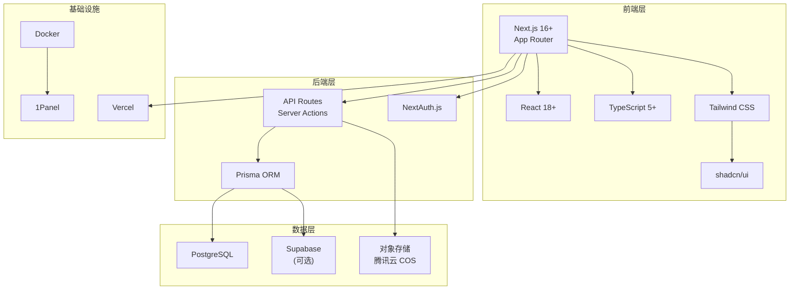

# 2.0 选对工具，事半功倍——技术栈全景

## 为什么技术选型如此重要？

在 Vibe Coding 时代，技术选型的核心标准发生了根本性转变：

**传统开发**：选择你最熟悉的技术栈。

**Vibe Coding**：选择 AI 最擅长的技术栈。

AI 模型的训练数据决定了它对某些技术栈的理解更深入、代码生成质量更高。选择一个 AI 友好的技术栈，意味着：

- AI 生成的代码更符合最佳实践
- 遇到问题时 AI 能给出更准确的解决方案
- 社区资源丰富，AI 的"知识库"更完善

## 本课程技术栈全景



## 版本锁定策略

### 为什么要锁定版本？

在团队协作和 AI 辅助开发中，版本不一致是最常见的"玄学问题"来源。明确锁定版本能够：

1. **保证可复现性**：今天能跑的代码，明天也一定能跑
2. **减少 AI 困惑**：AI 知道你用的是哪个版本的 API
3. **降低协作成本**：团队成员环境一致

### 核心依赖版本

```json
{
  "dependencies": {
    "next": "^14.2.0",
    "react": "^18.3.0",
    "react-dom": "^18.3.0",
    "typescript": "^5.4.0",
    "@prisma/client": "^5.14.0",
    "next-auth": "^4.24.0",
    "tailwindcss": "^3.4.0"
  },
  "devDependencies": {
    "prisma": "^5.14.0",
    "@types/node": "^20.0.0",
    "@types/react": "^18.3.0"
  }
}
```

### 版本号语义：SemVer

理解语义化版本号（Semantic Versioning）是管理依赖的基础：

```
主版本.次版本.修订版本
  ^        ^        ^
  |        |        +-- 修复 Bug，向后兼容
  |        +----------- 新功能，向后兼容
  +-------------------- 破坏性更新，可能不兼容
```

**package.json 中的版本范围**：

| 符号 | 含义 | 示例 |
|------|------|------|
| `^1.2.3` | 允许次版本和修订版本更新 | 匹配 `1.x.x` |
| `~1.2.3` | 只允许修订版本更新 | 匹配 `1.2.x` |
| `1.2.3` | 精确锁定 | 只匹配 `1.2.3` |

::: tip 最佳实践
对于核心框架（Next.js、React），建议使用 `^` 锁定主版本；对于可能有兼容性问题的库，使用 `~` 或精确版本。
:::

## 为什么选择这套技术栈？

### Next.js：全栈框架的最优解

| 特性 | 价值 |
|------|------|
| App Router | 基于文件系统的路由，直观易懂 |
| RSC | 服务器组件，减少客户端 JS 体积 |
| Server Actions | 直接在组件中调用服务端逻辑 |
| 内置优化 | 图片、字体、脚本自动优化 |

### TypeScript：AI 的最佳搭档

TypeScript 不仅是类型安全的保障，更是与 AI 协作的桥梁：

- **类型即文档**：AI 通过类型定义理解你的意图
- **自动补全**：类型系统让 AI 生成更精准的代码
- **重构安全**：类型检查让 AI 的大规模修改更可靠

### Prisma：类型安全的数据库操作

```typescript
// Prisma 自动生成的类型，让 AI 知道你的数据结构
const user = await prisma.user.findUnique({
  where: { id: userId },
  include: { posts: true }  // AI 知道这会返回带 posts 的 User
})
```

## AI 协作指南

当你需要让 AI 帮你做技术选型决策时，可以这样提问：

> **核心意图**：让 AI 理解你的项目约束，给出技术建议

**关键术语**：`Next.js App Router`、`TypeScript`、`Prisma`、`Server Components`、`Server Actions`

**交互策略**：
1. 先描述项目的核心需求和规模
2. 说明你的部署环境限制
3. 让 AI 基于本课程技术栈给出具体配置建议

::: warning 避坑提示
不要让 AI 随意推荐技术栈。明确告诉它："基于 Next.js 16 App Router + TypeScript + Prisma 技术栈"，避免 AI 推荐过时或不兼容的方案。
:::
