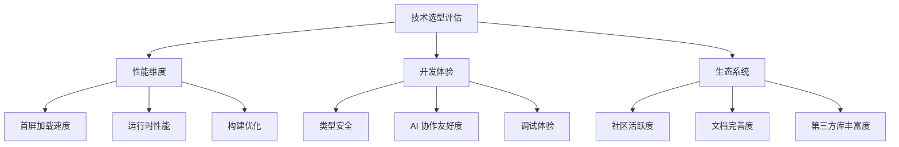
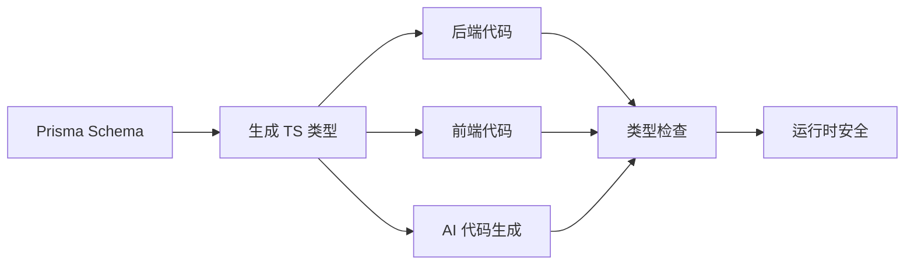

# 2.1.1 选它们图什么——技术栈选择理由

## 认知重构：技术选型的三个维度

传统的技术选型往往只关注"这个技术能不能实现我的需求"。而在 Vibe Coding 时代，我们需要从三个维度来评估：



## 性能维度：为什么选 Next.js

### 首屏性能对比

| 方案 | 首屏时间 | SEO | 服务器压力 |
|------|----------|-----|------------|
| 纯 React SPA | 慢 | 差 | 低 |
| Next.js SSR | 快 | 好 | 中 |
| Next.js SSG | 极快 | 好 | 极低 |
| Next.js RSC | 快 | 好 | 低 |

### Next.js 的性能优势

1. **自动代码分割**：每个页面只加载必需的 JS
2. **图片优化**：`next/image` 自动压缩、懒加载、响应式
3. **字体优化**：`next/font` 零布局偏移
4. **预取机制**：`<Link>` 自动预取可见链接

```typescript
// Next.js 的图片优化是开箱即用的
import Image from 'next/image'

export function Avatar({ src, alt }: { src: string; alt: string }) {
  return (
    <Image
      src={src}
      alt={alt}
      width={100}
      height={100}
      // 自动：WebP 格式、响应式 srcset、懒加载
    />
  )
}
```

## 开发体验：为什么选 TypeScript

### 类型安全的价值链



### TypeScript 让 AI 更懂你

```typescript
// 有了类型定义，AI 知道你需要什么
interface CreatePostInput {
  title: string
  content: string
  authorId: string
  tags?: string[]
}

// AI 生成的代码会自动匹配这个类型
async function createPost(input: CreatePostInput) {
  // AI 知道 input 有哪些字段，会正确使用
}
```

**没有类型**时，AI 可能生成：
```javascript
// AI 不知道 data 有什么字段，容易出错
function createPost(data) {
  // data.titel ← 拼写错误，运行时才发现
}
```

## 生态系统：为什么选这套组合

### 生态成熟度对比

| 技术 | npm 周下载量 | GitHub Stars | 年龄 |
|------|-------------|--------------|------|
| Next.js | 600万+ | 120k+ | 7年+ |
| Prisma | 200万+ | 35k+ | 5年+ |
| Tailwind | 800万+ | 80k+ | 6年+ |

### 为什么这些数字很重要？

- **周下载量高** → 问题更容易被发现和修复
- **Stars 多** → 社区支持好，教程资源丰富
- **年龄久** → 经过生产验证，API 稳定

### 关键依赖的选择标准

::: tip 选择第三方库的黄金法则
1. **npm 周下载量 > 10万**：说明有足够多人在用
2. **最近一次更新 < 3个月**：说明还在积极维护
3. **有 TypeScript 类型定义**：AI 协作必备
4. **issues 响应及时**：出问题能找到人
:::

## 觉知：Review AI 代码时的检查点

当 AI 帮你写代码时，需要重点检查以下几点：

### 1. 依赖版本

```json
// AI 可能生成过时的版本
{
  "dependencies": {
    "next": "^13.0.0"  // ❌ 应该用 14.x
  }
}
```

### 2. 导入路径

```typescript
// AI 可能混淆 App Router 和 Pages Router
import { useRouter } from 'next/router'     // ❌ Pages Router
import { useRouter } from 'next/navigation'  // ✅ App Router
```

### 3. 组件类型

```typescript
// AI 可能在服务器组件中使用客户端 Hook
export default function Page() {
  const [state, setState] = useState()  // ❌ 服务器组件不能用 useState
}
```

## 本节小结

选择 Next.js + TypeScript + Prisma 的核心理由：

| 维度 | 核心价值 |
|------|----------|
| **性能** | 开箱即用的优化，无需手动配置 |
| **开发体验** | 类型安全贯穿全栈，AI 协作高效 |
| **生态** | 社区活跃，问题有解，资源丰富 |
