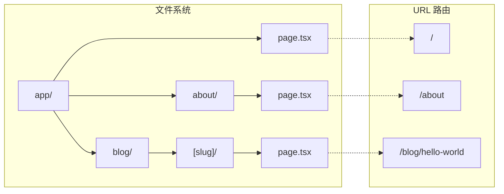
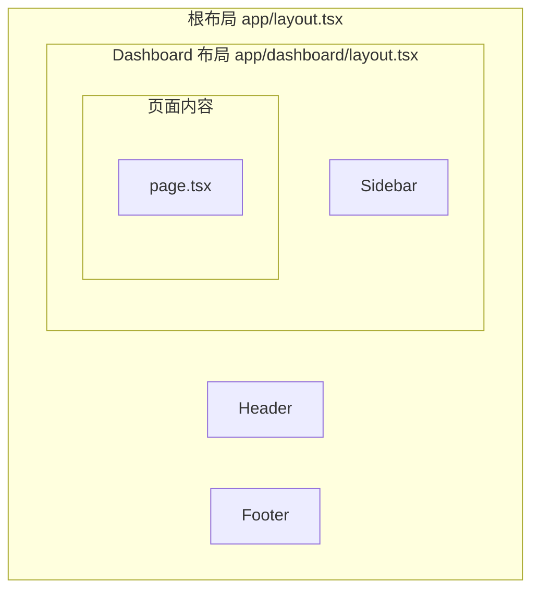

# 2.1.2 文件目录就是网页路由——App Router 架构

## 本质还原

App Router 的本质是**文件系统到 URL 的映射**。创建一个文件夹，就是创建一个路由段；在文件夹中放入 `page.tsx`，这个路由就能被访问。

```
传统路由：在代码中配置 URL → 组件的映射
App Router：文件夹结构 = URL 结构
```

## 可视化解构：目录结构与 URL



## 核心约定文件

App Router 中的每个文件夹可以包含以下约定文件：

| 文件名 | 作用 | 是否必需 |
|--------|------|----------|
| `page.tsx` | 路由的 UI 内容 | 路由可访问则必需 |
| `layout.tsx` | 共享布局，子路由复用 | 可选 |
| `loading.tsx` | 加载状态 UI | 可选 |
| `error.tsx` | 错误处理 UI | 可选 |
| `not-found.tsx` | 404 页面 | 可选 |
| `route.ts` | API 端点 | 与 page.tsx 互斥 |

### 最小目录结构

```
app/
├── layout.tsx      # 根布局（必需）
├── page.tsx        # 首页
├── globals.css     # 全局样式
└── about/
    └── page.tsx    # /about 页面
```

## 嵌套布局：最强大的特性

布局是 App Router 最强大的特性之一。它允许你在不同层级共享 UI，且**切换路由时布局不会重新渲染**。



### 布局代码示例

```typescript
// app/layout.tsx - 根布局
export default function RootLayout({
  children,
}: {
  children: React.ReactNode
}) {
  return (
    <html lang="zh">
      <body>
        <Header />
        {children}  {/* 子路由内容插入这里 */}
        <Footer />
      </body>
    </html>
  )
}

// app/dashboard/layout.tsx - Dashboard 布局
export default function DashboardLayout({
  children,
}: {
  children: React.ReactNode
}) {
  return (
    <div className="flex">
      <Sidebar />
      <main className="flex-1">{children}</main>
    </div>
  )
}
```

## 动态路由

使用方括号 `[]` 创建动态路由段：

| 语法 | 示例文件 | 匹配 URL |
|------|----------|----------|
| `[slug]` | `blog/[slug]/page.tsx` | `/blog/hello` |
| `[...slug]` | `docs/[...slug]/page.tsx` | `/docs/a/b/c` |
| `[[...slug]]` | `shop/[[...slug]]/page.tsx` | `/shop` 或 `/shop/a/b` |

```typescript
// app/blog/[slug]/page.tsx
export default function BlogPost({
  params,
}: {
  params: { slug: string }
}) {
  return <h1>文章: {params.slug}</h1>
}
```

## 路由组：组织而不影响 URL

使用圆括号 `()` 创建路由组，用于组织代码但不影响 URL：

```
app/
├── (marketing)/        # 不会出现在 URL 中
│   ├── layout.tsx      # marketing 页面共享的布局
│   ├── about/
│   │   └── page.tsx    # URL: /about
│   └── contact/
│       └── page.tsx    # URL: /contact
└── (shop)/             # 不会出现在 URL 中
    ├── layout.tsx      # shop 页面共享的布局
    └── products/
        └── page.tsx    # URL: /products
```

## 觉知：Review AI 代码时的检查点

### 1. page.tsx 位置正确吗？

```
app/
├── dashboard/
│   └── settings/
│       └── page.tsx    # ✅ /dashboard/settings
│
├── dashboard/
│   └── settings.tsx    # ❌ 这不是页面，是普通组件
```

### 2. layout.tsx 用对了吗？

```typescript
// ❌ 错误：layout 不应该有状态
export default function Layout({ children }) {
  const [user, setUser] = useState()  // 不要这样做
  return <div>{children}</div>
}

// ✅ 正确：状态应该在 Client Component 中
export default function Layout({ children }) {
  return (
    <div>
      <UserProvider>  {/* 用 Context Provider */}
        {children}
      </UserProvider>
    </div>
  )
}
```

### 3. 动态路由参数类型正确吗？

```typescript
// AI 可能忘记给 params 加类型
export default function Page({ params }) {  // ❌ 缺少类型
  // ...
}

export default function Page({ 
  params 
}: { 
  params: { slug: string }  // ✅ 明确类型
}) {
  // ...
}
```

## 本节小结

App Router 的核心理念：**约定优于配置**。

| 概念 | 作用 |
|------|------|
| **文件系统路由** | 文件夹结构 = URL 结构 |
| **嵌套布局** | UI 复用，切换不重渲染 |
| **约定文件** | page/layout/loading/error |
| **动态路由** | `[param]` 语法 |
| **路由组** | `(group)` 组织代码 |
