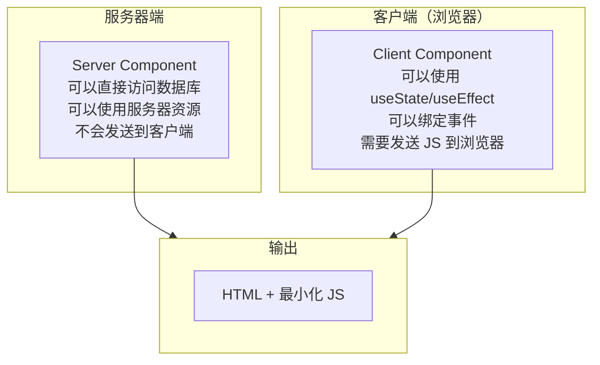
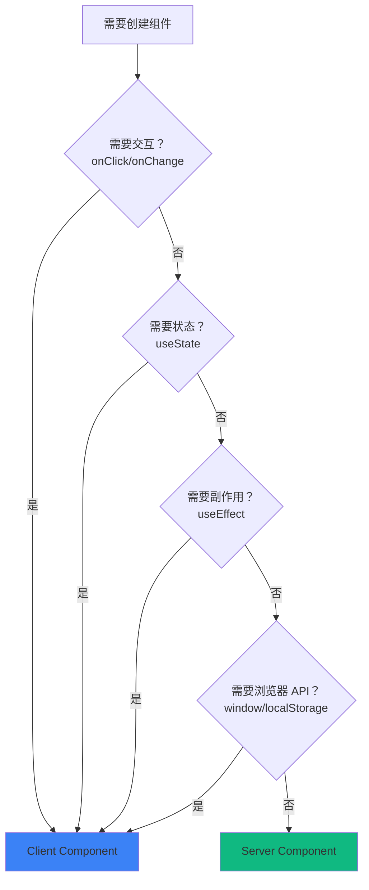
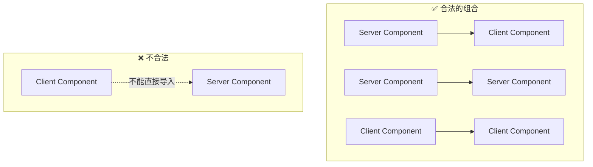

# 2.1.3 前后端代码写一起？——RSC 渲染策略

## 认知重构

传统的 React 应用中，所有组件都在浏览器中运行。而 React Server Components（RSC）打破了这个边界：

```
传统 React：所有组件 → 打包 → 发送到浏览器 → 浏览器执行
RSC：服务器组件在服务器执行 → 只发送渲染结果 → 客户端组件在浏览器执行
```

## 本质还原



## 服务器组件 vs 客户端组件

| 特性 | Server Component | Client Component |
|------|------------------|------------------|
| **运行环境** | 服务器 | 浏览器 |
| **访问数据库** | ✅ 可以 | ❌ 不能 |
| **使用 Hooks** | ❌ 不能用 useState/useEffect | ✅ 可以 |
| **事件处理** | ❌ 不能 onClick | ✅ 可以 |
| **打包大小** | 不计入 | 计入 JS Bundle |
| **默认行为** | App Router 默认 | 需要 `'use client'` |

## 何时使用哪种组件？



### 简单口诀

- **需要点击、输入、动画** → Client Component
- **只是展示数据** → Server Component
- **拿不准** → 先写成 Server Component，需要交互再改

## 代码示例

### Server Component（默认）

```typescript
// app/posts/page.tsx
// 默认就是 Server Component，不需要任何声明

import { prisma } from '@/lib/prisma'

export default async function PostsPage() {
  // ✅ 可以直接访问数据库
  const posts = await prisma.post.findMany()
  
  return (
    <ul>
      {posts.map(post => (
        <li key={post.id}>{post.title}</li>
      ))}
    </ul>
  )
}
```

### Client Component

```typescript
// components/like-button.tsx
'use client'  // ← 必须在文件顶部声明

import { useState } from 'react'

export function LikeButton({ postId }: { postId: string }) {
  // ✅ 可以使用 useState
  const [liked, setLiked] = useState(false)
  
  // ✅ 可以绑定事件
  return (
    <button onClick={() => setLiked(!liked)}>
      {liked ? '❤️' : '🤍'}
    </button>
  )
}
```

### 混合使用

```typescript
// app/posts/[id]/page.tsx - Server Component
import { prisma } from '@/lib/prisma'
import { LikeButton } from '@/components/like-button'

export default async function PostPage({ 
  params 
}: { 
  params: { id: string } 
}) {
  // 服务器端获取数据
  const post = await prisma.post.findUnique({
    where: { id: params.id }
  })
  
  return (
    <article>
      <h1>{post.title}</h1>
      <p>{post.content}</p>
      {/* 客户端组件嵌入服务器组件 */}
      <LikeButton postId={post.id} />
    </article>
  )
}
```

## 组件边界规则



### 关键规则

1. **Server → Client**：✅ 服务器组件可以导入客户端组件
2. **Server → Server**：✅ 服务器组件可以导入服务器组件
3. **Client → Client**：✅ 客户端组件可以导入客户端组件
4. **Client → Server**：❌ 客户端组件不能直接导入服务器组件

### 如果客户端组件需要包含服务器组件？

使用 `children` 模式：

```typescript
// ✅ 正确做法
// client-wrapper.tsx
'use client'
export function ClientWrapper({ children }: { children: React.ReactNode }) {
  return <div onClick={() => {}}>{children}</div>
}

// page.tsx (Server Component)
import { ClientWrapper } from './client-wrapper'
import { ServerComponent } from './server-component'

export default function Page() {
  return (
    <ClientWrapper>
      <ServerComponent />  {/* 通过 children 传入 */}
    </ClientWrapper>
  )
}
```

## 觉知：Review AI 代码时的检查点

### 1. `'use client'` 位置

```typescript
// ❌ 错误：不在文件顶部
import { useState } from 'react'
'use client'  // 这样无效

// ✅ 正确：必须在最顶部
'use client'
import { useState } from 'react'
```

### 2. 服务器组件中使用了客户端 API

```typescript
// ❌ AI 可能生成这样的代码
export default function Page() {
  const [data, setData] = useState()  // 服务器组件不能用 useState
  
  useEffect(() => {  // 服务器组件不能用 useEffect
    // ...
  }, [])
}
```

### 3. 数据获取位置

```typescript
// ❌ 在客户端组件中获取（不必要的）
'use client'
export function PostList() {
  const [posts, setPosts] = useState([])
  useEffect(() => {
    fetch('/api/posts').then(...)  // 多一次网络请求
  }, [])
}

// ✅ 在服务器组件中直接获取
export default async function PostList() {
  const posts = await prisma.post.findMany()  // 直接访问数据库
  return <ul>...</ul>
}
```

## 本节小结

RSC 的核心价值：**在正确的地方运行正确的代码**。

| 场景 | 选择 | 原因 |
|------|------|------|
| 数据展示 | Server Component | 减少 JS Bundle，直接访问数据 |
| 表单交互 | Client Component | 需要状态和事件 |
| 静态 UI | Server Component | 零客户端 JS |
| 动画效果 | Client Component | 需要浏览器 API |
