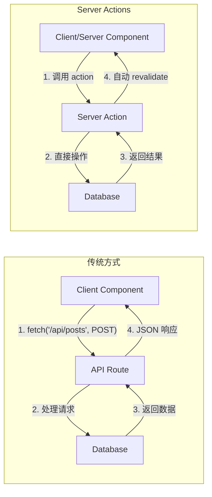
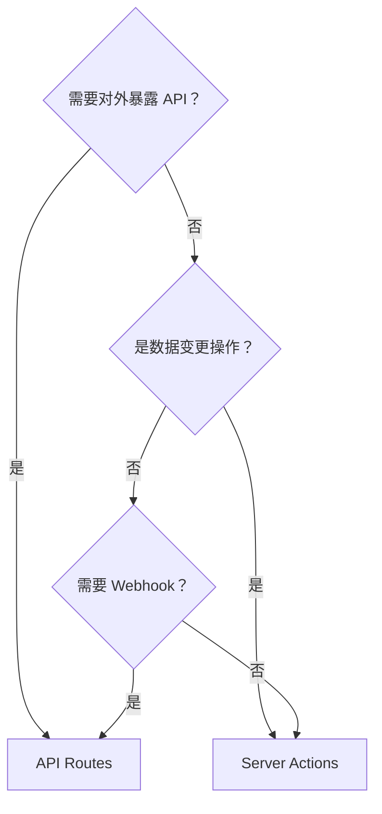

# 2.1.4 在前端直接调后端——Server Actions

## 认知重构

传统的数据变更流程：
```
用户点击 → 前端发 fetch 请求 → 后端 API 处理 → 返回结果 → 前端更新 UI
```

Server Actions 的流程：
```
用户点击 → 直接调用服务器函数 → 服务器处理 → 自动更新 UI
```

**本质**：Server Actions 是在组件中直接调用的服务器端函数，无需手动创建 API 端点。

## 可视化解构



## 定义 Server Action

### 方式一：内联定义（服务器组件中）

```typescript
// app/posts/page.tsx - Server Component
export default function PostsPage() {
  async function createPost(formData: FormData) {
    'use server'  // ← 标记为 Server Action
    
    const title = formData.get('title') as string
    await prisma.post.create({ data: { title } })
    revalidatePath('/posts')  // 刷新页面数据
  }
  
  return (
    <form action={createPost}>
      <input name="title" />
      <button type="submit">创建</button>
    </form>
  )
}
```

### 方式二：独立文件（推荐）

```typescript
// app/actions/posts.ts
'use server'  // ← 文件顶部声明，整个文件都是 Server Actions

import { prisma } from '@/lib/prisma'
import { revalidatePath } from 'next/cache'

export async function createPost(formData: FormData) {
  const title = formData.get('title') as string
  
  await prisma.post.create({
    data: { title }
  })
  
  revalidatePath('/posts')
}

export async function deletePost(id: string) {
  await prisma.post.delete({ where: { id } })
  revalidatePath('/posts')
}
```

## 在组件中使用

### 在 Server Component 中（form action）

```typescript
// app/posts/new/page.tsx
import { createPost } from '@/app/actions/posts'

export default function NewPostPage() {
  return (
    <form action={createPost}>
      <input name="title" placeholder="标题" />
      <textarea name="content" placeholder="内容" />
      <button type="submit">发布</button>
    </form>
  )
}
```

### 在 Client Component 中

```typescript
// components/delete-button.tsx
'use client'

import { deletePost } from '@/app/actions/posts'
import { useTransition } from 'react'

export function DeleteButton({ postId }: { postId: string }) {
  const [isPending, startTransition] = useTransition()
  
  return (
    <button
      disabled={isPending}
      onClick={() => {
        startTransition(() => {
          deletePost(postId)
        })
      }}
    >
      {isPending ? '删除中...' : '删除'}
    </button>
  )
}
```

## Server Actions vs API Routes

| 特性 | Server Actions | API Routes |
|------|----------------|------------|
| **适用场景** | 数据变更（CRUD） | 对外 API、Webhook |
| **调用方式** | 直接函数调用 | HTTP 请求 |
| **类型安全** | ✅ 自动推断 | 需手动定义 |
| **复用性** | 应用内部 | 可对外暴露 |
| **渐进增强** | ✅ 无 JS 也能工作 | 需要 JS |

### 何时用 Server Actions？



## 错误处理

```typescript
// app/actions/posts.ts
'use server'

import { z } from 'zod'

const PostSchema = z.object({
  title: z.string().min(1, '标题不能为空'),
  content: z.string().min(10, '内容至少 10 个字符')
})

export async function createPost(formData: FormData) {
  // 1. 验证输入
  const validatedFields = PostSchema.safeParse({
    title: formData.get('title'),
    content: formData.get('content')
  })
  
  if (!validatedFields.success) {
    return {
      errors: validatedFields.error.flatten().fieldErrors
    }
  }
  
  // 2. 执行操作
  try {
    await prisma.post.create({
      data: validatedFields.data
    })
  } catch (error) {
    return { errors: { _form: ['创建失败，请重试'] } }
  }
  
  // 3. 刷新缓存并重定向
  revalidatePath('/posts')
  redirect('/posts')
}
```

## 觉知：Review AI 代码时的检查点

### 1. `'use server'` 位置

```typescript
// ❌ 错误：放在函数外部但不在文件顶部
export async function myAction() {
  'use server'  // 如果不是文件顶部，必须在函数体内
}

// ✅ 正确：文件顶部
'use server'
export async function myAction() {}

// ✅ 正确：函数体内
export async function myAction() {
  'use server'
  // ...
}
```

### 2. 参数序列化问题

```typescript
// ❌ Server Actions 的参数必须可序列化
async function badAction(callback: () => void) {
  'use server'
  callback()  // 函数不能作为参数传递
}

// ✅ 只传递可序列化的数据
async function goodAction(id: string, data: { name: string }) {
  'use server'
  // ...
}
```

### 3. 忘记 revalidate

```typescript
// ❌ 数据变更后没有刷新缓存
async function createPost(formData: FormData) {
  'use server'
  await prisma.post.create({ ... })
  // 忘记 revalidatePath，页面数据不会更新
}

// ✅ 记得刷新相关路径的缓存
async function createPost(formData: FormData) {
  'use server'
  await prisma.post.create({ ... })
  revalidatePath('/posts')
}
```

## 本节小结

Server Actions 的核心价值：**消除前后端的边界，让数据变更像调用函数一样简单**。

| 场景 | 推荐方案 |
|------|----------|
| 表单提交 | Server Actions + form action |
| 按钮操作 | Server Actions + useTransition |
| 对外 API | API Routes |
| 第三方集成 | API Routes |
