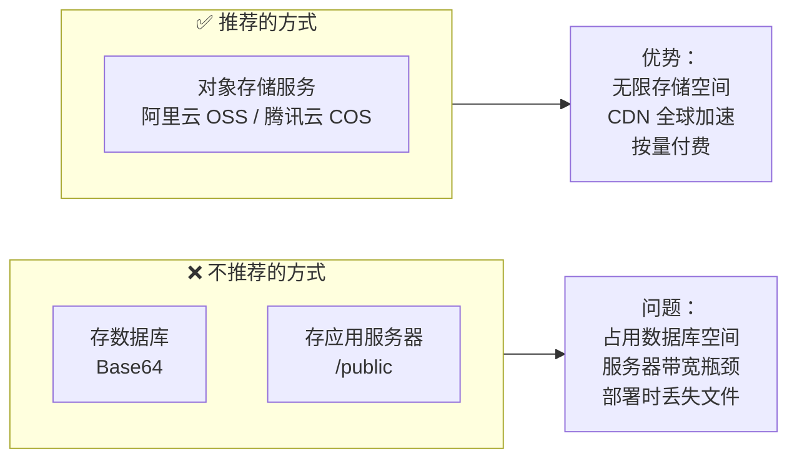
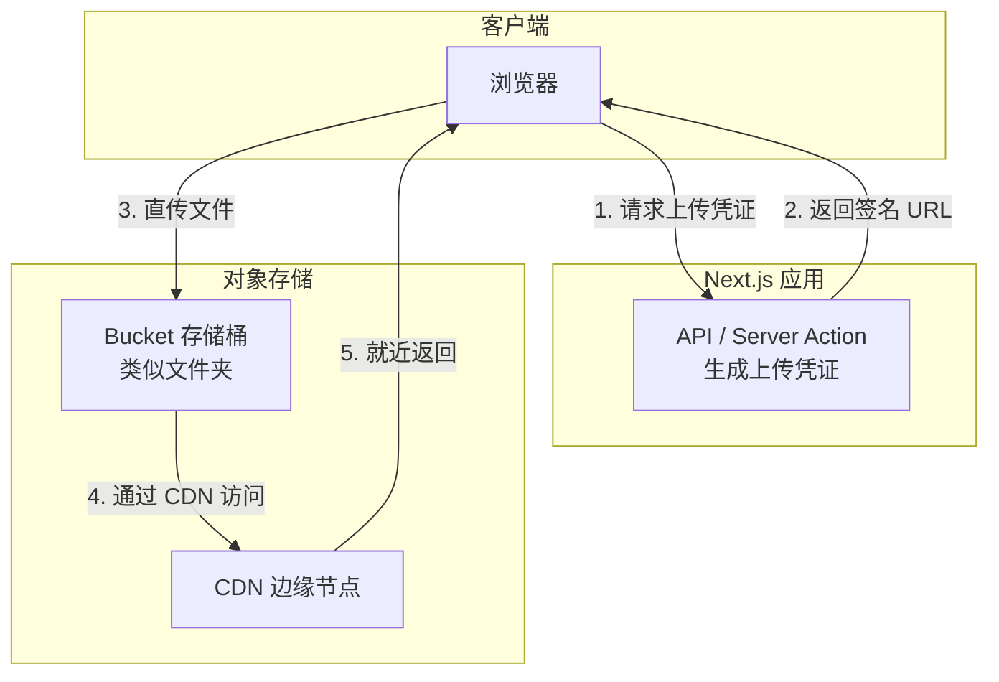
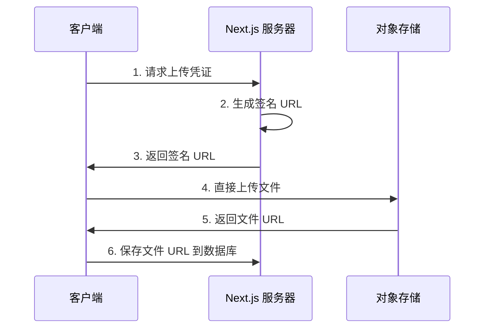

# 2.1.5 图片和文件放哪里最快——OSS 对象存储

## 一句话破题

图片、视频等静态文件不应该存在数据库里，也不应该存在应用服务器上。对象存储服务是专门为此设计的——便宜、快速、可扩展。

## 为什么需要对象存储？



| 存储方式 | 成本 | 性能 | 可扩展性 | 推荐度 |
|----------|------|------|----------|--------|
| 数据库 | 极高 | 差 | 差 | ❌ |
| 应用服务器 | 中 | 中 | 差 | ❌ |
| 对象存储 | 低 | 极好 | 无限 | ✅ |

## 核心概念

### 对象存储的基本架构



### 关键术语

| 术语 | 说明 |
|------|------|
| **Bucket** | 存储桶，相当于顶级文件夹 |
| **Object** | 对象，即存储的文件 |
| **Key** | 对象的唯一标识，相当于文件路径 |
| **签名 URL** | 带有时效性的安全访问链接 |
| **CDN** | 内容分发网络，就近访问 |

## 文件上传流程

### 前端直传（推荐）



**优势**：
- 文件不经过应用服务器，节省带宽
- 上传速度更快
- 服务器压力小

### 代码示例

```typescript
// app/api/upload/route.ts
import { NextResponse } from 'next/server'
import COS from 'cos-nodejs-sdk-v5'

const cos = new COS({
  SecretId: process.env.COS_SECRET_ID!,
  SecretKey: process.env.COS_SECRET_KEY!,
})

export async function POST(request: Request) {
  const { filename, contentType } = await request.json()
  
  // 生成唯一的文件路径
  const key = `uploads/${Date.now()}-${filename}`
  
  // 生成预签名 URL
  const signedUrl = cos.getObjectUrl({
    Bucket: process.env.COS_BUCKET!,
    Region: process.env.COS_REGION!,
    Key: key,
    Method: 'PUT',
    Sign: true,
    Expires: 3600,  // 1小时有效
  })
  
  return NextResponse.json({
    uploadUrl: signedUrl,
    fileUrl: `https://${process.env.COS_BUCKET}.cos.${process.env.COS_REGION}.myqcloud.com/${key}`
  })
}
```

```typescript
// components/file-upload.tsx
'use client'

export function FileUpload() {
  async function handleUpload(file: File) {
    // 1. 获取上传凭证
    const res = await fetch('/api/upload', {
      method: 'POST',
      body: JSON.stringify({
        filename: file.name,
        contentType: file.type
      })
    })
    const { uploadUrl, fileUrl } = await res.json()
    
    // 2. 直接上传到 OSS
    await fetch(uploadUrl, {
      method: 'PUT',
      body: file,
      headers: { 'Content-Type': file.type }
    })
    
    // 3. 返回文件 URL
    return fileUrl
  }
  
  return (
    <input 
      type="file" 
      onChange={(e) => {
        const file = e.target.files?.[0]
        if (file) handleUpload(file)
      }}
    />
  )
}
```

## 图片优化策略

### 结合 Next.js Image 组件

```typescript
// next.config.js
module.exports = {
  images: {
    remotePatterns: [
      {
        protocol: 'https',
        hostname: '*.cos.ap-shanghai.myqcloud.com',
      },
    ],
  },
}

// 使用
import Image from 'next/image'

export function Avatar({ url }: { url: string }) {
  return (
    <Image
      src={url}  // OSS URL
      alt="头像"
      width={100}
      height={100}
      // Next.js 会自动优化：WebP 格式、响应式、懒加载
    />
  )
}
```

### OSS 图片处理

大多数 OSS 服务都支持 URL 参数进行图片处理：

```typescript
// 原图
const url = 'https://bucket.cos.region.myqcloud.com/image.jpg'

// 缩略图（宽度 200px）
const thumbnail = `${url}?imageMogr2/thumbnail/200x`

// 裁剪为正方形
const square = `${url}?imageMogr2/crop/200x200/gravity/center`

// 转换格式
const webp = `${url}?imageMogr2/format/webp`
```

## 安全考虑

### 1. 不要暴露密钥

```typescript
// ❌ 危险：前端直接使用密钥
const cos = new COS({
  SecretId: 'AKID...',  // 绝对不要这样做
  SecretKey: 'xxx...',
})

// ✅ 安全：服务端生成临时凭证
// 前端只拿到有时效的签名 URL
```

### 2. 限制上传类型和大小

```typescript
// app/api/upload/route.ts
export async function POST(request: Request) {
  const { filename, contentType, size } = await request.json()
  
  // 验证文件类型
  const allowedTypes = ['image/jpeg', 'image/png', 'image/webp']
  if (!allowedTypes.includes(contentType)) {
    return NextResponse.json(
      { error: '不支持的文件类型' },
      { status: 400 }
    )
  }
  
  // 验证文件大小（10MB）
  if (size > 10 * 1024 * 1024) {
    return NextResponse.json(
      { error: '文件太大' },
      { status: 400 }
    )
  }
  
  // ... 生成签名 URL
}
```

### 3. 使用私有读写

```
Bucket 权限设置：
- 公有读：任何人可访问，适合公开资源
- 私有读写：需要签名才能访问，适合敏感文件
```

## 常见 OSS 服务商

| 服务商 | 产品名 | 特点 |
|--------|--------|------|
| 腾讯云 | COS | 国内访问快，与微信生态集成好 |
| 阿里云 | OSS | 功能最全，生态最完善 |
| AWS | S3 | 国际标准，海外访问好 |
| Cloudflare | R2 | 免出站流量费，性价比高 |

## 本节小结

对象存储的核心价值：**专业的事交给专业的服务**。

| 场景 | 方案 |
|------|------|
| 用户上传图片 | 前端直传 OSS |
| 静态资源 | OSS + CDN |
| 敏感文件 | 私有 Bucket + 签名 URL |
| 图片处理 | OSS 内置处理 / Next.js Image |
