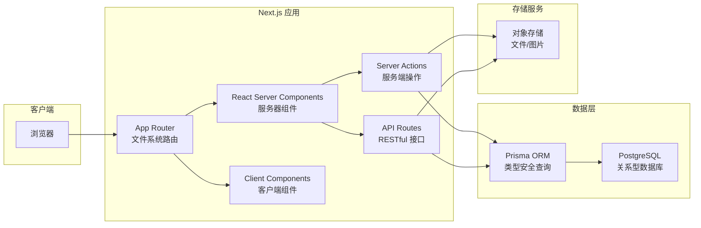

# 2.1 为什么我们选这套装备——架构全景

## 一句话破题

Next.js + TypeScript + Prisma + OSS 是 2024-2025 年全栈开发的"黄金组合"——它们不是最新潮的，但却是 AI 最擅长、生态最完善、生产验证最充分的技术栈。

## 架构全景图

## 各层职责速览

| 层级 | 技术 | 核心职责 |
|------|------|----------|
| **路由层** | App Router | URL 映射、布局嵌套、加载状态 |
| **视图层** | RSC + Client Components | UI 渲染、交互处理 |
| **操作层** | Server Actions | 表单处理、数据变更 |
| **接口层** | API Routes | 对外 API、第三方集成 |
| **数据层** | Prisma + PostgreSQL | 数据持久化、事务处理 |
| **存储层** | OSS | 文件存储、CDN 分发 |

## 为什么是这套组合？

### 1. AI 友好度最高

这套技术栈在 AI 训练数据中占比极高，意味着：

- AI 生成的代码更符合最佳实践
- 遇到问题时能得到更准确的解决方案
- 代码审查时 AI 能发现更多潜在问题

### 2. 开发体验统一

传统全栈开发需要在前后端之间频繁切换上下文。而这套技术栈：

- **一种语言**：全栈 TypeScript
- **一个项目**：前后端代码共存
- **一套类型**：Prisma 生成的类型前后端共享

### 3. 生产验证充分

| 技术 | 使用者 |
|------|--------|
| Next.js | Vercel、Netflix、TikTok、Notion |
| Prisma | Hashicorp、Miro、Mercedes-Benz |
| PostgreSQL | Instagram、Spotify、Reddit |

## 本节小结

选择技术栈的核心原则：**不选最新的，选最稳的；不选最酷的，选 AI 最懂的。**

接下来我们将深入探讨这套架构的每个核心组件：

- 2.1.1 技术栈选择理由
- 2.1.2 App Router 架构
- 2.1.3 RSC 渲染策略
- 2.1.4 Server Actions
- 2.1.5 OSS 对象存储
