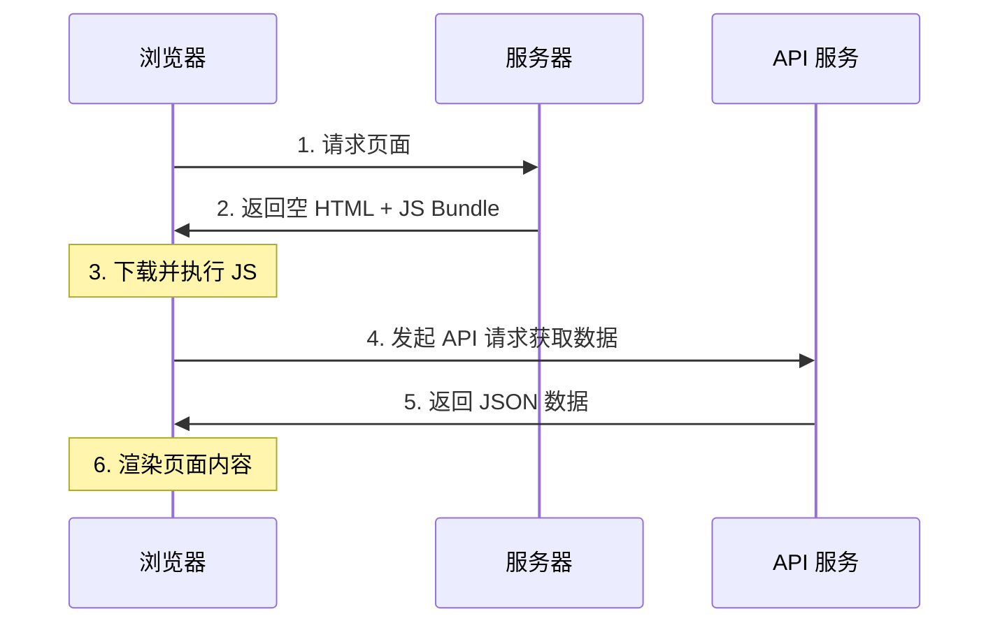

# 2.2.1 用户浏览器自己渲染——CSR 客户端渲染

## 一句话破题

CSR 是将渲染工作交给用户浏览器完成——服务器只返回一个空壳 HTML 和一堆 JavaScript，真正的页面内容由 JS 在浏览器中动态生成。

## 工作原理



### 服务器返回的 HTML

```html
<!DOCTYPE html>
<html>
<head>
  <title>My App</title>
</head>
<body>
  <div id="root"></div>  <!-- 空的容器 -->
  <script src="/bundle.js"></script>  <!-- JS 负责填充内容 -->
</body>
</html>
```

## CSR 的优缺点

| 优点 | 缺点 |
|------|------|
| 服务器压力小 | 首屏加载慢 |
| 页面切换流畅（SPA） | SEO 极差 |
| 前后端完全分离 | 依赖 JavaScript |
| 交互体验好 | 首次内容绘制延迟 |

## 适用场景

### ✅ 适合 CSR 的场景

- **后台管理系统**：不需要 SEO，用户会停留较长时间
- **Dashboard**：数据实时性要求高，需要频繁更新
- **SaaS 应用**：登录后的功能区，SEO 无意义
- **内部工具**：公司内网应用

### ❌ 不适合 CSR 的场景

- **营销落地页**：首屏速度直接影响转化率
- **博客/文档**：SEO 是核心需求
- **电商商品页**：需要被搜索引擎收录

## 在 Next.js 中实现 CSR

### 方式一：使用 `'use client'` + useEffect

```typescript
// components/user-dashboard.tsx
'use client'

import { useState, useEffect } from 'react'

export function UserDashboard() {
  const [data, setData] = useState(null)
  const [loading, setLoading] = useState(true)
  
  useEffect(() => {
    fetch('/api/dashboard')
      .then(res => res.json())
      .then(data => {
        setData(data)
        setLoading(false)
      })
  }, [])
  
  if (loading) return <div>加载中...</div>
  
  return (
    <div>
      <h1>欢迎，{data.userName}</h1>
      {/* 其他内容 */}
    </div>
  )
}
```

### 方式二：使用 SWR / React Query

```typescript
// components/user-dashboard.tsx
'use client'

import useSWR from 'swr'

const fetcher = (url: string) => fetch(url).then(res => res.json())

export function UserDashboard() {
  const { data, error, isLoading } = useSWR('/api/dashboard', fetcher)
  
  if (isLoading) return <div>加载中...</div>
  if (error) return <div>加载失败</div>
  
  return (
    <div>
      <h1>欢迎，{data.userName}</h1>
    </div>
  )
}
```

## 性能优化策略

### 1. 代码分割

```typescript
// 动态导入，按需加载
import dynamic from 'next/dynamic'

const HeavyComponent = dynamic(() => import('./heavy-component'), {
  loading: () => <p>加载中...</p>,
  ssr: false  // 禁用服务器端渲染
})
```

### 2. 骨架屏

```typescript
function DashboardSkeleton() {
  return (
    <div className="animate-pulse">
      <div className="h-8 bg-gray-200 rounded w-1/4 mb-4" />
      <div className="h-4 bg-gray-200 rounded w-full mb-2" />
      <div className="h-4 bg-gray-200 rounded w-3/4" />
    </div>
  )
}
```

### 3. 数据预取

```typescript
// 在用户可能访问前，提前获取数据
function Navigation() {
  const prefetchDashboard = () => {
    // 鼠标悬停时预取
    fetch('/api/dashboard')
  }
  
  return (
    <Link 
      href="/dashboard"
      onMouseEnter={prefetchDashboard}
    >
      Dashboard
    </Link>
  )
}
```

## 觉知：CSR 的常见陷阱

### 1. 闪烁问题

```typescript
// ❌ 会导致闪烁：服务端渲染空内容，客户端再填充
export default function Page() {
  const [data, setData] = useState(null)
  // ...
  return data ? <Content /> : null
}

// ✅ 提供加载状态
export default function Page() {
  const [data, setData] = useState(null)
  const [loading, setLoading] = useState(true)
  // ...
  return loading ? <Skeleton /> : <Content />
}
```

### 2. Hydration 错误

```typescript
// ❌ 服务端和客户端渲染结果不一致
export default function Page() {
  return <div>{new Date().toLocaleString()}</div>  // 时间会不同
}

// ✅ 只在客户端渲染时间
'use client'
export default function Page() {
  const [time, setTime] = useState<string>()
  useEffect(() => {
    setTime(new Date().toLocaleString())
  }, [])
  return <div>{time}</div>
}
```

## 本节小结

CSR 的核心特点：**牺牲首屏速度和 SEO，换取交互体验和服务器减压**。

| 场景 | 是否适合 CSR |
|------|-------------|
| 后台管理 | ✅ 最佳选择 |
| SaaS 应用 | ✅ 适合 |
| 营销页面 | ❌ 不适合 |
| 博客内容 | ❌ 不适合 |
