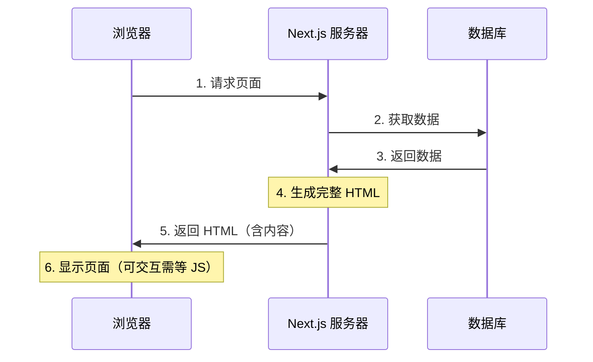

# 2.2.2 服务器渲染好再发——SSR 服务器端渲染

## 一句话破题

SSR 是在每次用户请求时，服务器实时获取数据、生成完整的 HTML，再发送给浏览器——用户看到的第一眼就是完整内容。

## 工作原理



## SSR 的优缺点

| 优点 | 缺点 |
|------|------|
| SEO 友好 | 服务器压力大 |
| 首屏内容快 | 每次请求都要渲染 |
| 数据实时 | TTFB 较慢 |
| 社交分享友好 | 无法利用 CDN 缓存 |

## 在 Next.js 中实现 SSR

### 方式一：使用动态函数（自动 SSR）

```typescript
// app/search/page.tsx
// 使用了 searchParams，自动变为 SSR
export default async function SearchPage({
  searchParams,
}: {
  searchParams: { q?: string }
}) {
  const results = await searchProducts(searchParams.q)
  
  return (
    <div>
      <h1>搜索：{searchParams.q}</h1>
      <ProductList products={results} />
    </div>
  )
}
```

### 方式二：显式声明动态渲染

```typescript
// app/dashboard/page.tsx
export const dynamic = 'force-dynamic'  // 强制 SSR

export default async function DashboardPage() {
  const stats = await getRealtimeStats()
  
  return <Dashboard stats={stats} />
}
```

### 触发 SSR 的条件

Next.js 会在以下情况自动使用 SSR：

| 使用的 API | 说明 |
|------------|------|
| `cookies()` | 读取 Cookie |
| `headers()` | 读取请求头 |
| `searchParams` | URL 查询参数 |
| `fetch` 无缓存 | `cache: 'no-store'` |

```typescript
import { cookies, headers } from 'next/headers'

export default async function Page() {
  const cookieStore = cookies()  // 触发 SSR
  const headersList = headers()  // 触发 SSR
  
  // 或者
  const data = await fetch('...', { 
    cache: 'no-store'  // 触发 SSR
  })
}
```

## 适用场景

### ✅ 适合 SSR 的场景

- **搜索结果页**：内容由用户输入决定
- **用户个人主页**：需要 SEO，数据因用户而异
- **实时数据页**：股票、天气等需要最新数据
- **需要认证的页面**：根据用户身份显示不同内容

### ❌ 不适合 SSR 的场景

- **静态内容**：用 SSG 更高效
- **极高并发**：服务器扛不住
- **内容变化不频繁**：用 ISR 更好

## 性能优化

### 1. 流式渲染

```typescript
// app/posts/page.tsx
import { Suspense } from 'react'

export default function PostsPage() {
  return (
    <div>
      <h1>文章列表</h1>
      <Suspense fallback={<PostsSkeleton />}>
        <PostsList />  {/* 异步组件，流式传输 */}
      </Suspense>
    </div>
  )
}

async function PostsList() {
  const posts = await getPosts()  // 慢查询
  return <ul>{posts.map(...)}</ul>
}
```

### 2. 并行数据获取

```typescript
// ❌ 串行获取（慢）
const user = await getUser()
const posts = await getPosts()

// ✅ 并行获取（快）
const [user, posts] = await Promise.all([
  getUser(),
  getPosts()
])
```

## 觉知：SSR 常见问题

### 1. 无限重渲染

```typescript
// ❌ 每次渲染都不同，导致缓存失效
export default async function Page() {
  const data = await fetch('...', {
    headers: { 'x-timestamp': Date.now().toString() }  // 每次不同
  })
}

// ✅ 使用稳定的请求参数
export default async function Page() {
  const data = await fetch('...', {
    next: { revalidate: 60 }  // 60 秒缓存
  })
}
```

### 2. 忘记处理错误

```typescript
// ✅ 添加错误边界
// app/search/error.tsx
'use client'

export default function Error({
  error,
  reset,
}: {
  error: Error
  reset: () => void
}) {
  return (
    <div>
      <h2>搜索出错了</h2>
      <button onClick={reset}>重试</button>
    </div>
  )
}
```

## 本节小结

SSR 的核心价值：**实时数据 + SEO 友好**。

| 场景 | 是否适合 SSR |
|------|-------------|
| 搜索页 | ✅ 最佳选择 |
| 用户主页 | ✅ 适合 |
| 文档页 | ❌ 用 SSG |
| Dashboard | ⚠️ 看情况 |
