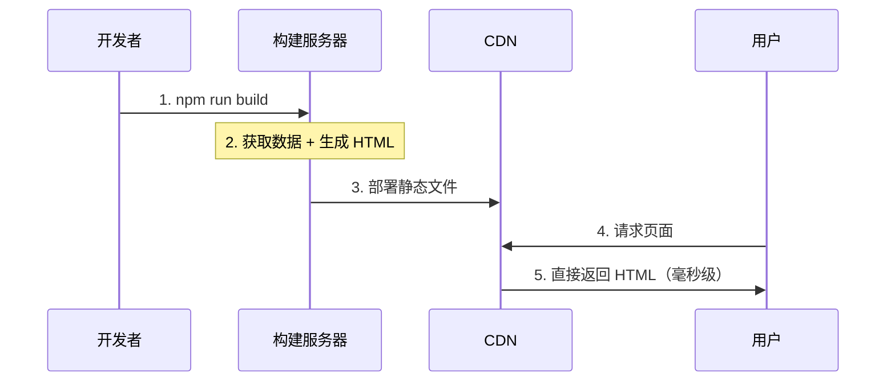

# 2.2.3 提前渲染好所有页面——SSG 静态站点生成

## 一句话破题

SSG 是在构建阶段（`npm run build`）就把所有页面渲染成静态 HTML 文件，部署后直接从 CDN 返回——速度极快，服务器零压力。

## 工作原理



## SSG 的优缺点

| 优点 | 缺点 |
|------|------|
| 极快（CDN 直返） | 构建时间长 |
| 服务器零压力 | 内容更新需重新部署 |
| SEO 友好 | 不适合动态内容 |
| 高可用性 | 页面多则构建慢 |

## 在 Next.js 中实现 SSG

### 基础用法（默认行为）

```typescript
// app/about/page.tsx
// 没有动态数据，默认就是 SSG
export default function AboutPage() {
  return <h1>关于我们</h1>
}
```

### 带数据的 SSG

```typescript
// app/posts/page.tsx
async function getPosts() {
  const res = await fetch('https://api.example.com/posts', {
    next: { revalidate: false }  // 构建时获取，不再更新
  })
  return res.json()
}

export default async function PostsPage() {
  const posts = await getPosts()
  
  return (
    <ul>
      {posts.map(post => (
        <li key={post.id}>{post.title}</li>
      ))}
    </ul>
  )
}
```

### 动态路由的 SSG

```typescript
// app/blog/[slug]/page.tsx

// 告诉 Next.js 需要预渲染哪些页面
export async function generateStaticParams() {
  const posts = await getPosts()
  
  return posts.map(post => ({
    slug: post.slug
  }))
}

export default async function BlogPost({
  params
}: {
  params: { slug: string }
}) {
  const post = await getPost(params.slug)
  
  return (
    <article>
      <h1>{post.title}</h1>
      <div>{post.content}</div>
    </article>
  )
}
```

## 适用场景

### ✅ 适合 SSG 的场景

- **博客文章**：内容创建后很少变化
- **文档站点**：如本教程
- **营销落地页**：首屏速度决定转化率
- **产品展示页**：内容相对固定

### ❌ 不适合 SSG 的场景

- **用户数据**：每人不同
- **实时内容**：股票、天气
- **海量页面**：百万级商品页

## 性能数据对比

```
SSG 页面加载时间：~50ms（CDN 直返）
SSR 页面加载时间：~200-500ms（服务器渲染）
CSR 页面加载时间：~500-1500ms（下载 JS + 渲染）
```

## 觉知：SSG 常见问题

### 1. 构建时数据获取失败

```typescript
// ✅ 添加错误处理
export async function generateStaticParams() {
  try {
    const posts = await getPosts()
    return posts.map(post => ({ slug: post.slug }))
  } catch (error) {
    console.error('获取文章列表失败:', error)
    return []  // 返回空数组，不中断构建
  }
}
```

### 2. 忘记 generateStaticParams

```typescript
// ❌ 动态路由没有 generateStaticParams，会变成 SSR
// app/blog/[slug]/page.tsx
export default async function Page({ params }) {
  // ...
}

// ✅ 添加 generateStaticParams 实现 SSG
export async function generateStaticParams() {
  // ...
}
```

## 本节小结

SSG 的核心价值：**极致性能 + 零服务器成本**。

| 场景 | 是否适合 SSG |
|------|-------------|
| 博客 | ✅ 最佳选择 |
| 文档 | ✅ 最佳选择 |
| 电商首页 | ✅ 适合 |
| 用户中心 | ❌ 不适合 |
