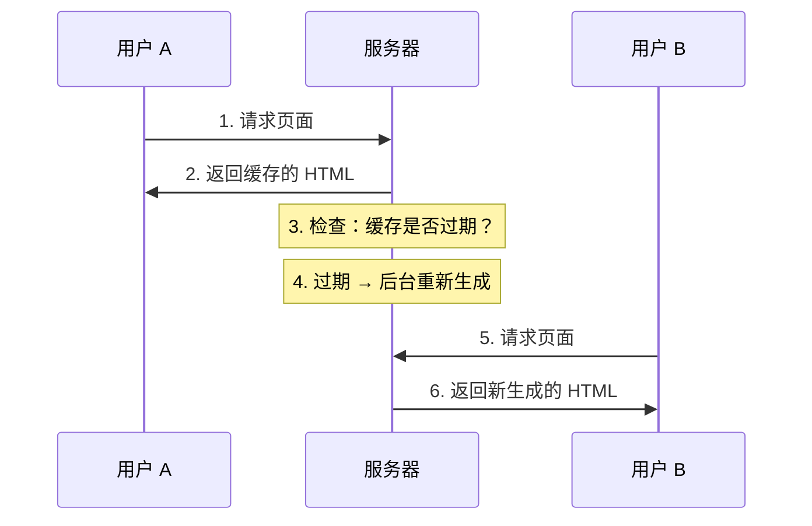

# 2.2.4 半静态半动态渲染——ISR 增量静态再生

## 一句话破题

ISR 结合了 SSG 的速度和 SSR 的新鲜度——页面在构建时生成，但可以在后台定期更新，无需重新部署。

## 工作原理



### 关键概念：Stale-While-Revalidate

1. 用户请求时，**立即返回缓存内容**（即使可能过期）
2. 如果缓存过期，**后台异步更新**
3. 下一个用户得到**新内容**

## ISR 的优缺点

| 优点 | 缺点 |
|------|------|
| 首屏极快（缓存） | 首个用户可能看到旧数据 |
| 数据可更新 | 更新有延迟 |
| 无需重新部署 | 需要服务器运行时 |
| 服务器压力小 | 不适合实时数据 |

## 在 Next.js 中实现 ISR

### 基础用法：revalidate

```typescript
// app/products/page.tsx
async function getProducts() {
  const res = await fetch('https://api.example.com/products', {
    next: { revalidate: 60 }  // 60 秒后重新验证
  })
  return res.json()
}

export default async function ProductsPage() {
  const products = await getProducts()
  
  return (
    <ul>
      {products.map(product => (
        <li key={product.id}>{product.name}</li>
      ))}
    </ul>
  )
}
```

### 页面级 revalidate

```typescript
// app/news/page.tsx
export const revalidate = 3600  // 整个页面 1 小时更新一次

export default async function NewsPage() {
  const news = await getNews()
  return <NewsList news={news} />
}
```

### 按需重新验证

```typescript
// app/api/revalidate/route.ts
import { revalidatePath, revalidateTag } from 'next/cache'
import { NextRequest } from 'next/server'

export async function POST(request: NextRequest) {
  const { path, tag, secret } = await request.json()
  
  // 验证密钥
  if (secret !== process.env.REVALIDATE_SECRET) {
    return Response.json({ error: 'Invalid secret' }, { status: 401 })
  }
  
  // 按路径重新验证
  if (path) {
    revalidatePath(path)
  }
  
  // 按标签重新验证
  if (tag) {
    revalidateTag(tag)
  }
  
  return Response.json({ revalidated: true })
}
```

## revalidate 时间选择指南

| 场景 | 建议时间 | 说明 |
|------|----------|------|
| 博客文章 | 3600（1小时） | 内容稳定 |
| 商品价格 | 60（1分钟） | 需要较新 |
| 新闻头条 | 300（5分钟） | 平衡速度和新鲜度 |
| 排行榜 | 600（10分钟） | 不需要实时 |

## 适用场景

### ✅ 适合 ISR 的场景

- **电商商品页**：价格会变，但不需要实时
- **新闻资讯**：内容更新，但延迟几分钟可接受
- **用户博客**：作者可能编辑内容
- **CMS 内容**：编辑发布后自动更新

### ❌ 不适合 ISR 的场景

- **实时股票**：需要秒级更新
- **在线聊天**：必须实时
- **库存显示**：过期数据可能导致超卖

## 觉知：ISR 常见问题

### 1. revalidate 设置不当

```typescript
// ❌ 太短：频繁重新生成，失去缓存意义
export const revalidate = 1

// ❌ 太长：数据过时严重
export const revalidate = 86400  // 1天

// ✅ 根据业务需求选择合适时间
export const revalidate = 60  // 1分钟，适合商品页
```

### 2. 混淆 revalidate 和 cache

```typescript
// revalidate: ISR，有缓存但会更新
fetch(url, { next: { revalidate: 60 } })

// cache: 'no-store': SSR，无缓存
fetch(url, { cache: 'no-store' })

// cache: 'force-cache': SSG，永久缓存
fetch(url, { cache: 'force-cache' })
```

## 本节小结

ISR 的核心价值：**静态速度 + 动态更新**。

| 场景 | 是否适合 ISR |
|------|-------------|
| 商品页 | ✅ 最佳选择 |
| 新闻列表 | ✅ 适合 |
| 纯静态页 | ❌ 用 SSG |
| 实时数据 | ❌ 用 SSR |
