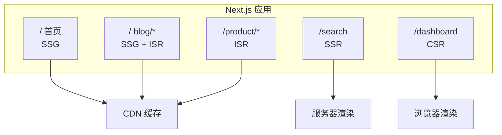
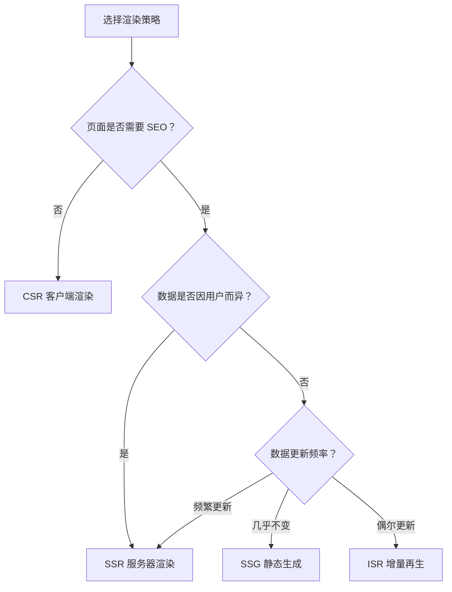

# 2.2.5 具体页面具体分析——混合渲染

## 一句话破题

Next.js 的真正威力在于：**同一个应用中，不同页面可以使用不同的渲染策略**——首页用 SSG，搜索用 SSR，Dashboard 用 CSR，商品页用 ISR。

## 混合渲染架构



## 典型电商网站的渲染策略

| 页面 | 策略 | 原因 |
|------|------|------|
| 首页 | SSG | 内容固定，追求极致速度 |
| 分类页 | ISR | 商品会更新，但不频繁 |
| 商品详情 | ISR | 价格、库存偶尔变化 |
| 搜索结果 | SSR | 查询参数决定内容 |
| 购物车 | CSR | 用户数据，不需 SEO |
| 订单页 | CSR | 用户私有数据 |

## 代码示例

### 首页 (SSG)

```typescript
// app/page.tsx
export default async function HomePage() {
  const featured = await getFeaturedProducts()
  
  return (
    <>
      <Hero />
      <FeaturedProducts products={featured} />
    </>
  )
}
```

### 商品页 (ISR)

```typescript
// app/products/[id]/page.tsx
export const revalidate = 60  // 1分钟更新

export async function generateStaticParams() {
  const products = await getTopProducts(100)  // 预渲染前 100 个热门商品
  return products.map(p => ({ id: p.id }))
}

export default async function ProductPage({
  params
}: {
  params: { id: string }
}) {
  const product = await getProduct(params.id)
  return <ProductDetail product={product} />
}
```

### 搜索页 (SSR)

```typescript
// app/search/page.tsx
export default async function SearchPage({
  searchParams
}: {
  searchParams: { q?: string; category?: string }
}) {
  const results = await searchProducts(searchParams)
  
  return (
    <div>
      <SearchFilters />
      <ProductGrid products={results} />
    </div>
  )
}
```

### 购物车 (CSR)

```typescript
// app/cart/page.tsx
'use client'

import { useCart } from '@/hooks/use-cart'

export default function CartPage() {
  const { items, total, updateQuantity, removeItem } = useCart()
  
  return (
    <div>
      <CartItems items={items} />
      <CartSummary total={total} />
    </div>
  )
}
```

## 同一页面内的混合策略

```typescript
// app/product/[id]/page.tsx
import { Suspense } from 'react'

export default async function ProductPage({ params }) {
  const product = await getProduct(params.id)  // ISR
  
  return (
    <div>
      {/* 静态部分 */}
      <ProductInfo product={product} />
      
      {/* 动态部分：流式加载 */}
      <Suspense fallback={<InventorySkeleton />}>
        <RealtimeInventory productId={params.id} />
      </Suspense>
      
      {/* 客户端交互 */}
      <AddToCartButton product={product} />
    </div>
  )
}

// 实时库存：SSR
async function RealtimeInventory({ productId }: { productId: string }) {
  const inventory = await getInventory(productId)  // 每次请求获取
  return <InventoryBadge count={inventory.count} />
}
```

## 决策流程图



## 验收清单

当你设计页面渲染策略时，检查以下问题：

- [ ] 这个页面需要被搜索引擎收录吗？
- [ ] 内容是所有用户相同，还是因人而异？
- [ ] 数据多久更新一次？
- [ ] 页面对首屏速度要求高吗？
- [ ] 服务器能承受多大并发？

## 本节小结

混合渲染的核心原则：**根据页面特性选择最合适的策略，而不是一刀切**。

| 需求 | 策略 |
|------|------|
| 极致速度 + 固定内容 | SSG |
| 速度 + 偶尔更新 | ISR |
| SEO + 动态内容 | SSR |
| 用户数据 + 交互 | CSR |
