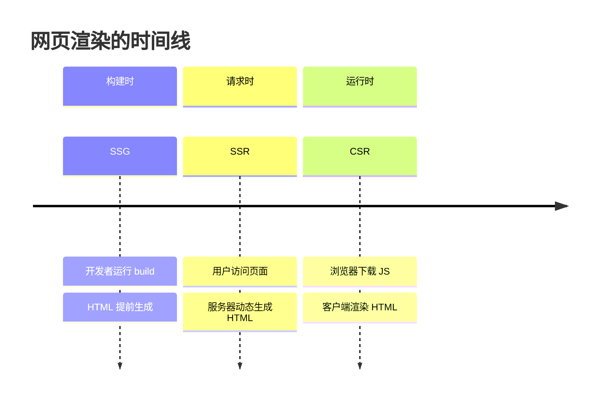
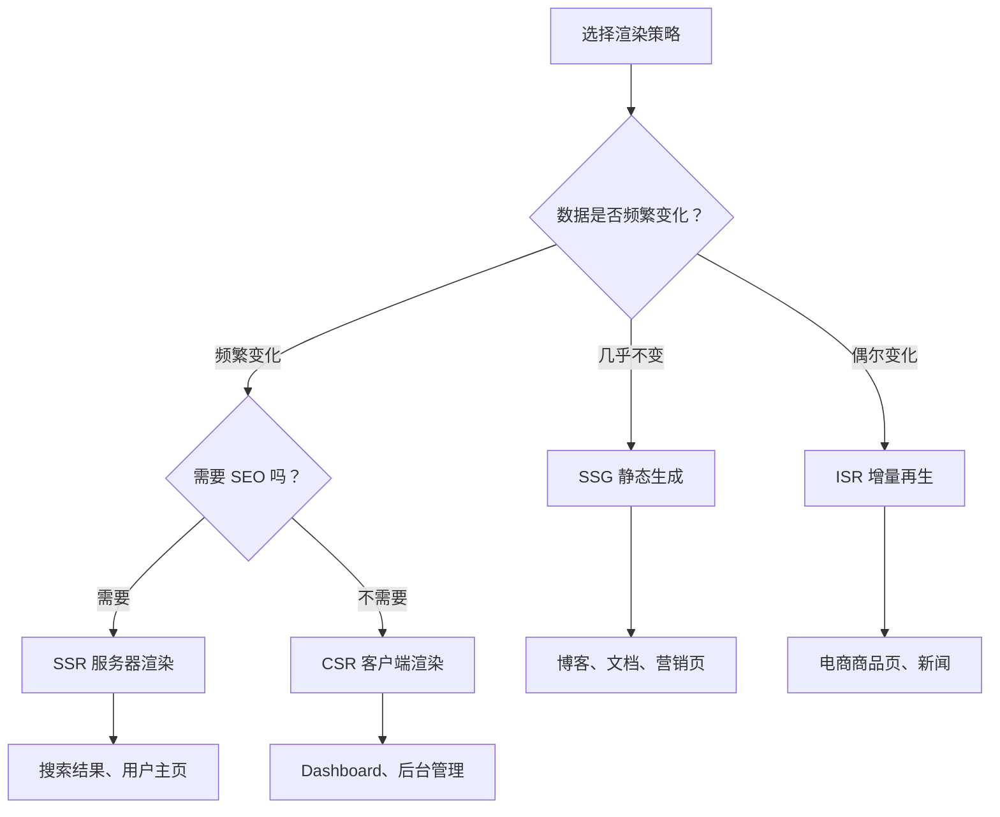

# 2.2 你的网页何时被创建——Next.js 渲染策略全景

## 认知重构

网页的 HTML 内容，到底是在什么时候、由谁来生成的？这个问题的答案，就是"渲染策略"的本质。



## 四种渲染策略对比

| 策略 | HTML 生成时机 | 生成者 | 首屏速度 | SEO | 数据新鲜度 |
|------|---------------|--------|----------|-----|------------|
| **CSR** | 运行时 | 浏览器 | 慢 | 差 | 实时 |
| **SSR** | 请求时 | 服务器 | 中 | 好 | 实时 |
| **SSG** | 构建时 | 服务器 | 极快 | 好 | 静态 |
| **ISR** | 构建时 + 后台更新 | 服务器 | 极快 | 好 | 准实时 |

## 可视化解构

```mermaid
flowchart TB
    subgraph CSR["CSR 客户端渲染"]
        direction LR
        C1["浏览器请求"] --> C2["返回空 HTML + JS"]
        C2 --> C3["JS 执行"]
        C3 --> C4["API 请求"]
        C4 --> C5["渲染页面"]
    end
    
    subgraph SSR["SSR 服务器渲染"]
        direction LR
        S1["浏览器请求"] --> S2["服务器获取数据"]
        S2 --> S3["生成 HTML"]
        S3 --> S4["返回完整 HTML"]
    end
    
    subgraph SSG["SSG 静态生成"]
        direction LR
        G1["构建时生成 HTML"] --> G2["部署到 CDN"]
        G2 --> G3["浏览器请求"]
        G3 --> G4["直接返回 HTML"]
    end
    
    subgraph ISR["ISR 增量静态再生"]
        direction LR
        I1["首次：返回静态 HTML"] --> I2["后台检查是否过期"]
        I2 --> I3["过期则重新生成"]
        I3 --> I4["下次请求返回新 HTML"]
    end
```



## 如何选择渲染策略？



## Next.js 中的默认行为

在 Next.js App Router 中：

- **默认是静态的**：如果页面没有动态数据获取，会在构建时生成
- **自动变为动态**：使用了 `cookies()`、`headers()`、`searchParams` 等会触发 SSR
- **可以显式控制**：通过 `export const dynamic = 'force-dynamic'` 等配置

```typescript
// 静态生成（默认）
export default function Page() {
  return <h1>Hello</h1>
}

// 动态渲染（自动检测）
export default function Page({ searchParams }) {
  // 使用了 searchParams，自动变为 SSR
  return <h1>Search: {searchParams.q}</h1>
}

// 强制动态渲染
export const dynamic = 'force-dynamic'
export default function Page() {
  return <h1>Always SSR</h1>
}
```

## 本章导航

- **2.2.1 CSR**：客户端渲染的场景与限制
- **2.2.2 SSR**：服务器渲染与 SEO 优化
- **2.2.3 SSG**：静态生成的最佳实践
- **2.2.4 ISR**：增量静态再生的魔力
- **2.2.5 混合渲染**：一个页面多种策略
