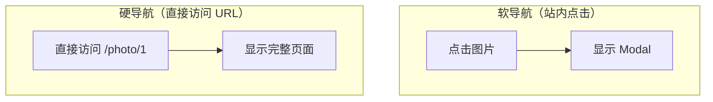

# 2.3.1 并行路由与拦截路由

## 一句话破题

并行路由让同一个页面可以同时渲染多个独立区域，拦截路由让软导航和硬导航显示不同内容——这两个特性组合起来，可以实现"弹窗即页面"的优雅体验。

## 并行路由 (Parallel Routes)

### 什么是并行路由？

```
app/
├── layout.tsx          # 使用 @team 和 @analytics
├── @team/
│   └── page.tsx        # 团队区域
├── @analytics/
│   └── page.tsx        # 分析区域
└── page.tsx            # 主内容
```

### 基本用法

```typescript
// app/layout.tsx
export default function Layout({
  children,
  team,
  analytics,
}: {
  children: React.ReactNode
  team: React.ReactNode
  analytics: React.ReactNode
}) {
  return (
    <div className="grid grid-cols-2">
      <div>{children}</div>
      <div>
        {team}
        {analytics}
      </div>
    </div>
  )
}
```

### 独立加载状态

```typescript
// app/@team/loading.tsx
export default function TeamLoading() {
  return <div>加载团队数据...</div>
}

// app/@analytics/loading.tsx
export default function AnalyticsLoading() {
  return <div>加载分析数据...</div>
}
```

## 拦截路由 (Intercepting Routes)

### 核心概念



### 文件结构约定

```
(.)   → 匹配同级
(..)  → 匹配上一级
(..)(..) → 匹配上两级
(...)  → 匹配根目录
```

### 实战：图片预览弹窗

```
app/
├── photos/
│   └── [id]/
│       └── page.tsx      # 完整图片页面
├── @modal/
│   └── (.)photos/
│       └── [id]/
│           └── page.tsx  # Modal 内的图片
└── layout.tsx
```

```typescript
// app/layout.tsx
export default function Layout({
  children,
  modal,
}: {
  children: React.ReactNode
  modal: React.ReactNode
}) {
  return (
    <>
      {children}
      {modal}
    </>
  )
}
```

```typescript
// app/@modal/(.)photos/[id]/page.tsx
import { Modal } from '@/components/modal'

export default function PhotoModal({
  params,
}: {
  params: { id: string }
}) {
  return (
    <Modal>
      
    </Modal>
  )
}
```

```typescript
// app/photos/[id]/page.tsx
export default function PhotoPage({
  params,
}: {
  params: { id: string }
}) {
  return (
    <div className="full-screen">
      
      <PhotoDetails id={params.id} />
    </div>
  )
}
```

## Modal 组件实现

```typescript
// components/modal.tsx
'use client'

import { useRouter } from 'next/navigation'

export function Modal({ children }: { children: React.ReactNode }) {
  const router = useRouter()
  
  return (
    <div 
      className="fixed inset-0 bg-black/50 flex items-center justify-center"
      onClick={() => router.back()}
    >
      <div 
        className="bg-white rounded-lg p-4"
        onClick={e => e.stopPropagation()}
      >
        {children}
      </div>
    </div>
  )
}
```

## 适用场景

| 场景 | 方案 |
|------|------|
| Dashboard 多区域 | 并行路由 |
| 图片/视频预览 | 拦截路由 + Modal |
| 登录弹窗 | 拦截路由 |
| 侧边栏详情 | 并行路由 |

## 觉知：常见问题

### 1. default.tsx 的作用

```typescript
// app/@modal/default.tsx
// 当没有匹配的 modal 时，返回 null
export default function Default() {
  return null
}
```

### 2. 刷新后 Modal 消失

这是预期行为！刷新是硬导航，会走完整页面路由。

## 本节小结

- **并行路由**：同一页面多个独立区域，各自有 loading/error 状态
- **拦截路由**：软导航拦截，硬导航正常
- **组合使用**：实现"弹窗即页面"的 UX 最佳实践
